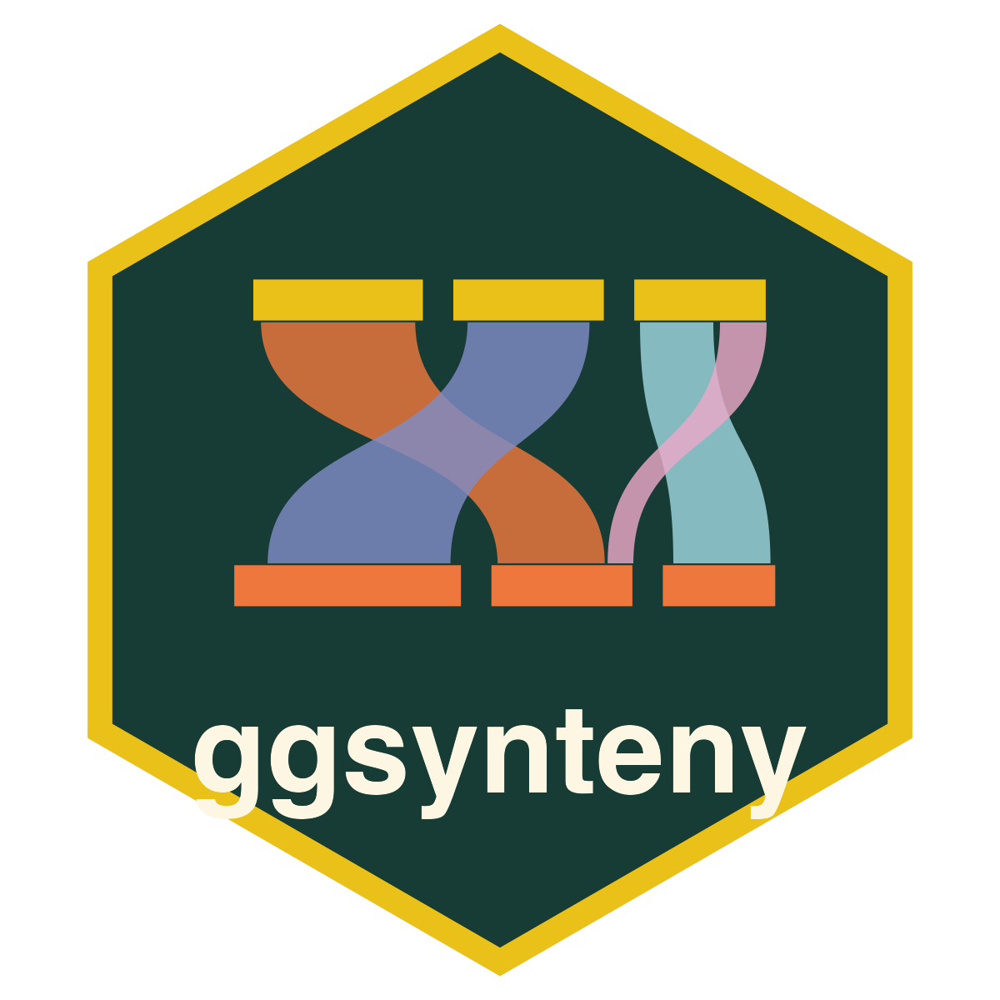
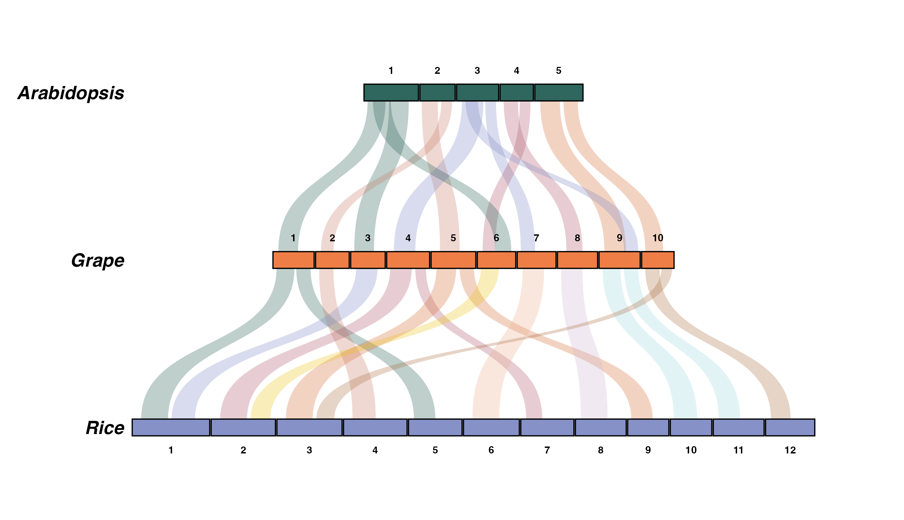
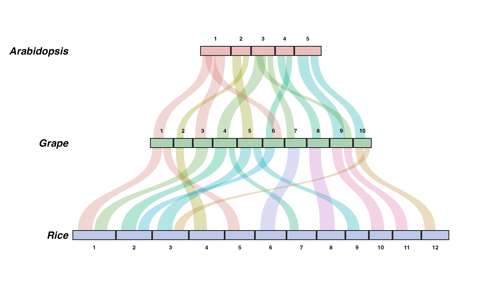
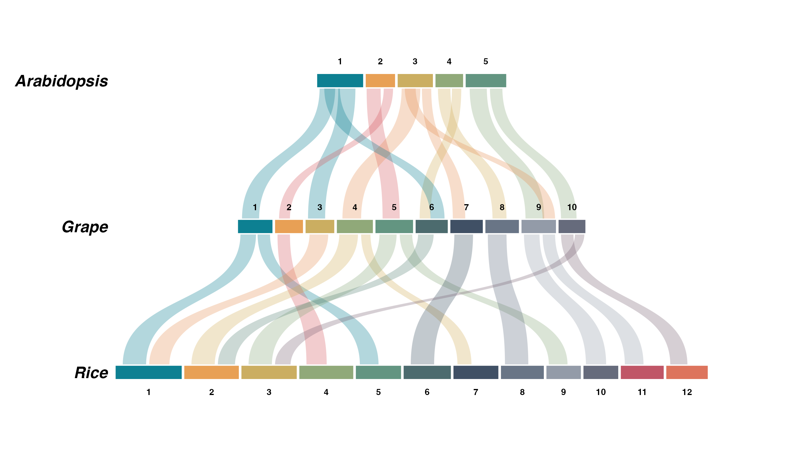
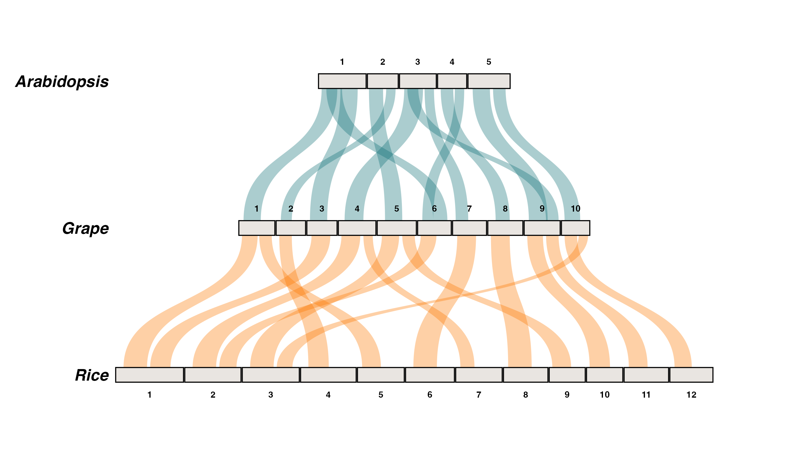
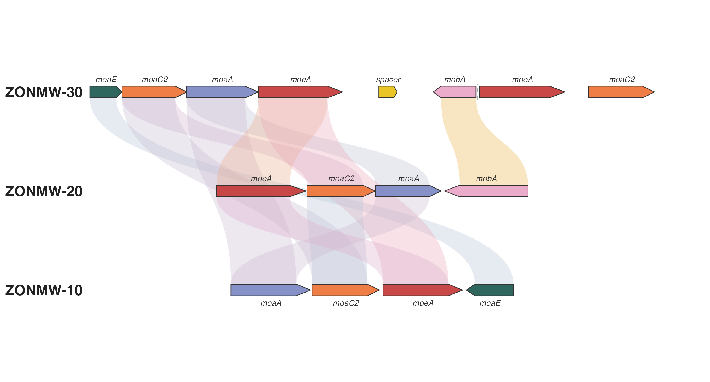
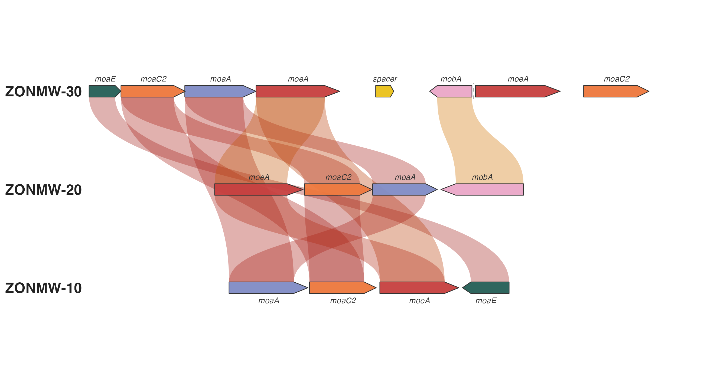
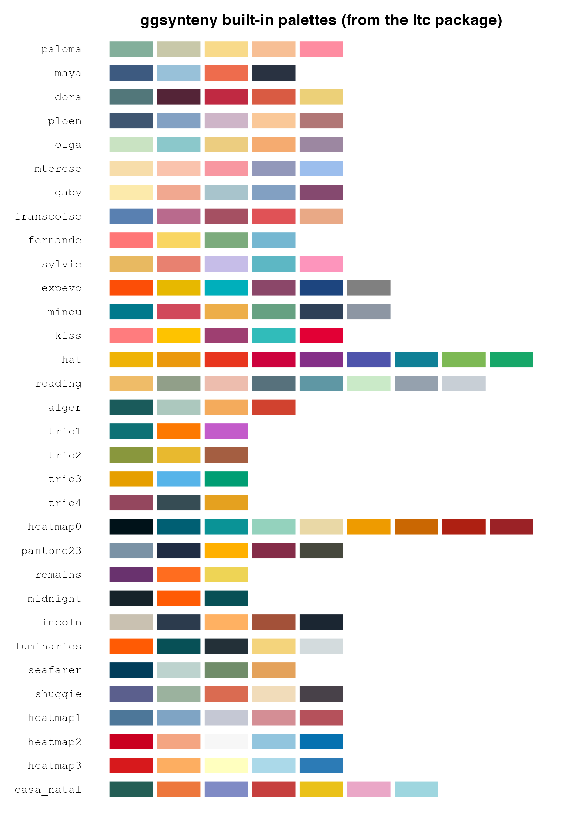

# ggsynteny

<!-- badges: start -->
[](https://github.com/loukesio/ggsynteny/actions/workflows/R-CMD-check.yaml)
[](https://lifecycle.r-lib.org/articles/stages.html#experimental)
[](https://opensource.org/licenses/MIT)
<!-- badges: end -->

> Publication-quality synteny plots with ggplot2

📖 **Website & full documentation:** <https://loukesio.github.io/ggsynteny/>

**ggsynteny** draws comparative-genomics figures in **pure ggplot2**: both
**macro-synteny** (chromosome-level ribbons across any number of species) and
**micro-synteny** (gene-level arrows connected by homology ribbons). It ships
parsers for MCScanX, GENESPACE, and plain TSV input, and every colour
argument accepts the 32 palettes of the
[ltc package](https://github.com/loukesio/ltc-color-palettes) by name —
`palette = "casa_natal"` just works.

## Installation



``` r
# with remotes (lightweight)
install.packages("remotes")
remotes::install_github("loukesio/ggsynteny")

# ...or with devtools
devtools::install_github("loukesio/ggsynteny")

# and load it
library(ggsynteny)
```

## The one-glance demo

Three plant genomes, one bundled dataset, one ltc palette driving the whole
figure — chromosomes coloured per species, ribbons by source chromosome:

``` r
library(ggsynteny)

syn <- example_synteny_data()   # Arabidopsis, Grape, Rice

plot_synteny(syn,
             species_order = c("Arabidopsis", "Grape", "Rice"),
             palette = "casa_natal")
```



Every function below follows the same pattern: what it is for, the arguments
that matter (with their defaults), and a worked example.

## The functions

### `plot_synteny()` — chromosome-level (macro) synteny

**What it's for:** stacking species as tiers of chromosomes and connecting
their syntenic blocks with curved ribbons. Takes a list with `chromosomes`
and `blocks` data frames (see the input formats below).

| Argument | Default | What it does |
|----|----|----|
| `syn_data` | — | List with `chromosomes` and `blocks` data frames |
| `species_order` | — | Display order, top to bottom |
| `palette` | `NULL` | One palette for the whole plot: an ltc name (`"casa_natal"`), `"Okabe-Ito"`, or a colour vector |
| `chr_fill` | `"per_species"` | Chromosome colouring: `"per_species"`, `"uniform"`, `"per_chr"`, or `"custom"` |
| `chr_palette` | `NULL` | Overrides `palette` for chromosomes: a palette name, colour vector, or *named* key-to-colour vector |
| `ribbon_fill` | `"source_chr"` | Ribbon colouring: `"source_chr"`, `"target_chr"`, `"species_pair"`, `"uniform"`, or `"custom"` |
| `ribbon_palette` | `NULL` | Overrides `palette` for ribbons; same forms as `chr_palette` |
| `ribbon_alpha` | `0.30` | Ribbon transparency |
| `curvature` | `0.55` | Ribbon curve strength (0–1) |
| `tier_spacing` | `18` | Vertical distance between species |

With no colours at all you get soft per-species pastels and auto-generated
ribbon hues:

``` r
plot_synteny(syn, species_order = c("Arabidopsis", "Grape", "Rice"))
```



`chr_fill = "per_chr"` colours each chromosome label separately — here from
the `minou` palette (interpolated when there are more chromosomes than
colours):

``` r
plot_synteny(syn, species_order = c("Arabidopsis", "Grape", "Rice"),
             chr_fill = "per_chr", palette = "minou")
```



And quiet chromosomes with one ribbon colour per species pair, from `trio1`:

``` r
plot_synteny(syn, species_order = c("Arabidopsis", "Grape", "Rice"),
             chr_fill = "uniform",       chr_palette = "#E8E4DF",
             ribbon_fill = "species_pair", ribbon_palette = "trio1",
             ribbon_alpha = 0.35)
```



Named vectors keep working as explicit mappings whenever you need full
control:

``` r
plot_synteny(syn, species_order = c("Arabidopsis", "Grape", "Rice"),
             chr_fill = "per_species",
             chr_palette = c("Arabidopsis" = "#B8D4E3",
                             "Grape"       = "#C5B4E3",
                             "Rice"        = "#B8E3C5"))
```

### `plot_microsynteny()` — gene-level (micro) synteny

**What it's for:** drawing individual genes as strand-aware arrows and
connecting homologous genes with ribbons — the classic gene-cluster figure.

| Argument | Default | What it does |
|----|----|----|
| `features` | — | Data frame: `bin_id`, `seq_id`, `start`, `end`, `strand`, `feat_id`, `name` |
| `links` | — | Data frame: `feat_id_a`, `feat_id_b`, optional `identity` (0–100) |
| `bin_order` | first appearance | Display order, top to bottom |
| `palette` | `NULL` | One palette for genes *and* ribbons, as in `plot_synteny()` |
| `gene_fill` | `"per_name"` | Gene colouring: `"per_name"`, `"per_feat"`, or `"uniform"` |
| `gene_palette` | `NULL` | Overrides `palette` for genes |
| `ribbon_fill` | `"identity"` | Ribbon colouring: `"identity"`, `"per_name"`, or `"uniform"` |
| `ribbon_palette` | `NULL` | Overrides `palette` for ribbons; with `"identity"`, used as the colour ramp |
| `label_genes` | `TRUE` | Italic gene-name labels above/below the arrows |

``` r
micro <- demo_microsynteny_data()   # a moa/moe gene cluster, three strains

plot_microsynteny(micro$features, micro$links,
                  bin_order = c("ZONMW-30", "ZONMW-20", "ZONMW-10"),
                  palette = "casa_natal")
```



With `ribbon_fill = "identity"` the ribbon colour encodes percent identity.
By default that is a light-to-dark blue ramp; name an ordered palette
(`heatmap0`–`heatmap3`) to restyle it:

``` r
plot_microsynteny(micro$features, micro$links,
                  bin_order = c("ZONMW-30", "ZONMW-20", "ZONMW-10"),
                  gene_fill = "per_name",  gene_palette = "casa_natal",
                  ribbon_fill = "identity", ribbon_palette = "heatmap0")
```



### `syn_palettes()` — the built-in colours

**What it's for:** every `palette` argument accepts, by name, all 32
palettes of the [ltc package](https://github.com/loukesio/ltc-color-palettes)
(vendored — ltc need not be installed; a few are curated for use as fills on
a white background, dropping pure-black and near-white entries). Names match
case-insensitively and ignore spaces, underscores and dashes, so
`"casa_natal"`, `"Casa Natal"` and `"casanatal"` are the same palette.
`"Okabe-Ito"`, any colour vector, and `grDevices::hcl.colors()` names work
too. `syn_palettes()` returns them all as a named list:

``` r
names(syn_palettes())      # all 32 names
syn_palettes()$casa_natal  # the hex colours of one palette
```



The `heatmap0`–`heatmap3` palettes are ordered ramps (always interpolated
end-to-end) — the natural choice for `ribbon_fill = "identity"`; the rest
are qualitative sets for species, chromosomes, and genes.

## Data input formats

### 1. Native TSV format

``` r
syn <- read_synteny_tsv("chromosomes.tsv", "synteny_blocks.tsv")
```

**chromosomes.tsv** (sizes in any consistent unit, e.g. Mb):

    species  chr  size
    Human    1    249
    Human    2    243
    Mouse    1    195

**synteny_blocks.tsv:**

    species1  chr1  start1  end1  species2  chr2  start2  end2
    Human     1     10      25    Mouse     4     80      95

### 2. MCScanX

``` r
syn <- read_mcscanx("output.collinearity", "output.gff")
plot_synteny(syn, species_order = c("SpeciesA", "SpeciesB"))
```

### 3. GENESPACE

``` r
syn <- read_genespace("synHits.tsv")
plot_synteny(syn, species_order = c("genome1", "genome2", "genome3"))
```

## Saving your plot

Two independent knobs control a saved PNG: `width`/`height` in pixels decide
how big (and how sharp) the image is; `dpi` decides how big the *letters*
are relative to the plot. Letters too small → raise `dpi`; labels
overlapping → lower it.

``` r
p <- plot_synteny(syn, species_order = c("Arabidopsis", "Grape", "Rice"),
                  palette = "casa_natal")

ggsave("synteny.png", p, width = 2600, height = 1500, units = "px",
       dpi = 300, bg = "white")   # bg = "white": otherwise the PNG is transparent

ggsave("synteny.pdf", p, width = 12, height = 7)   # vector, for journals
```

## API reference

| Function | Purpose |
|----|----|
| `plot_synteny()` | Macro-synteny: chromosome tiers + block ribbons (`palette`, `chr_fill`, `ribbon_fill`, `curvature`) |
| `plot_microsynteny()` | Micro-synteny: gene arrows + homology ribbons (`palette`, `gene_fill`, `ribbon_fill = "identity"`) |
| `syn_palettes()` | List the 32 built-in colour palettes |
| `read_synteny_tsv()` | Read the native two-TSV format |
| `read_mcscanx()` | Parse MCScanX `.collinearity` + `.gff` |
| `read_genespace()` | Parse a GENESPACE `synHits` file |
| `example_synteny_data()` | Bundled macro-synteny example (Arabidopsis, Grape, Rice) |
| `demo_microsynteny_data()` | Bundled micro-synteny example (moa/moe cluster) |

## Citation

If you use ggsynteny in your research, please cite the package:

``` r
citation("ggsynteny")
```

## Contributions

ggsynteny is developed and maintained by Loukas Theodosiou
(theodosiou@evolbio.mpg.de). Issues and pull requests are welcome at
<https://github.com/loukesio/ggsynteny/issues>. It pairs naturally with its
sibling packages [ltc](https://github.com/loukesio/ltc-color-palettes)
(the colour palettes) and [ggvmap](https://github.com/loukesio/ggvmap)
(Voronoi treemaps).

## License

MIT
