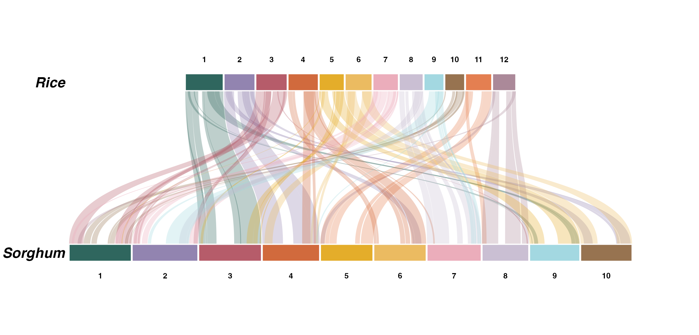
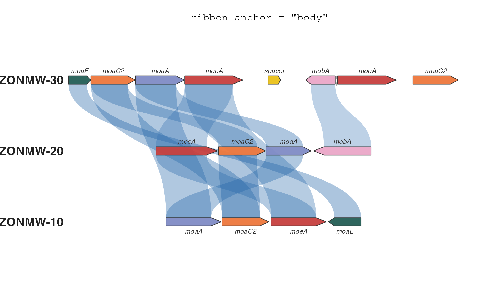
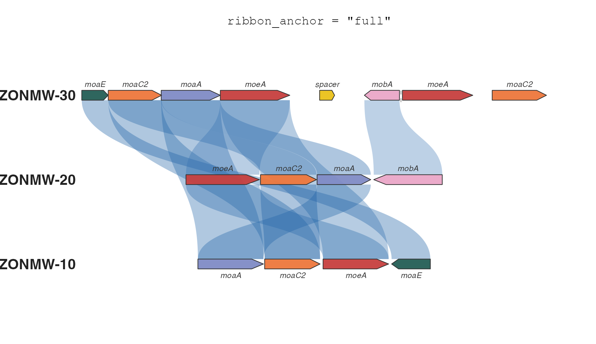

# ggsynteny

<!-- badges: start -->
[](https://github.com/loukesio/ggsynteny/actions/workflows/R-CMD-check.yaml)
[](https://lifecycle.r-lib.org/articles/stages.html#experimental)
[](https://opensource.org/licenses/MIT)
<!-- badges: end -->

> Publication-quality synteny plots with ggplot2

📖 **Website & full documentation:** <https://loukesio.github.io/ggsynteny/>

**ggsynteny** draws comparative-genomics figures in **pure ggplot2**: both
**macro-synteny** (chromosome-level ribbons across any number of species) and
**micro-synteny** (gene-level arrows connected by homology ribbons). It ships
parsers for MCScanX, GENESPACE, and plain TSV input, a real rice-sorghum
dataset, interactive hover-and-tooltip plots via **ggiraph**, and every
colour argument accepts the 32 palettes of the
[ltc package](https://github.com/loukesio/ltc-color-palettes) by name —
`palette = "casa_natal"` just works.

## Installation


``` r
# with remotes (lightweight)
install.packages("remotes")
remotes::install_github("loukesio/ggsynteny")

# ...or with devtools
devtools::install_github("loukesio/ggsynteny")

# and load it
library(ggsynteny)
```

## The one-glance demo

Three plant genomes, one bundled dataset, one ltc palette driving the whole
figure — chromosomes coloured per species, ribbons by source chromosome:

``` r
library(ggsynteny)

syn <- example_synteny_data()   # Arabidopsis, Grape, Rice

plot_synteny(syn,
             species_order = c("Arabidopsis", "Grape", "Rice"),
             palette = "casa_natal")
```


## Real data: rice vs sorghum

The bundled `rice_sorghum` dataset is genuine MCScanX output — the
rice-sorghum example data shipped with MCScanX itself, run through the tool
and parsed with ggsynteny's own `read_mcscanx()` (full pipeline in
`data-raw/rice_sorghum.R`). Two grasses, ~50 million years of divergence,
and the textbook conserved blocks are all there — rice 1 mapping almost
entirely to sorghum 3, rice 11/12 to sorghum 5/8:

``` r
data(rice_sorghum)

plot_synteny(rice_sorghum, c("Rice", "Sorghum"),
             palette = "casa_natal",
             chr_fill = "per_chr", ribbon_fill = "source_chr")
```



The full worked example — including a real bacterial gene cluster at the
micro scale — is in the [Real data
article](https://loukesio.github.io/ggsynteny/articles/real-data.html).

Chromosomes are square-cornered by default; `chr_radius` (in millimetres,
via ggforce) rounds them into karyotype-style capsules —
`gene_radius` does the same for gene arrows in micro-synteny:

``` r
plot_synteny(rice_sorghum, c("Rice", "Sorghum"),
             palette = "casa_natal",
             chr_fill = "per_chr", chr_radius = 1.5)
```


Every function below follows the same pattern: what it is for, the arguments
that matter (with their defaults), and a worked example.

## The functions

### `plot_synteny()` — chromosome-level (macro) synteny

**What it's for:** stacking species as tiers of chromosomes and connecting
their syntenic blocks with curved ribbons. Takes a list with `chromosomes`
and `blocks` data frames (see the input formats below).

| Argument | Default | What it does |
|----|----|----|
| `syn_data` | — | List with `chromosomes` and `blocks` data frames |
| `species_order` | — | Display order, top to bottom |
| `palette` | `NULL` | One palette for the whole plot: an ltc name (`"casa_natal"`), `"Okabe-Ito"`, or a colour vector |
| `chr_fill` | `"uniform"` | Chromosome colouring: `"uniform"` (dark `#333333` default), `"per_species"`, `"per_chr"`, or `"custom"` |
| `chr_color` | `"white"` | Chromosome outline — white seams by default; `"black"` for the classic outlined look |
| `chr_palette` | `NULL` | Overrides `palette` for chromosomes: a palette name, colour vector, or *named* key-to-colour vector |
| `ribbon_fill` | `"source_chr"` | Ribbon colouring: `"source_chr"`, `"target_chr"`, `"species_pair"`, `"uniform"`, or `"custom"` |
| `ribbon_palette` | `NULL` | Overrides `palette` for ribbons; same forms as `chr_palette` |
| `ribbon_alpha` | `0.30` | Ribbon transparency |
| `curvature` | `0.55` | Ribbon curve strength (0–1) |
| `tier_spacing` | `18` | Vertical distance between species |
| `chr_radius` | `0` | Corner radius in mm — `1.5` gives karyotype-style capsules (needs ggforce) |
| `interactive` | `FALSE` | Build ggiraph-interactive layers — render with `syn_girafe()` |

With nothing specified you get the house default: quiet dark chromosomes
(`"#333333"` with white seams) and ribbons coloured from the `alger`
palette — the ribbons carry the signal, the chromosomes stay out of the
way:

``` r
plot_synteny(syn, species_order = c("Arabidopsis", "Grape", "Rice"))
```


`chr_fill = "per_chr"` colours each chromosome label separately — here from
the `minou` palette (interpolated when there are more chromosomes than
colours):

``` r
plot_synteny(syn, species_order = c("Arabidopsis", "Grape", "Rice"),
             chr_fill = "per_chr", palette = "minou")
```


And quiet chromosomes with one ribbon colour per species pair, from `trio1`:

``` r
plot_synteny(syn, species_order = c("Arabidopsis", "Grape", "Rice"),
             chr_fill = "uniform",       chr_palette = "#E8E4DF",
             ribbon_fill = "species_pair", ribbon_palette = "trio1",
             ribbon_alpha = 0.35)
```


Named vectors keep working as explicit mappings whenever you need full
control:

``` r
plot_synteny(syn, species_order = c("Arabidopsis", "Grape", "Rice"),
             chr_fill = "per_species",
             chr_palette = c("Arabidopsis" = "#B8D4E3",
                             "Grape"       = "#C5B4E3",
                             "Rice"        = "#B8E3C5"))
```

### `plot_microsynteny()` — gene-level (micro) synteny

**What it's for:** drawing individual genes as strand-aware arrows and
connecting homologous genes with ribbons — the classic gene-cluster figure.

| Argument | Default | What it does |
|----|----|----|
| `features` | — | Data frame: `bin_id`, `seq_id`, `start`, `end`, `strand`, `feat_id`, `name` |
| `links` | — | Data frame: `feat_id_a`, `feat_id_b`, optional `identity` (0–100) |
| `bin_order` | first appearance | Display order, top to bottom |
| `palette` | `NULL` | One palette for genes *and* ribbons, as in `plot_synteny()` |
| `gene_fill` | `"per_name"` | Gene colouring: `"per_name"`, `"per_feat"`, or `"uniform"` |
| `gene_palette` | `NULL` | Overrides `palette` for genes |
| `ribbon_fill` | `"identity"` | Ribbon colouring: `"identity"`, `"per_name"`, or `"uniform"` |
| `ribbon_palette` | `NULL` | Overrides `palette` for ribbons; with `"identity"`, used as the colour ramp |
| `gene_radius` | `0` | Corner radius in mm — softens the arrows (needs ggforce) |
| `ribbon_anchor` | `"body"` | Where ribbons attach: `"body"` keeps arrowheads clear; `"full"` spans the whole gene (see below) |
| `label_genes` | `TRUE` | Italic gene-name labels above/below the arrows |
| `interactive` | `FALSE` | Build ggiraph-interactive layers — render with `syn_girafe()` |

``` r
micro <- demo_microsynteny_data()   # a moa/moe gene cluster, three strains

plot_microsynteny(micro$features, micro$links,
                  bin_order = c("ZONMW-30", "ZONMW-20", "ZONMW-10"),
                  palette = "casa_natal")
```


With `ribbon_fill = "identity"` the ribbon colour encodes percent identity.
By default that is a light-to-dark blue ramp; pass an ordered palette
(`heatmap0`–`heatmap3`) as `ribbon_palette` to restyle it:

``` r
plot_microsynteny(micro$features, micro$links,
                  bin_order = c("ZONMW-30", "ZONMW-20", "ZONMW-10"),
                  gene_fill = "per_name",  gene_palette = "casa_natal",
                  ribbon_fill = "identity", ribbon_palette = "heatmap0")
```


#### Where ribbons attach: `ribbon_anchor`

A gene arrow has a rectangular body and a pointed tip, and there are two
defensible places for a ribbon to end. `ribbon_anchor = "body"` (the
default) attaches ribbons to the body only, so every arrowhead stays clear
and strand direction remains readable even under dense links.
`ribbon_anchor = "full"` spans the whole gene, tip included — the
convention of clinker, gggenomes and pyGenomeViz — which reads as "this
entire gene is part of the link":

<p float="left">
  
  
</p>

Use `"body"` when the figure is about gene order and orientation (the
tips carry the information); switch to `"full"` when the links represent
alignments over entire genes and coverage is the message.

### `syn_girafe()` — interactive plots

**What it's for:** hover highlighting and tooltips in HTML output
(R Markdown, Quarto, Shiny, pkgdown) via **ggiraph**. Build the plot with
`interactive = TRUE`, then render the widget with `syn_girafe()` — hovering
a ribbon fades all the others and shows the block coordinates (or the gene
pair and its identity in micro-synteny):

``` r
data(rice_sorghum)

p <- plot_synteny(rice_sorghum, c("Rice", "Sorghum"),
                  palette = "casa_natal", chr_fill = "per_chr",
                  interactive = TRUE)
syn_girafe(p)
```

Try it live (hover it yourself) in the [Interactive
article](https://loukesio.github.io/ggsynteny/articles/interactive.html).

### `syn_palettes()` — the built-in colours

**What it's for:** every `palette` argument accepts, by name, all 32
palettes of the [ltc package](https://github.com/loukesio/ltc-color-palettes)
(vendored — ltc need not be installed; a few are curated for use as fills on
a white background, dropping pure-black and near-white entries). Names match
case-insensitively and ignore spaces, underscores and dashes, so
`"casa_natal"`, `"Casa Natal"` and `"casanatal"` are the same palette.
`"Okabe-Ito"`, any colour vector, and `grDevices::hcl.colors()` names work
too. `syn_palettes()` returns them all as a named list:

``` r
names(syn_palettes())      # all 32 names
syn_palettes()$casa_natal  # the hex colours of one palette
```


The `heatmap0`–`heatmap3` palettes are ordered ramps (always interpolated
end-to-end) — the natural choice for `ribbon_fill = "identity"`; the rest
are qualitative sets for species, chromosomes, and genes.

## Data input formats

### 1. Native TSV format

``` r
syn <- read_synteny_tsv("chromosomes.tsv", "synteny_blocks.tsv")
```

**chromosomes.tsv** (sizes in any consistent unit, e.g. Mb):

    species  chr  size
    Human    1    249
    Human    2    243
    Mouse    1    195

**synteny_blocks.tsv:**

    species1  chr1  start1  end1  species2  chr2  start2  end2
    Human     1     10      25    Mouse     4     80      95

### 2. MCScanX

``` r
syn <- read_mcscanx("output.collinearity", "output.gff")
plot_synteny(syn, species_order = c("SpeciesA", "SpeciesB"))
```

### 3. GENESPACE

``` r
syn <- read_genespace("synHits.tsv")
plot_synteny(syn, species_order = c("genome1", "genome2", "genome3"))
```

## Saving your plot

Two independent knobs control a saved PNG: `width`/`height` in pixels decide
how big (and how sharp) the image is; `dpi` decides how big the *letters*
are relative to the plot. Letters too small → raise `dpi`; labels
overlapping → lower it.

``` r
p <- plot_synteny(syn, species_order = c("Arabidopsis", "Grape", "Rice"),
                  palette = "casa_natal")

ggsave("synteny.png", p, width = 2600, height = 1500, units = "px",
       dpi = 300, bg = "white")   # bg = "white": otherwise the PNG is transparent

ggsave("synteny.pdf", p, width = 12, height = 7)   # vector, for journals
```

## API reference

| Function | Purpose |
|----|----|
| `plot_synteny()` | Macro-synteny: chromosome tiers + block ribbons (`palette`, `chr_fill`, `ribbon_fill`, `curvature`) |
| `plot_microsynteny()` | Micro-synteny: gene arrows + homology ribbons (`palette`, `gene_fill`, `ribbon_fill = "identity"`, `ribbon_anchor`) |
| `syn_girafe()` | Render an `interactive = TRUE` plot as a hoverable widget |
| `syn_palettes()` | List the 32 built-in colour palettes |
| `read_synteny_tsv()` | Read the native two-TSV format |
| `read_mcscanx()` | Parse MCScanX `.collinearity` + `.gff` |
| `read_genespace()` | Parse a GENESPACE `synHits` file |
| `rice_sorghum` | Real rice-sorghum macro-synteny (MCScanX output) — `data(rice_sorghum)` |
| `example_synteny_data()` | Bundled macro-synteny example (Arabidopsis, Grape, Rice) |
| `demo_microsynteny_data()` | Bundled micro-synteny example (moa/moe cluster) |

## Citation

If you use ggsynteny in your research, please cite the package:

``` r
citation("ggsynteny")
```

## Contributions

ggsynteny is developed and maintained by Loukas Theodosiou
(theodosiou@evolbio.mpg.de). Issues and pull requests are welcome at
<https://github.com/loukesio/ggsynteny/issues>. It pairs naturally with its
sibling packages [ltc](https://github.com/loukesio/ltc-color-palettes)
(the colour palettes) and [ggvmap](https://github.com/loukesio/ggvmap)
(Voronoi treemaps).

## License

MIT © 2026 Loukas Theodosiou — see [LICENSE.md](LICENSE.md) for the full
text. (The two-line [LICENSE](LICENSE) file is the CRAN-required stub that
points to the same terms.)
