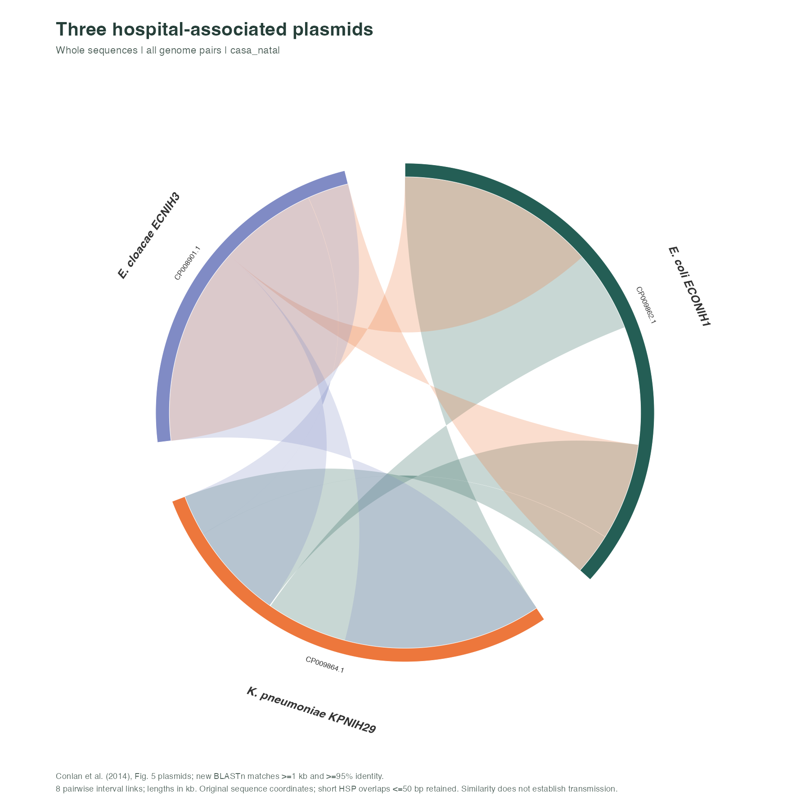
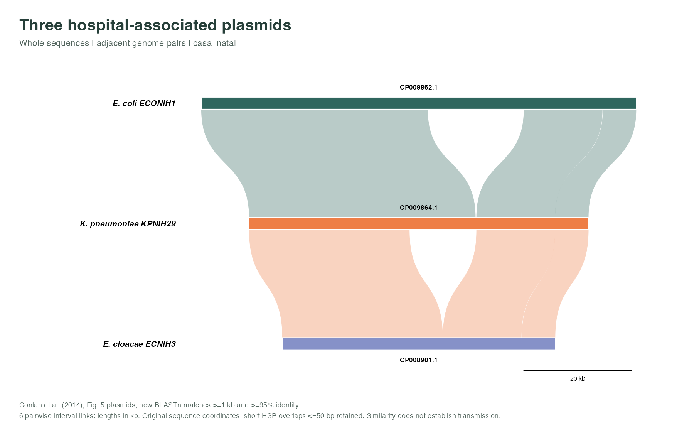
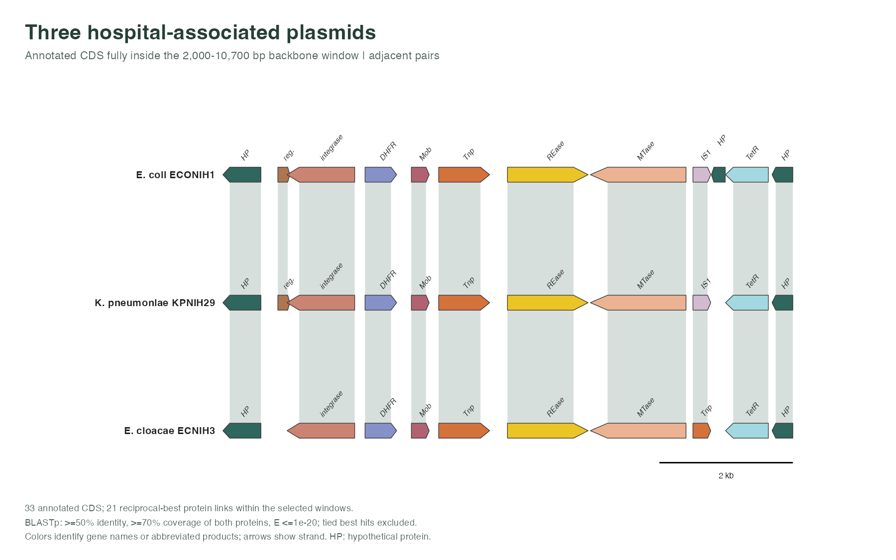

# ggsynteny on real data

This branch, `examples/real-data`, is a showcase: published data in, figures
and scripts out. It changes no package code, adds no tests and touches no
documentation of the package itself. Every figure is drawn with exported
ggsynteny functions from tables that ship here with their provenance, source
locks and checksums. To use the package, install `main`.

```
data/      the published tables, with provenance and checksums
scripts/   fetch, prepare, render and validate them
figures/   every rendered view, PNG and PDF
gallery/   one standalone interactive page
```

| Application | Data | What it shows |
|---|---|---|
| [Four *Bartonella* genomes](#four-bartonella-genomes) | NCBI RefSeq records; Mauve backbone from genoPlotR (GPL-2, retained) | whole-genome blocks with inversions, and the `rpoB` neighbourhood with protein links |
| [Three hospital plasmids](#three-hospital-associated-plasmids) | Conlan et al. 2014 complete sequences, new BLAST alignments | shared backbone and rearrangement among carbapenemase plasmids in three hosts |
| [Two malaria vectors](#two-anopheles-malaria-vectors) | Jiang et al. 2014, 380 published synteny blocks | chromosome-arm block order; coordinates are block ranks, not base pairs |
| [A chloroplast genome ring](#a-chloroplast-genome-ring) | *Arabidopsis thaliana* plastid, RefSeq NC_000932.1 | regions, kb ticks, genes by strand and function, GC content and skew, repeat links |

<p float="left">
  
  
</p>

**View:** [all eleven bacterial and vector views as one PDF](figures/public-health-examples.pdf).
**Interact:** download [the standalone HTML gallery](https://raw.githubusercontent.com/loukesio/ggsynteny/examples/real-data/gallery/index.html)
and open it in a browser. Hover for identifiers and coordinates, scroll to
zoom, drag to pan. GitHub's file viewer does not execute HTML widgets.

Gene links are computed from protein alignments; matching annotation names
alone never create a link. All figures use `palette = "casa_natal"`.

## Four Bartonella genomes

This reuses the Mauve backbone supplied with
[genoPlotR's four-genome example](https://genoplotr.r-forge.r-project.org/vignette.php).
The source file and genome order are pinned to genoPlotR's CRAN mirror commit
`3887f91ed718b7df935c11d1a84e9276f4f6b01c`.
The included species have public-health relevance: *B. henselae*,
*B. quintana* and *B. bacilliformis* cause distinct forms of bartonellosis.
[CDC background](https://www.cdc.gov/bartonella/about/index.html).

| Genome | Versioned record | Length |
|---|---|---:|
| *B. bacilliformis* KC583 | [NC_008783.1](https://www.ncbi.nlm.nih.gov/nuccore/NC_008783.1) | 1,445,021 bp |
| *B. grahamii* as4aup | [NC_012846.1](https://www.ncbi.nlm.nih.gov/nuccore/NC_012846.1) | 2,341,328 bp |
| *B. henselae* Houston-1 | [NC_005956.1](https://www.ncbi.nlm.nih.gov/nuccore/NC_005956.1) | 1,931,047 bp |
| *B. quintana* Toulouse | [NC_005955.1](https://www.ncbi.nlm.nih.gov/nuccore/NC_005955.1) | 1,581,384 bp |


The 672 source backbone rows yield **215 pairwise interval links** after
requiring at least 10 kb in each genome of a pair. Of these, **62 have reversed
relative orientation**. A source block can contribute to multiple genome pairs;
215 is not a count of independent evolutionary events. Circular plots show
all six pairs; the linear figure shows 111 links between adjacent genomes.


The close-up selects `rpoB` and its four neighboring annotated CDS on each
side, in reference-coordinate order: **36 CDS and 46 protein links** across
all pairs, or 24 adjacent-pair links in the linear view. These protein matches
are newly computed from the selected annotated windows. The reverse strand
and reversed local order of the displayed *B. quintana* region are retained;
we have not rotated or reverse-complemented the reference genomes.

## Three hospital-associated plasmids

These are the IncN plasmids compared in Figure 5 of
[Conlan et al. (2014), *Single molecule sequencing to track plasmid diversity
of hospital-associated carbapenemase-producing Enterobacteriaceae*](https://pmc.ncbi.nlm.nih.gov/articles/PMC4203314/).
The study provides a clinical context for related plasmids in different
bacterial hosts. Here the alignments are newly generated from deposited
complete sequences; they are not the authors' original alignment files.

| Host label used in the study | Plasmid | Versioned record | Length |
|---|---|---|---:|
| *E. coli* ECONIH1 | pKPC-629 | [CP009862.1](https://www.ncbi.nlm.nih.gov/nuccore/CP009862.1) | 80,186 bp |
| *K. pneumoniae* KPNIH29 | pKPC-e4e | [CP009864.1](https://www.ncbi.nlm.nih.gov/nuccore/CP009864.1) | 62,589 bp |
| *E. cloacae* ECNIH3 | pKPC-47e | [CP008901.1](https://www.ncbi.nlm.nih.gov/nuccore/CP008901.1) | 50,333 bp |

ECNIH3 is now identified in the source record and
[RefSeq](https://www.ncbi.nlm.nih.gov/nuccore/NZ_CP008901.1) as
*Enterobacter hormaechei* subsp. *hoffmannii*. The plots retain the study's
host label so they can be compared with its figures; `sequences.tsv` records
the downloaded organism name separately.



The three pairwise BLASTn comparisons retain **eight local nucleotide matches**
across all pairs, or six between adjacent hosts. These show shared sequence
and differences in its arrangement. Their presence does not by itself establish
the direction, timing or route of plasmid transmission.



The close-up contains annotated CDS fully inside the same 2,000–10,700 bp
window of each deposited plasmid: **33 CDS and 31 protein links**, or 21 links
in the linear view. This shared-backbone window illustrates local annotation
and gene-order differences. It is not the complete resistance region, and an
absent arrow means no retained CDS annotation at that position, not necessarily
absence of the underlying sequence.

## Two Anopheles malaria vectors

The *An. gambiae*–*An. stephensi* comparison reuses **380 published synteny
blocks across five arms per species** from
[Jiang et al. (2014)](https://doi.org/10.1186/s13059-014-0459-2).
It adds a eukaryotic example with different 2L/3L arm correspondences and
extensive changes in block order. *An. stephensi* is an urban malaria vector
whose spread prompted a [WHO vector alert](https://www.who.int/publications/b/67602).


**These are block ranks, not base-pair coordinates.** Each block has equal
width, and track lengths count blocks. All 380 source links are shown in both
overviews; the X detail shows 66. The 198 opposite-orientation blocks are not
an estimate of evolutionary inversion events. The source's stephensi physical
map covered about 62% of the assembly, and only 32 of 86 mapped scaffolds had
experimentally assigned orientation. These limitations are retained in the
plots and documentation. The figure does not establish effects on transmission
or insecticide resistance.

[Download the native tables, original spreadsheet and provenance](data/anopheles),
read the [full methods](data/anopheles/README.md),
or open the [composite PDF](figures/anopheles-block-order.pdf).
The gallery includes interactive versions of all three Anopheles views.

## A chloroplast genome ring

The *Arabidopsis thaliana* plastid, [RefSeq NC_000932.1](https://www.ncbi.nlm.nih.gov/nuccore/NC_000932.1),
154,478 bp, drawn as one circular molecule: the four structural regions with
ticks every 10 kb, genes split by strand and coloured by function, GC content
in 1-kb windows against the genome mean, GC skew, and ribbons joining each of
the 17 inverted-repeat genes to its copy.


This example ships with the package rather than with this branch; its data are
in `inst/extdata/chloroplast/` and the script is
[`scripts/genome_ring.R`](scripts/genome_ring.R). It is listed here because
it is the application that exercises the annotation tracks: `syn_axis()` and
the `syn_track_*()` wrappers on a published genome.

## Plot from the committed tables

Install ggsynteny from `main`, clone this branch beside it, and read the
tables straight from `data/`:

```sh
git clone --branch examples/real-data https://github.com/loukesio/ggsynteny.git ggsynteny-examples
cd ggsynteny-examples
```

```r
# install.packages("remotes"); remotes::install_github("loukesio/ggsynteny")
library(ggsynteny)

read_table <- function(dataset, name)
  read.delim(file.path("data", dataset, paste0(name, ".tsv")), stringsAsFactors = FALSE)

syn <- list(chromosomes = read_table("bartonella", "chromosomes"),
            blocks      = read_table("bartonella", "blocks"))
plot_circular_synteny(syn, palette = "casa_natal", chr_fill = "per_species",
                      ribbon_fill = "species_pair", show_orientation = TRUE)

plot_circular_microsynteny(read_table("bartonella", "features"),
                           read_table("bartonella", "links"),
                           palette = "casa_natal", ribbon_fill = "uniform")
```

Replace `"bartonella"` with `"plasmids"` for the second dataset. For
`"anopheles"` read only `chromosomes` and `blocks`; there are no gene-feature
or protein-link tables, and the coordinate unit is block rank. Use
`plot_synteny(syn, unique(syn$chromosomes$species), show_inversions = TRUE)` or
`plot_microsynteny(features, links)` for linear views; the figure scripts
restrict linear gene links to adjacent genomes for clarity. For an interactive
plot, pass `interactive = TRUE` and give the result to `syn_girafe()`.

## Upload to ggsynteny Studio

Open [the public app](https://01a0ae1e-adb1-a4f8-1ced-261952037ebf.share.connect.posit.cloud/)
or run `ggsynteny_app()` locally. Download the four relevant TSV files from
[Bartonella](data/bartonella) or
[plasmids](data/plasmids). For
[Anopheles](data/anopheles), download its two native
chromosome/block tables; the values are block ranks, not base pairs.

| View | Input format | First upload | Second upload |
|---|---|---|---|
| Whole sequences / block orders | Native chromosome tables | `chromosomes.tsv` | `blocks.tsv` |
| Gene windows | Gene / link tables | `features.tsv` | `links.tsv` |

Select Upload, choose the format and files, and select Linear or Circular.
Enable the Interactive switch for tooltips and navigation. For whole-sequence
views, enable the orientation option to retain reversed matches. Keep the link
limit at 1,000 or higher to include every supplied link. Studio's labels and
spacing use its own controls; the PDF/gallery use the documented figure script.

## Methods and reproduction

From a checkout of this branch, **render the committed results without network
access or BLAST**:

```sh
Rscript scripts/render.R
```

Rendering requires the package's dependencies, devtools, ggiraph, htmlwidgets,
htmltools, rmarkdown, and Pandoc. The output is eleven individual PNG/PDF views, an eleven-page combined
PDF, the three-panel Anopheles composite, and one standalone HTML page
containing seven interactive views. To rebuild the input tables as
well, use Python 3.10+, Biopython and NCBI BLAST+:

```sh
python3 scripts/prepare.py
python3 scripts/prepare_anopheles.py
Rscript scripts/render.R
Rscript scripts/validate.R
```

The Anopheles conversion additionally needs Python's `openpyxl`; it reads the
bundled spreadsheet offline, verifies its checksum and reconstructs every
signed block order. Pass `--download-source` to `prepare_anopheles.py` to
re-fetch the original publisher archive. Its separate source lock and table
hashes are in `anopheles/provenance.json` in the data directory.

The bacterial preparation script pins accession versions, verifies SHA-256 hashes of the
downloaded GenBank records, and records sequence hashes and software versions.
It stops if an upstream record changes, including annotation changes under an
unchanged accession version. Review such changes before updating the source
lock. Raw downloads and intermediate FASTA files stay in the ignored cache.

- **Coordinates:** all intervals are zero-based, half-open. Whole-sequence
  tables use **kb**, including sequence lengths; gene tables use **bp**.
  Anopheles whole-arm tables instead use ordinal block positions: the interval
  for rank r is [r-1, r), and sequence sizes are block counts.
  Mauve's signed one-based coordinates are converted while preserving relative
  orientation. Protein strands come directly from the sequence annotations.
- **Plasmid matches:** BLASTn, task `blastn`, E-value ≤1e-20, dust and soft
  masking disabled; retain identity ≥95% and alignment/coordinate spans ≥1 kb.
  Process by decreasing bit score; discard matches overlapping an accepted
  match by >50 bp on either sequence. The audit table retains every raw match
  and its filtering decision. These are local alignments, not a separate
  synteny-block inference algorithm or an exhaustive map of repetitive DNA.
- **Protein links:** BLASTp with SEG filtering, E-value ≤1e-20, one HSP per
  subject; identity ≥50% and aligned span ≥70% of both protein lengths. Keep
  unique reciprocal best bit-score matches within each pair of selected
  windows, excluding tied best hits. These are regional homology candidates,
  not a genome-wide orthology analysis. All raw protein matches are included.
- **Labels:** existing gene names are retained; otherwise a short product
  label is used. HP = hypothetical protein; Ntr = nitroreductase; Sda = serine
  ammonia-lyase; dehyd. = serine dehydratase beta chain; DHFR = dihydrofolate
  reductase; REase = restriction endonuclease; MTase = EcoRII methylase;
  Mob = mobilization protein; Tnp = transposase; reg. = transcriptional regulator.
  Full products, locus tags, protein accessions and coordinates remain in the
  feature tables. Equal colors identify equal labels, not proven orthology.
- **Circular views:** bacterial whole-sequence sectors represent complete circular
  replicons. Anopheles sectors represent published block orders along linear
  chromosome arms, not complete chromosome lengths. Gene sectors span only the selected features. The latter are local
  windows displayed around a circle; unannotated flanks are not inferred.

The reuse notice and GPL license for the upstream Bartonella alignment and
derived macro tables are in [the data directory](data/README.md).
The preparation and rendering scripts are original example code under the
repository license.
