# ggsynteny

<!-- badges: start -->
[](https://github.com/loukesio/ggsynteny/actions/workflows/R-CMD-check.yaml)
[](https://lifecycle.r-lib.org/articles/stages.html#experimental)
[](https://opensource.org/licenses/MIT)
<!-- badges: end -->

> **Publication-quality synteny plots, in pure ggplot2.**
> Chromosomes or genes · linear or circular · one line of code · 32 palettes by name.

<p align="center">
  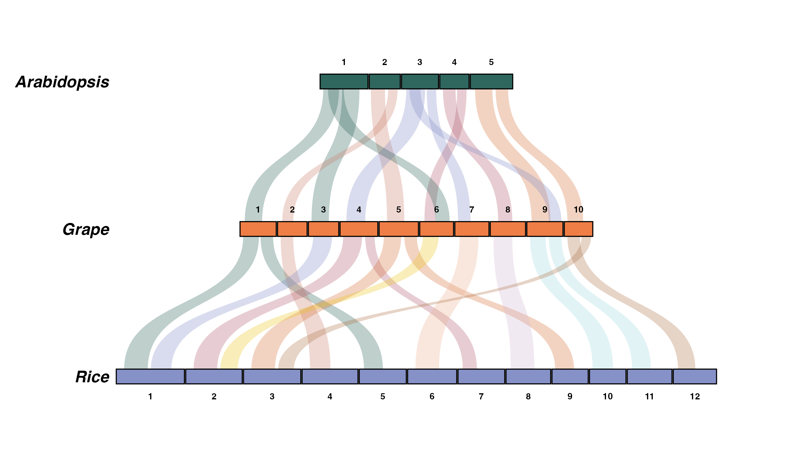
</p>

<table align="center">
  <tr>
    <td align="center" width="25%"><a href="#plot-synteny">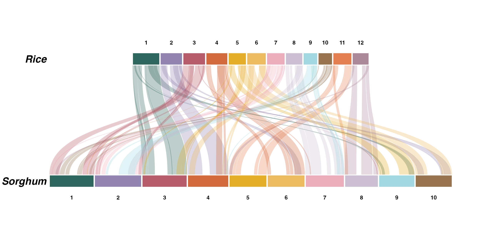<br><b>Macro-synteny</b></a><br><sub>chromosome tiers + block ribbons</sub></td>
    <td align="center" width="25%"><a href="#plot-microsynteny">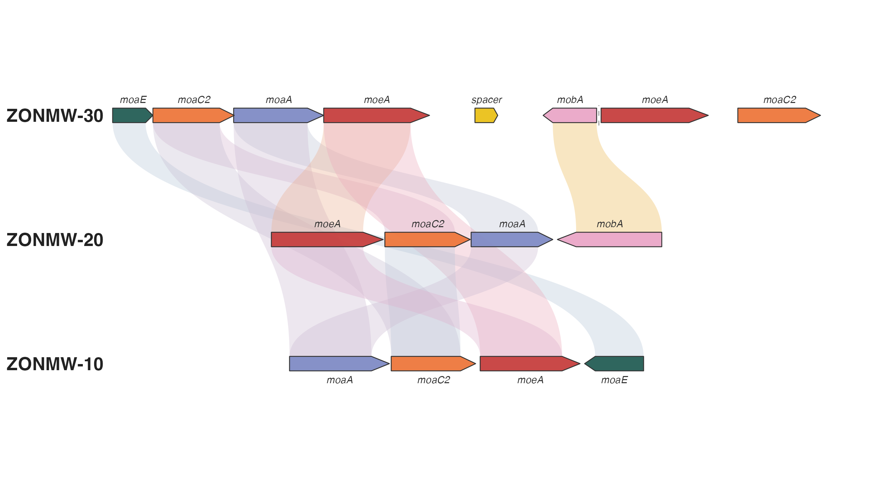<br><b>Micro-synteny</b></a><br><sub>gene arrows + homology ribbons</sub></td>
    <td align="center" width="25%"><a href="#plot-circular-synteny">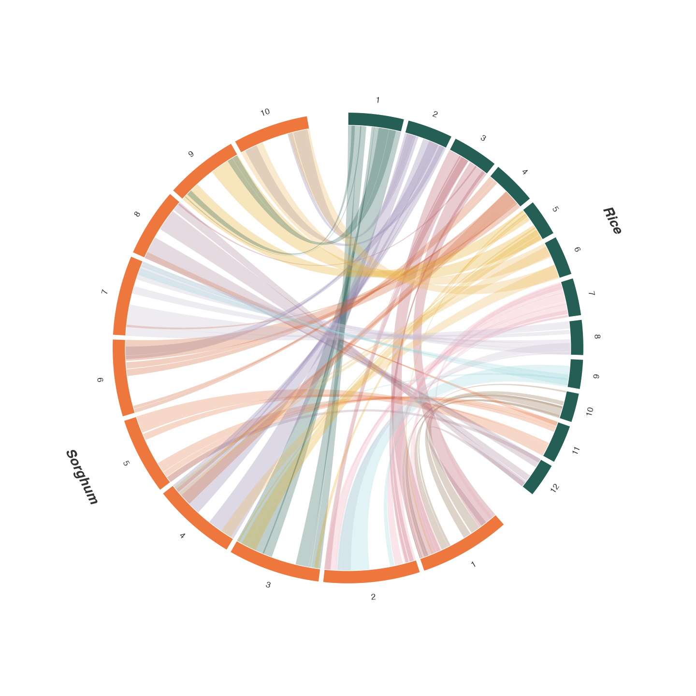<br><b>Circular</b></a><br><sub>chromosome arcs + chords</sub></td>
    <td align="center" width="25%"><a href="#annotation-tracks"><br><b>Annotation tracks</b></a><br><sub>GC, genes, axes — stacked with <code>+</code></sub></td>
  </tr>
</table>

📖 **Website & full documentation:** <https://loukesio.github.io/ggsynteny/> ·
🧪 **Try it in the browser, no install:** [ggsynteny Studio](https://01a0ae1e-adb1-a4f8-1ced-261952037ebf.share.connect.posit.cloud/)

**ggsynteny** draws comparative-genomics figures with ordinary ggplot2 objects, so
everything you already know (`+ labs()`, `+ theme()`, `ggsave()`) just works.
It reads **MCScanX**, **GENESPACE** and plain **TSV** results, ships a real
rice–sorghum dataset, renders hover-and-tooltip versions via **ggiraph**, and
every colour argument accepts the 32 palettes of the
[ltc package](https://github.com/loukesio/ltc-color-palettes) by name —
`palette = "casa_natal"` just works.

Version **0.5.0** adds circular views and **ggsynteny Studio**, a local Shiny
app for uploading results, previewing data, and exporting figures and tables.
The previous [0.3.0 source is preserved](https://github.com/loukesio/ggsynteny/releases/tag/v0.3.0).

---

## Contents

1. [Installation](#installation)
2. [Your first plot](#your-first-plot) — three lines, one figure
3. [Pick your view](#pick-your-view) — which function for which figure
4. [Bring your own data](#bring-your-own-data) — MCScanX, GENESPACE, TSV, or Studio
5. [The four plots](#the-four-plots) — arguments, defaults, worked examples
6. [Add to any plot](#add-to-any-plot) — annotation tracks, interactivity, palettes
7. [ggsynteny Studio](#ggsynteny-app) — the Shiny app, with reference comparison
8. [Data input formats](#data-input-formats) · [Saving your plot](#saving-your-plot) · [API reference](#api-reference) · [Citation](#citation)

---

## Installation

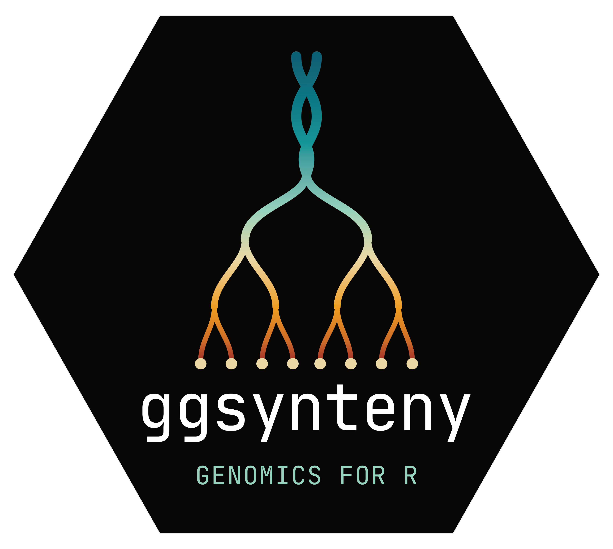

``` r
install.packages("remotes")  # only needed once
remotes::install_github("loukesio/ggsynteny", upgrade = "never")
library(ggsynteny)
```

The released 0.5.0 has the four plots and Studio. The development version on
GitHub adds annotation tracks and the genome ring shown above. Restart R after
installation if ggsynteny was already loaded.

<br>

## Your first plot

Three plant genomes, one bundled dataset, one ltc palette driving the whole
figure. Nothing to download:

``` r
library(ggsynteny)

syn <- example_synteny_data()   # Arabidopsis, Grape, Rice

plot_synteny(syn,
             species_order = c("Arabidopsis", "Grape", "Rice"),
             palette = "casa_natal")
```

That is the figure at the top of this page. Chromosomes are coloured per species, ribbons by source chromosome. Swap
`palette` for any of the [32 built-in names](#syn-palettes),
or add `chr_radius = 1.5` for rounded, karyotype-style chromosomes.

## Pick your view

Four plotting functions, two questions: **chromosomes or genes?** and
**linear or circular?** Every one of them takes `palette = "…"` and returns a
ggplot object.

| | Linear | Circular |
|---|---|---|
| **Chromosomes** (macro-synteny)<br><sub>`chromosomes` + `blocks` tables</sub> | [`plot_synteny()`](#plot-synteny) | [`plot_circular_synteny()`](#plot-circular-synteny) |
| **Genes** (micro-synteny)<br><sub>`features` + `links` tables</sub> | [`plot_microsynteny()`](#plot-microsynteny) | [`plot_circular_microsynteny()`](#plot-circular-microsynteny) |

Then layer on what you need:

- **Annotation tracks** — `+ syn_track_heatmap()`, `+ syn_track_line()`, `+ syn_track_feature()`, `+ syn_axis()` → [Annotation tracks](#annotation-tracks)
- **Interactivity** — `interactive = TRUE`, then `syn_girafe(p)` → [`syn_girafe()`](#syn-girafe)
- **Reference rings** — one reference, many genomes → [Reference comparison](#reference-comparison), in Studio or `plot_reference_comparison()`

<p align="center">
  
  
</p>
<p align="center"><sub>The same real rice–sorghum MCScanX data, drawn with <code>plot_synteny()</code> (left) and <code>plot_circular_synteny()</code> (right).</sub></p>

## Bring your own data

Already have results? Each parser returns the list that `plot_synteny()` and
`plot_circular_synteny()` expect:

``` r
syn <- read_mcscanx("out.collinearity", "out.gff")          # MCScanX
syn <- read_genespace("synHits.tsv")                          # GENESPACE
syn <- read_synteny_tsv("chromosomes.tsv", "blocks.tsv")      # two plain tables

plot_synteny(syn, species_order = c("Rice", "Sorghum"), palette = "casa_natal")
```

Gene-level plots take two plain data frames — `features` (one row per gene) and
`links` (one row per homologous pair). Column names and bundled example files
for every format are in [Data input formats](#data-input-formats).

Prefer not to write code? **[Open ggsynteny Studio](https://01a0ae1e-adb1-a4f8-1ced-261952037ebf.share.connect.posit.cloud/)**,
upload the same files, and download the figure plus an R script that
reproduces it. Details in [`ggsynteny_app()`](#ggsynteny-app).

---

---

<a id="the-four-plots"></a>
## The four plots

Each function below follows the same pattern: what it is for, the arguments
that matter with their defaults, and worked examples. Chromosome-level
functions take a list with `chromosomes` and `blocks` tables; gene-level
functions take `features` and `links` tables.

<a id="plot-synteny"></a>
### `plot_synteny()` — chromosome-level, linear

Stacks species as tiers of chromosomes and connects their syntenic blocks
with curved ribbons.

| Argument | Default | What it does |
|----|----|----|
| `syn_data` | — | List with `chromosomes` and `blocks` data frames |
| `species_order` | — | Display order, top to bottom |
| `palette` | `NULL` | One palette for the whole plot: an ltc name, `"Okabe-Ito"`, or a colour vector |
| `chr_fill` | `"uniform"` | Chromosome colouring: `"uniform"`, `"per_species"`, `"per_chr"`, or `"custom"` |
| `ribbon_fill` | `"source_chr"` | Ribbon colouring: `"source_chr"`, `"target_chr"`, `"species_pair"`, `"uniform"`, or `"custom"` |
| `chr_palette`, `ribbon_palette` | `NULL` | Override `palette` for one element; named vectors map keys to colours |
| `ribbon_alpha`, `curvature` | `0.30`, `0.55` | Ribbon transparency and curve strength |
| `chr_radius` | `0` | Corner radius in mm; `1.5` gives karyotype-style capsules (needs ggforce) |
| `interactive` | `FALSE` | Build ggiraph layers; render with `syn_girafe()` |

The house default is quiet dark chromosomes with ribbons from the `alger`
palette, so the ribbons carry the signal. `chr_fill = "per_chr"` colours each
chromosome; `ribbon_fill = "species_pair"` gives one ribbon colour per pair:

``` r
plot_synteny(syn, species_order = c("Arabidopsis", "Grape", "Rice"), chr_fill = "per_chr", palette = "minou")
```

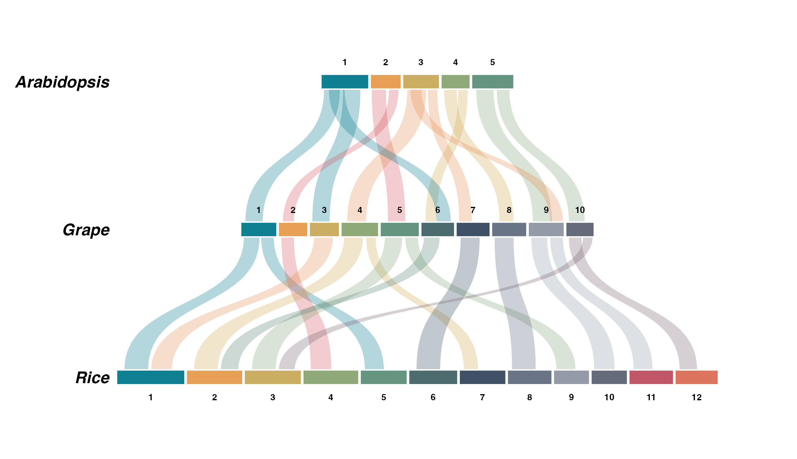

**Real data.** The bundled `rice_sorghum` dataset is genuine MCScanX output,
parsed with `read_mcscanx()` (pipeline in `data-raw/rice_sorghum.R`). Two
grasses, about 50 million years apart, and the textbook conserved blocks are
all there: rice 1 maps almost entirely to sorghum 3, rice 11/12 to sorghum 5/8.

``` r
data(rice_sorghum)
plot_synteny(rice_sorghum, c("Rice", "Sorghum"), palette = "casa_natal",
             chr_fill = "per_chr", ribbon_fill = "source_chr")
```


More variations (species-pair ribbons, named colour maps, rounded
chromosomes) are in the
[getting-started guide](https://loukesio.github.io/ggsynteny/articles/getting-started.html)
and the [real-data article](https://loukesio.github.io/ggsynteny/articles/real-data.html).

<a id="plot-microsynteny"></a>
### `plot_microsynteny()` — gene-level, linear

Draws genes as strand-aware arrows and connects homologous genes with
ribbons: the classic gene-cluster figure.

| Argument | Default | What it does |
|----|----|----|
| `features` | — | Data frame: `bin_id`, `seq_id`, `start`, `end`, `strand`, `feat_id`, `name` |
| `links` | — | Data frame: `feat_id_a`, `feat_id_b`, optional `identity` (0–100) |
| `bin_order` | first appearance | Display order, top to bottom |
| `gene_fill` | `"per_name"` | Gene colouring: `"per_name"`, `"per_feat"`, or `"uniform"` |
| `ribbon_fill` | `"identity"` | Ribbon colouring: `"identity"` (a colour ramp), `"per_name"`, or `"uniform"` |
| `ribbon_anchor` | `"body"` | `"body"` keeps arrowheads clear; `"full"` spans the whole gene |
| `gene_radius` | `0` | Corner radius in mm (needs ggforce) |
| `label_genes` | `TRUE` | Italic gene-name labels |
| `interactive` | `FALSE` | Build ggiraph layers; render with `syn_girafe()` |

``` r
micro <- example_microsynteny_data()   # a moa/moe gene cluster, three strains
plot_microsynteny(micro$features, micro$links,
                  bin_order = c("ZONMW-30", "ZONMW-20", "ZONMW-10"), palette = "casa_natal")
```


With `ribbon_fill = "identity"` the ribbon colour encodes percent identity on
a light-to-dark ramp; pass an ordered palette (`heatmap0` to `heatmap3`) as
`ribbon_palette` to restyle it. `ribbon_anchor` decides where ribbons end:
`"body"` (default) keeps every arrowhead readable under dense links; `"full"`
spans tip included, the convention of clinker and gggenomes, and reads as
"this entire gene is part of the link".

<p float="left">
  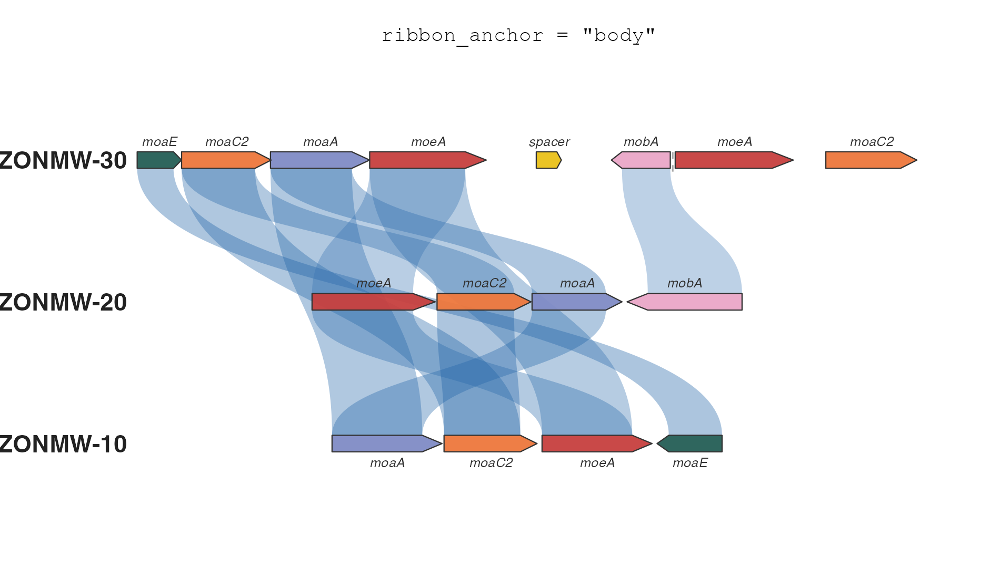
  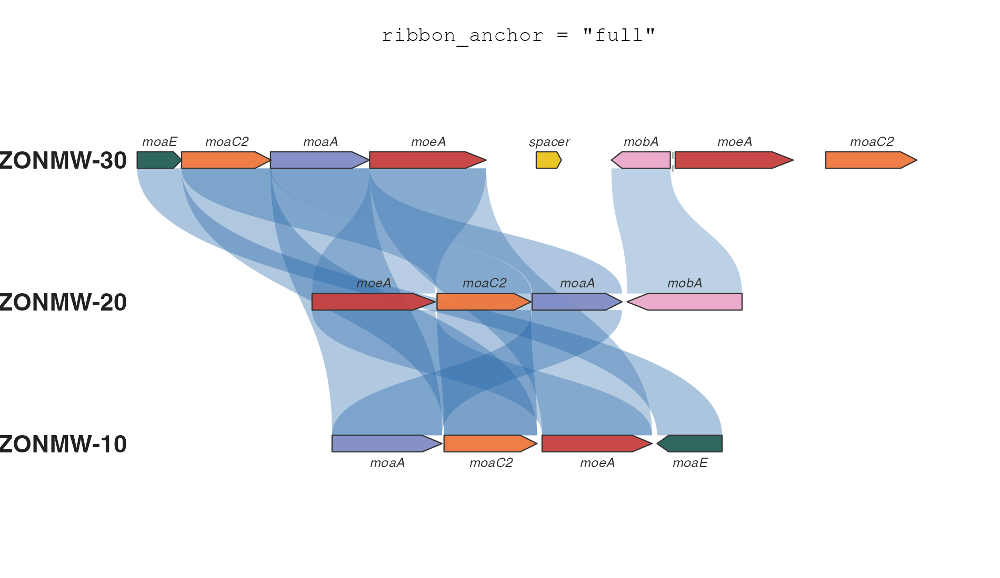
</p>

<a id="plot-circular-synteny"></a>
### `plot_circular_synteny()` — chromosome-level, ring

Arranges chromosomes as proportional arcs around a circle and connects
syntenic blocks with ribbons inside. Same input tables as `plot_synteny()`;
all relationships among the selected species are drawn, including
non-adjacent ones.

| Argument | Default | What it does |
|----|----|----|
| `syn_data`, `species_order` | — | As in `plot_synteny()`; the order runs around the circle |
| `chr_fill`, `ribbon_fill`, palettes | as linear | Same choices as `plot_synteny()`; `ribbon_fill` also accepts any `blocks` column name |
| `chr_order` | `NULL` | Chromosome order within a species: factor levels, `"input"`, a vector, or a per-species list |
| `gap`, `group_gap` | `1`, `10` | Gaps between chromosomes and between species, in degrees |
| `start_angle`, `clockwise` | `90`, `TRUE` | Start at the top, coordinates increasing clockwise |
| `track_width` | `0.055` | Chromosome band thickness as a fraction of the radius |
| `show_orientation` | `FALSE` | Connect endpoints by the block's `plus`/`minus` orientation |

``` r
plot_circular_synteny(rice_sorghum, c("Rice", "Sorghum"), palette = "casa_natal", chr_fill = "per_species")
```


Arc lengths share one genomic scale and ribbons keep their block
coordinates. A twist alone does not identify an inversion around a circle;
use `show_orientation` with the orientation metadata. A ring can also hold a
single circular molecule with annotation rings around it: see the
[genome ring](#annotation-tracks) below.

<a id="plot-circular-microsynteny"></a>
### `plot_circular_microsynteny()` — gene-level, ring

Draws gene regions from several genomes as curved strand-aware arrows with
homology ribbons inside. Same input tables as `plot_microsynteny()`.

| Argument | Default | What it does |
|----|----|----|
| `features`, `links`, `bin_order` | — | As in `plot_microsynteny()`; the order runs around the circle |
| `gene_fill`, `ribbon_fill`, `ribbon_anchor` | as linear | Same choices as `plot_microsynteny()` |
| `gap`, `group_gap` | `2`, `10` | Gaps between contigs and between bins, in degrees |
| `track_width`, `arrowhead_frac` | `0.065`, `0.18` | Arrow thickness and arrowhead length |
| `label_genes` | `TRUE` | Italic gene-name labels outside the arrows |

``` r
plot_circular_microsynteny(micro$features, micro$links, palette = "casa_natal", ribbon_fill = "per_name")
```

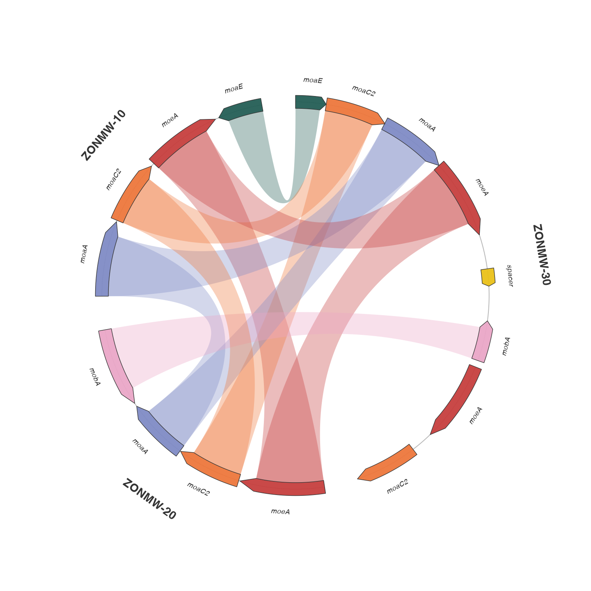

**Real data.** Three bacteria, 21 genes across four contigs, nine supplied
homology links, from the bundled TSVs:

``` r
features <- read.delim(system.file("extdata", "circular_bacterial_features.tsv", package = "ggsynteny"))
links    <- read.delim(system.file("extdata", "circular_bacterial_links.tsv", package = "ggsynteny"))
plot_circular_microsynteny(features, links, bin_order = c("ZONMW-30", "ZONMW-20", "HI1"),
                           palette = "casa_natal", ribbon_fill = "per_name",
                           ribbon_alpha = 0.36, group_gap = 15, gap = 5)
```

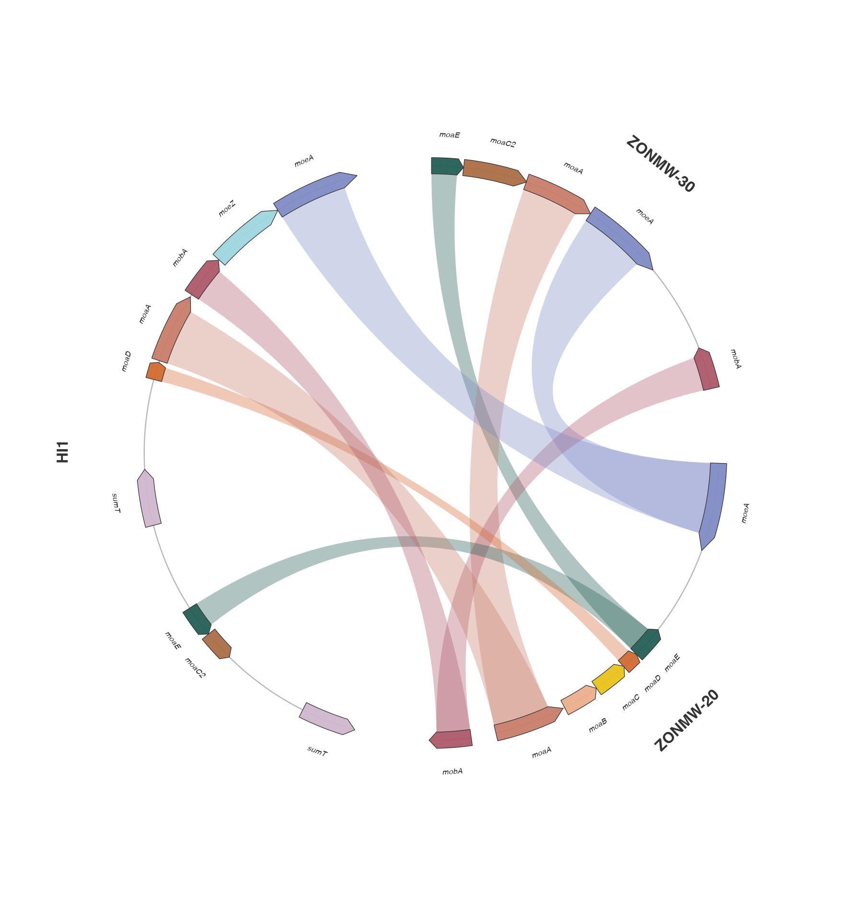

No links or identity scores are inferred; the figure shows the supplied
relationships only. The [circular guide](https://loukesio.github.io/ggsynteny/articles/circular-synteny.html)
covers coordinates, orientation and export.

---

<a id="add-to-any-plot"></a>
## Add to any plot

<a id="annotation-tracks"></a>
### Annotation tracks — `syn_track_*()`

**Not a fifth plot type, an add-on.** A track is a table of intervals plus a
geom saying how to draw what each interval carries. Add one with `+` to any
of the four plots; the genome ring at the top of this page is
`plot_circular_synteny()` plus four tracks and an axis. Tracks are in the
development version on GitHub, not in the published 0.5.0 release. Tracks stack
below each genome in linear plots, and outward from the chromosome band in
rings (or inward with `position = "inside"`, where the ribbons shrink to make
room). One wrapper per geom lists only the options it uses:

| Wrapper | Draws | Reads | Key options |
|---|---|---|---|
| `syn_track_feature()` | boxes coloured by a category: genes, regions, repeats | `start`, `end`, the `fill` column; optional `label`, `strand` | `fill`, `palette`, `strand = "split"`/`"arrow"`, `label` |
| `syn_track_heatmap()` | one colour tile per interval | `start`, `end`, numeric `value` | `limits`, `palette` |
| `syn_track_line()` | a line through interval midpoints | same | `limits`, `reference`, `colour` |
| `syn_track_bar()` | a bar from `baseline` over each interval | same | `limits`, `baseline`, `reference` |

`syn_axis()` adds position ticks, `gc_content()` computes GC per gene or
window from DNA, and `out_of_bounds = "clip"` keeps windows that run past a
sequence end. When the plot shows one species or one sequence, the
`species`/`chr` columns can be left out of the track tables.

``` r
example_dir <- system.file("extdata", "gc-tracks", package = "ggsynteny")   # bundled, simulated DNA
read_example <- function(name) read.delim(file.path(example_dir, paste0(name, ".tsv")))
features <- read_example("features"); links <- read_example("links"); dna <- read_example("sequences")
gene_gc   <- gc_content(dna, intervals = features)       # one GC value per gene
window_gc <- gc_content(dna, window = 300, step = 100)   # GC in sliding windows
gene_gc$gc_class <- ifelse(is.na(gene_gc$value), "No called bases",
                           ifelse(gene_gc$value >= 50, "GC-rich gene", "AT-rich gene"))

plot_microsynteny(features, links, gene_fill = "uniform", label_genes = FALSE) +
  syn_track_feature(gene_gc, fill = "gc_class", strand = "arrow", name = "Gene class") +
  syn_axis(by = 1000, unit = "kb") +
  syn_track_line(window_gc, name = "Window GC (%)", reference = 50)
```

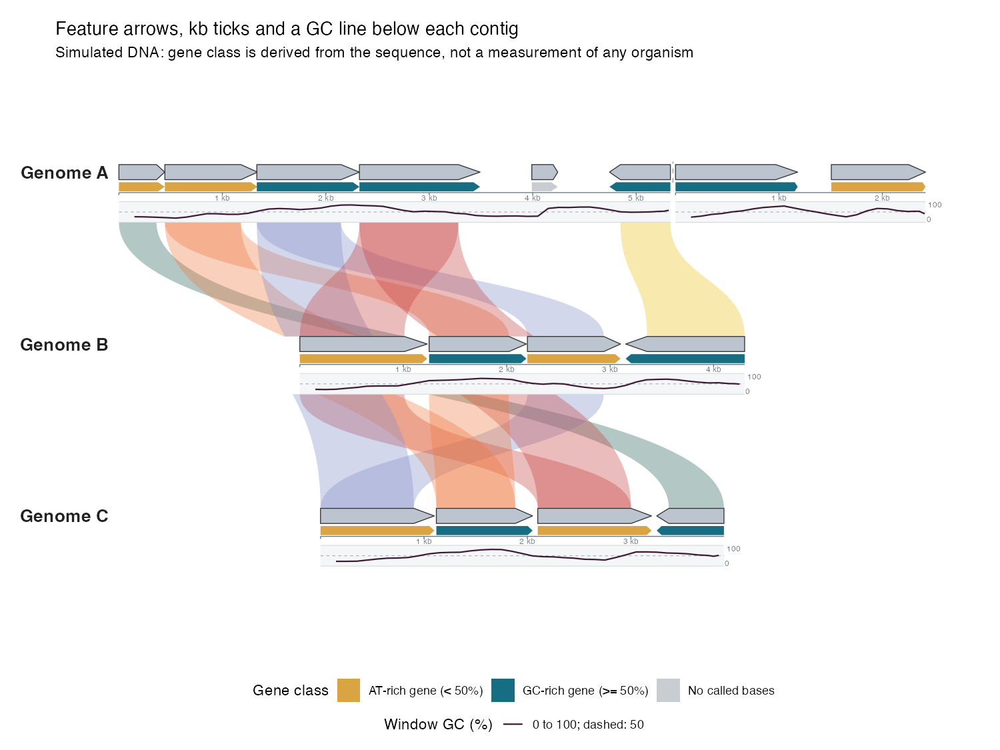

Together they draw a complete genome map. The data are the published
*Arabidopsis thaliana* chloroplast annotation (RefSeq NC_000932.1), bundled
with the package: one circular molecule as one sector, four regions, genes by
strand and function, GC content and GC skew per window, and the 17 genes of
the inverted repeat joined to their copies.

``` r
dir <- system.file("extdata", "chloroplast", package = "ggsynteny")
regions <- read.csv(file.path(dir, "regions.csv"));  genes <- read.csv(file.path(dir, "genes.csv"))
windows <- read.csv(file.path(dir, "gc_windows.csv")); pairs <- read.csv(file.path(dir, "ir_pairs.csv"))
syn <- list(chromosomes = data.frame(species = "Arabidopsis thaliana", chr = "plastid", size = 154478),
            blocks = data.frame(species1 = "Arabidopsis thaliana", chr1 = "plastid", start1 = pairs$b_start,
                                end1 = pairs$b_end, species2 = "Arabidopsis thaliana", chr2 = "plastid",
                                start2 = pairs$a_start, end2 = pairs$a_end, class = pairs$class))
gc   <- data.frame(start = windows$start, end = windows$start + 999, value = 100 * windows$gc)
skew <- data.frame(start = windows$start, end = windows$start + 999, value = windows$skew)

plot_circular_synteny(syn, ribbon_fill = "class", ribbon_legend = FALSE, label_size = 0, species_label_size = 0) +
  syn_track_feature(regions, fill = "region", label = "region", height = 0.07, gap = 0, show.legend = FALSE) +
  syn_axis(by = 10000, unit = "kb", gap = 0) +
  syn_track_feature(genes, fill = "class", strand = "split", position = "inside", height = 0.14, out_of_bounds = "clip") +
  syn_track_line(gc, name = "GC (%)", limits = c(20, 60), reference = 36.3, position = "inside", height = 0.15, out_of_bounds = "clip") +
  syn_track_heatmap(skew, name = "GC skew", limits = c(-0.25, 0.25), position = "inside", height = 0.05, out_of_bounds = "clip")
```


[Reproduce the ring](data-raw/genome_ring.R) ·
[Track guide](https://loukesio.github.io/ggsynteny/articles/annotation-tracks.html) ·
[Data provenance](inst/extdata/chloroplast/README.md)

<a id="syn-girafe"></a>
### Interactive plots — `syn_girafe()`

Build any plot with `interactive = TRUE` and render it with `syn_girafe()`
(via **ggiraph**). Hovering a ribbon fades the others and shows the block
coordinates, or the gene pair and its identity in gene-level plots. Tracks
stay static. Try it in the
[interactive article](https://loukesio.github.io/ggsynteny/articles/interactive.html).

``` r
p <- plot_synteny(rice_sorghum, c("Rice", "Sorghum"), palette = "casa_natal", chr_fill = "per_chr",
                  interactive = TRUE)
syn_girafe(p)
```

<a id="syn-palettes"></a>
### Palettes — `syn_palettes()`

Every `palette` argument accepts the 32 palettes of the
[ltc package](https://github.com/loukesio/ltc-color-palettes) by name
(vendored, so ltc need not be installed), `"Okabe-Ito"`, any colour vector,
and `grDevices::hcl.colors()` names. Names ignore case, spaces, underscores
and dashes. `syn_palettes()` returns them all; the `heatmap0` to `heatmap3`
palettes are ordered ramps for `ribbon_fill = "identity"` and heatmap tracks.

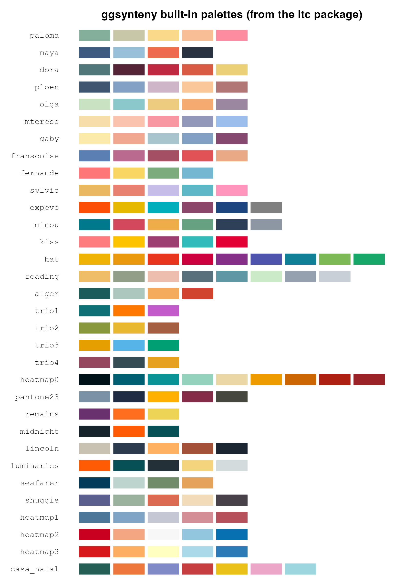

---

<a id="ggsynteny-app"></a>
## ggsynteny Studio — `ggsynteny_app()`

**[Open ggsynteny Studio in your browser](https://01a0ae1e-adb1-a4f8-1ced-261952037ebf.share.connect.posit.cloud/)**,
or run it locally:

``` r
install.packages("shiny")   # optional; needed only for the app
ggsynteny_app()
```

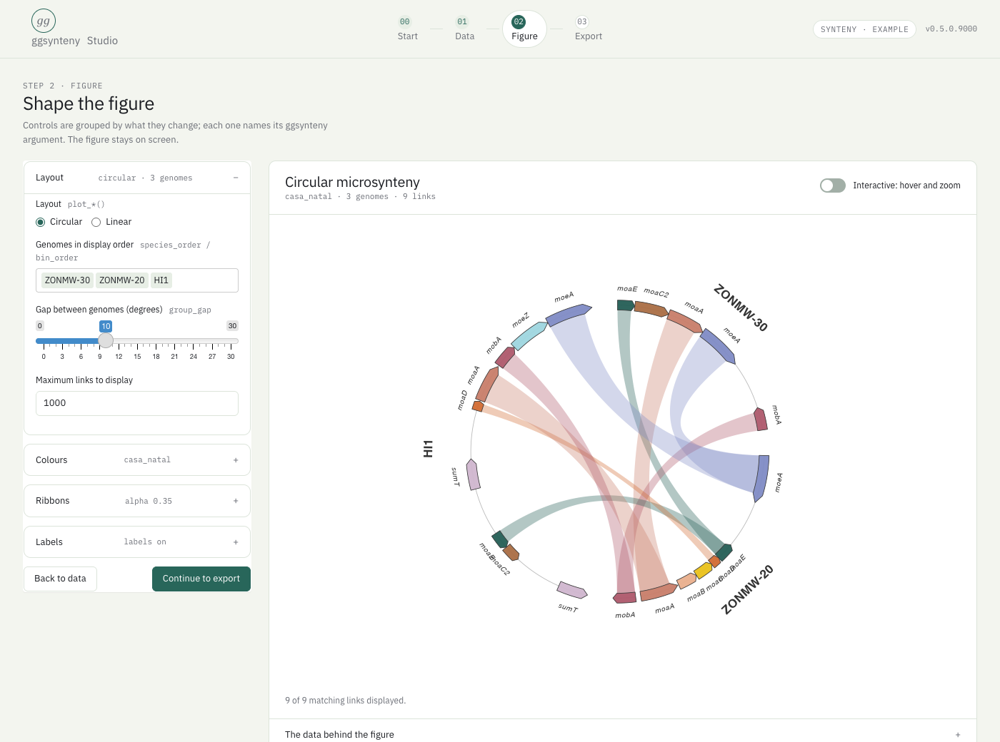

Select the software or table format, upload its files, and see the data and
plot preview. Switch between the four plots, choose a palette, reorder or
subset genomes, adjust ribbons, turn on the interactive switch for tooltips
and zoom, and download the figure (PDF or PNG), the displayed tables, pair
counts, or an R script that recreates the figure.

| Results from | Upload | Views |
|----|----|----|
| Native chromosome tables | Chromosome sizes and syntenic blocks, TSV or CSV | Linear and circular chromosome synteny |
| MCScanX | `.collinearity` and its gene-position GFF | Linear and circular chromosome synteny |
| GENESPACE | `synHits` TSV | Linear and circular chromosome synteny |
| Gene / link tables | Gene features and homology links, TSV or CSV | Linear and circular microsynteny |

Every format includes example data (the MCScanX and GENESPACE previews are
explicitly simulated). Uploaded tables are validated; no identity scores or
missing links are inferred, and the app reads existing results rather than
running MCScanX, GENESPACE or an aligner. To host your own copy, see the
[Posit Connect Cloud guide](deploy/posit-connect-cloud/README.md).

<a id="reference-comparison"></a>
### Reference comparison

Studio's **Reference comparison** tab draws a different kind of figure: one
reference sequence in the centre and each comparison genome as an outer ring
in the reference's coordinates, showing variant calls (insertions, deletions,
duplications, inversions, SNPs) and alignment identity per window. The same
view is available in R as `plot_reference_comparison()`, with
`save_reference_comparison()` for PDF and PNG exports in the bundled fonts.
`palette` colours the variant marks and `identity_palette` the identity
shading. The bundled example, five genomes with identity for every 30-kb
window, is invented teaching data.

``` r
dir <- system.file("extdata", "reference_comparison", package = "ggsynteny")
variants <- read.delim(file.path(dir, "variants_five_genomes.tsv"))
identity <- read.delim(file.path(dir, "identity_five_genomes.tsv"))
p <- plot_reference_comparison(variants, genome_length = 4800000, reference = "Example reference",
                               sample_order = paste0("Genome_", LETTERS[1:5]), palette = "casa_natal",
                               identity_windows = identity, identity_palette = c("#E8D5A8", "#6FA8C9", "#1B3A5C"),
                               title = "Five invented genomes against one reference")
save_reference_comparison(p, "reference-comparison.pdf")   # bundled IBM Plex fonts; needs showtext + sysfonts
```

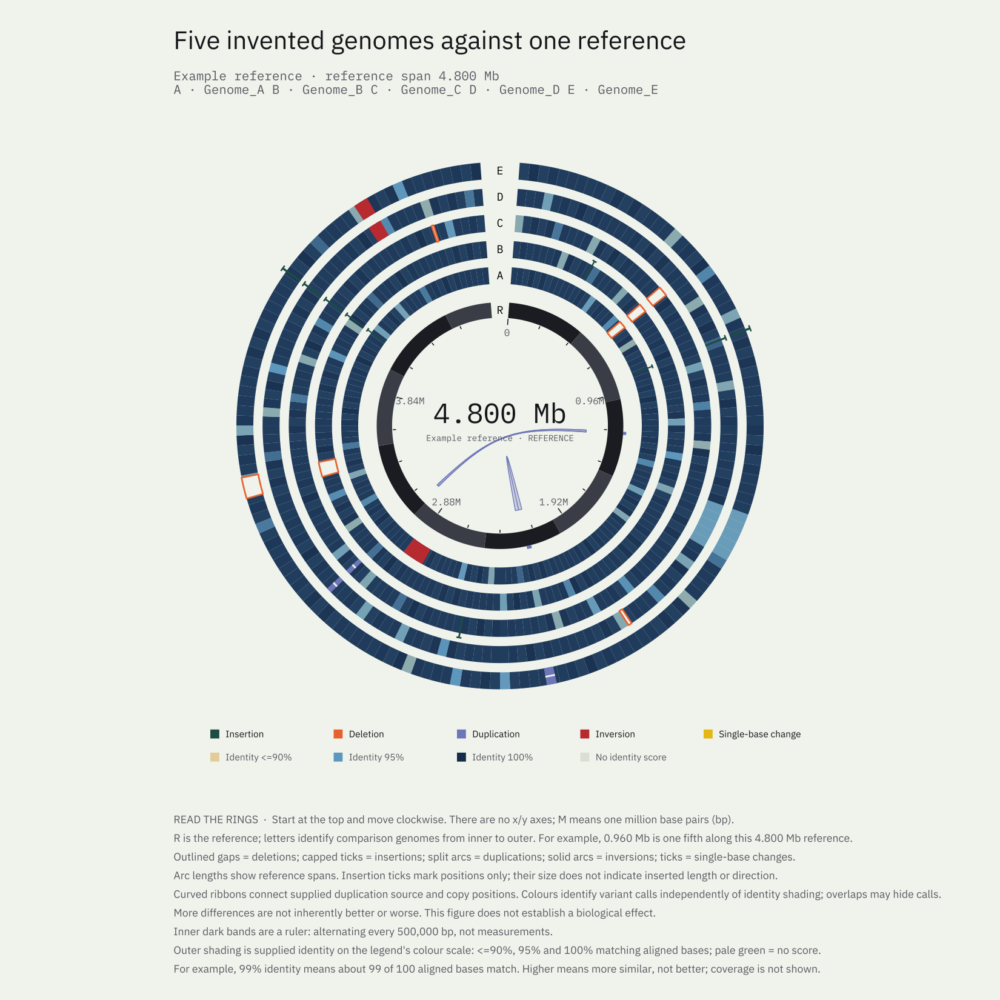

Read clockwise from the top. Inner bands are a coordinate ruler; marks show
the event types in the legend; ring shading is alignment identity per window,
from sand (90% or below) to navy (100%), computed from an alignment and not
from the number of variants. See
`?plot_reference_comparison` for the input tables and how to read each mark.

---

<a id="data-input-formats"></a>
## Data input formats

Each format ships with a small example under
`system.file("extdata", ..., package = "ggsynteny")`.

**Native TSV**, two files in any consistent unit:

``` r
syn <- read_synteny_tsv(system.file("extdata", "chromosomes.tsv", package = "ggsynteny"),
                        system.file("extdata", "synteny_blocks.tsv", package = "ggsynteny"))
```

    chromosomes.tsv            synteny_blocks.tsv
    species  chr  size         species1  chr1  start1  end1  species2  chr2  start2  end2
    Human    1    249          Human     1     10      25    Mouse     1     80      95
    Mouse    1    195          Human     2     5       40    Mouse     2     60      100

**MCScanX**: `read_mcscanx(collinearity_file, gff_file)` keeps
`plus`/`minus` in `blocks$orientation`; `show_inversions = TRUE` draws
inverted blocks as twisted ribbons.

**GENESPACE**: `read_genespace(synhits_file)`.

**Gene tables** for the gene-level plots: `features` with `bin_id`,
`seq_id`, `start`, `end`, `strand`, `feat_id`, `name`; `links` with
`feat_id_a`, `feat_id_b` and optional `identity`.

## Saving your plot

`width`/`height` decide how big and sharp the image is; `dpi` decides how
big the letters are relative to the plot.

``` r
ggplot2::ggsave("synteny.png", p, width = 2600, height = 1500, units = "px", dpi = 300, bg = "white")
ggplot2::ggsave("synteny.pdf", p, width = 12, height = 7)   # vector, for journals
```

## API reference

| Function | Purpose |
|----|----|
| `plot_synteny()`, `plot_circular_synteny()` | Chromosome-level synteny, linear tiers or ring |
| `plot_microsynteny()`, `plot_circular_microsynteny()` | Gene-level synteny, linear tiers or ring |
| `syn_track()` and `syn_track_feature()`, `syn_track_heatmap()`, `syn_track_line()`, `syn_track_bar()` | Annotation tracks added with `+` |
| `syn_axis()` | Coordinate ticks and labels along every sequence |
| `gc_content()` | GC per gene or window from DNA strings |
| `scale_fill_syn_heatmap()`, `scale_fill_syn_feature()` | Recolour one track |
| `syn_layout()`, `syn_project()` | Sector geometry and genomic-to-plot projection for custom layers |
| `syn_girafe()` | Render an `interactive = TRUE` plot as a hoverable widget |
| `syn_palettes()` | The 32 built-in colour palettes |
| `ggsynteny_app()` | Studio: upload results, preview all four plots, export |
| `plot_reference_comparison()`, `save_reference_comparison()` | Reference-centred variant and identity rings |
| `read_synteny_tsv()`, `read_mcscanx()`, `read_genespace()` | Parsers |
| `rice_sorghum`, `example_synteny_data()`, `example_microsynteny_data()` | Bundled data |

## Citation

``` r
citation("ggsynteny")
```

## Contributions

ggsynteny is developed and maintained by Loukas Theodosiou
(loukesio@gmail.com). Issues and pull requests are welcome at
<https://github.com/loukesio/ggsynteny/issues>. It pairs with its sibling
packages [ltc](https://github.com/loukesio/ltc-color-palettes) (colour
palettes) and [ggvmap](https://github.com/loukesio/ggvmap) (Voronoi treemaps).

## License

MIT © 2026 Loukas Theodosiou — see [LICENSE.md](LICENSE.md).
