# GC content and annotation tracks

Add a GC-content strip to any synteny plot with `p + syn_track(values)`.
The same table works in linear and circular views. Choose
`geom = "heatmap"`, `"line"`, or `"bar"`, and combine them with `+`. The
underlying gene and ribbon colors keep their own meaning. All drawing
uses ggplot2 layers.

## A complete gene example

These bundled DNA strings are simulated. They demonstrate the
calculation and alignment; their GC values are not measurements of real
organisms.

``` r

example_dir <- system.file("extdata", "gc-tracks", package = "ggsynteny")
read_example <- function(name) {
  readr::read_tsv(file.path(example_dir, paste0(name, ".tsv")), show_col_types = FALSE)
}
features <- read_example("features")
links <- read_example("links")
dna <- read_example("sequences")
gene_gc <- gc_content(dna, intervals = features)
```

``` r

p <- plot_microsynteny(features, links, palette = "casa_natal",
                      ribbon_fill = "per_name")
p + syn_track(gene_gc) + ggplot2::labs(title = "GC content per gene: simulated DNA")
```

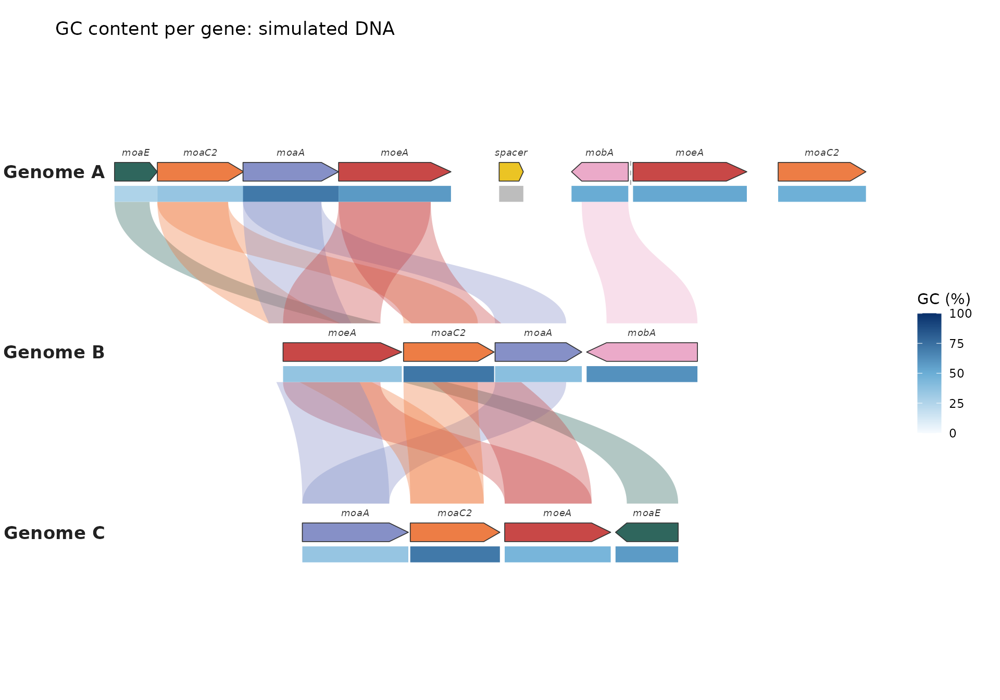

``` r

plot_circular_microsynteny(features, links, palette = "casa_natal",
                          ribbon_fill = "per_name") +
  syn_track(gene_gc) + ggplot2::labs(title = "The same GC values around a circle")
```

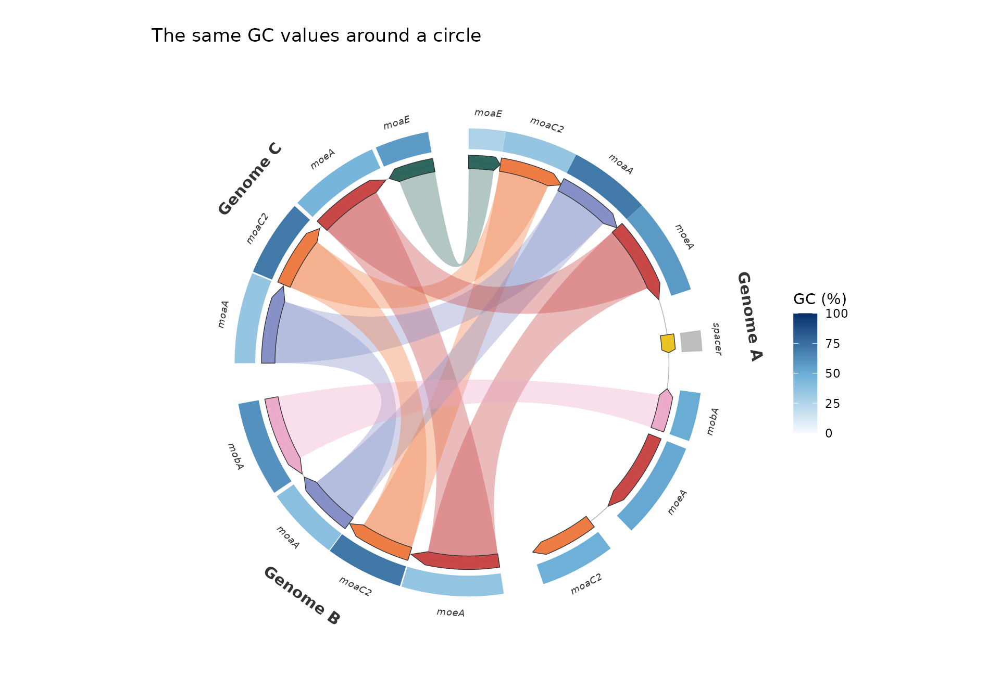

GC is the percentage of called bases that are G or C:
`100 * (G + C) / (A + C + G + T)`. Ambiguous bases such as `N` are left
out of the denominator. `n_called` and `n_ambiguous` let you assess how
much sequence supports each value. An interval with no called bases has
`NA`, drawn grey. Missing intervals remain gaps. Neither is treated as
zero.

## Chromosome windows

``` r

syn <- list(chromosomes = read_example("chromosomes"), blocks = read_example("blocks"))
window_gc <- gc_content(dna, window = 250)
plot_synteny(syn, unique(syn$chromosomes$species), palette = "casa_natal") +
  syn_track(window_gc, name = "GC (%) / 250 bp") +
  ggplot2::theme(plot.margin = ggplot2::margin(10, 30, 10, 100))
```

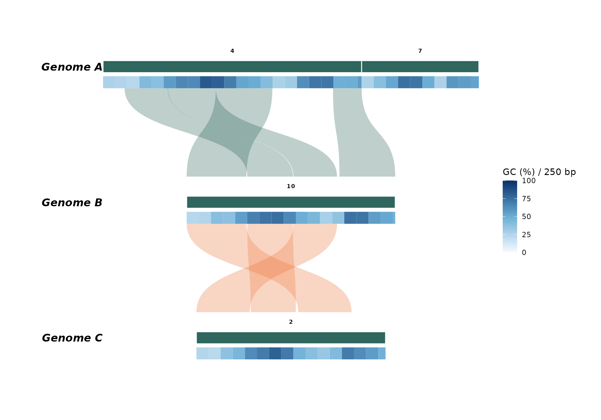

``` r

plot_circular_synteny(syn, palette = "casa_natal") +
  syn_track(window_gc, name = "GC (%) / 250 bp")
```

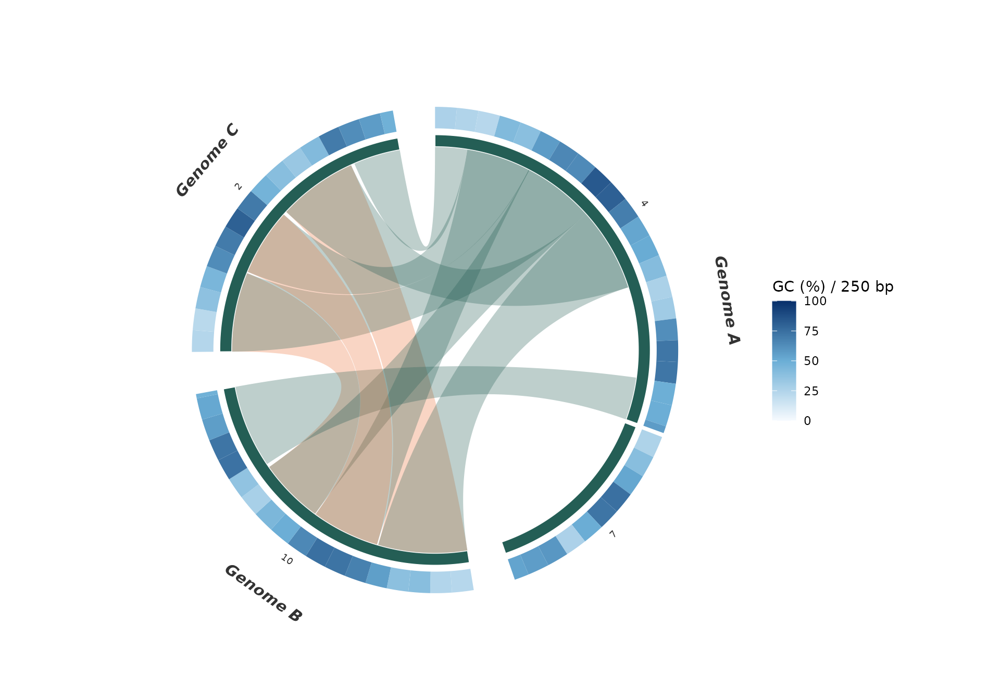

The final window is shortened at a sequence end. Set `step` smaller than
`window` to calculate sliding windows. Their intervals overlap; tiles
draw in input order, with later rows on top. For an unambiguous heatmap,
use non-overlapping windows or reduce overlapping measurements to
disjoint bins before plotting. A line track instead plots the value at
each window center, so overlapping sliding windows can be displayed
directly. Intervals crossing a circular origin must first be split; the
calculator does not wrap windows around the origin.

## Supplying your own measurements

The common table has five columns:

| Column         | Meaning                                                |
|----------------|--------------------------------------------------------|
| `group`        | Species in chromosome plots; bin/genome in gene plots  |
| `seq_id`       | Chromosome or contig identifier within that group      |
| `start`, `end` | Interval boundaries in the plot’s coordinate system    |
| `value`        | Numeric measurement; GC uses percentages from 0 to 100 |

Existing `species`/`chr` and `bin_id`/`seq_id` columns also work. Gene
feature tables can be passed directly after adding a `value` column.
Rows for groups not shown in the plot are omitted with a warning.
Unknown sequences within a displayed group and intervals outside
displayed bounds cause an error. Gene plots only display each contig’s
first-to-last feature span; restrict window tables to those bounds
before adding them.

[`gc_content()`](https://loukesio.github.io/ggsynteny/reference/gc_content.md)
reads character DNA strings, with sequence coordinate zero at the first
base. Its intervals use **zero-based, half-open base-pair coordinates**:
`start = 0, end = 4` selects bases 1 through 4. Convert one-based
inclusive gene annotations by subtracting 1 from `start` and leaving
`end` unchanged. If a chromosome plot uses kb or Mb, convert the
calculated interval coordinates to that unit before plotting. GC values
cannot be obtained from synteny links, block ranks, or gene positions
alone.

For unavailable sequence, supply `NA_character_` in `sequence` and
explicit intervals. Missing sequence identifiers are errors. Sequences
with no length cannot be used to create windows. Lowercase and
whitespace are accepted; gaps and non-DNA characters are rejected.
Reverse-complementing a gene does not change its GC content.

## Multiple tracks and custom colors

The first addition is closest to the chromosome or gene row. Later
additions stack below linear genes or outward around a circle, with
their own legends. Linear rows expand automatically; ribbons occupy
separate gaps, and gene labels sit above the genes. Links skipping a row
are split across the gaps, never drawn through intervening tracks.
Circular labels move outward as before.

``` r

sliding_gc <- gc_content(dna, window = 400, step = 100)
ambiguous <- gc_content(dna, window = 100)
ambiguous$value <- 100 * ambiguous$n_ambiguous / (ambiguous$end - ambiguous$start)
tracks <- list(
  syn_track(gene_gc, geom = "heatmap", name = "Gene GC (%)", height = 0.055),
  syn_track(sliding_gc, geom = "line", name = "Window GC (%)",
            height = 0.19, gap = 0.025, colour = "#176D81", reference = 50),
  syn_track(ambiguous, geom = "bar", name = "Ambiguous bases (%)",
            height = 0.11, gap = 0.025, colour = "#BE7442")
)
plot_microsynteny(features, links, palette = "casa_natal", label_genes = FALSE) + tracks
```

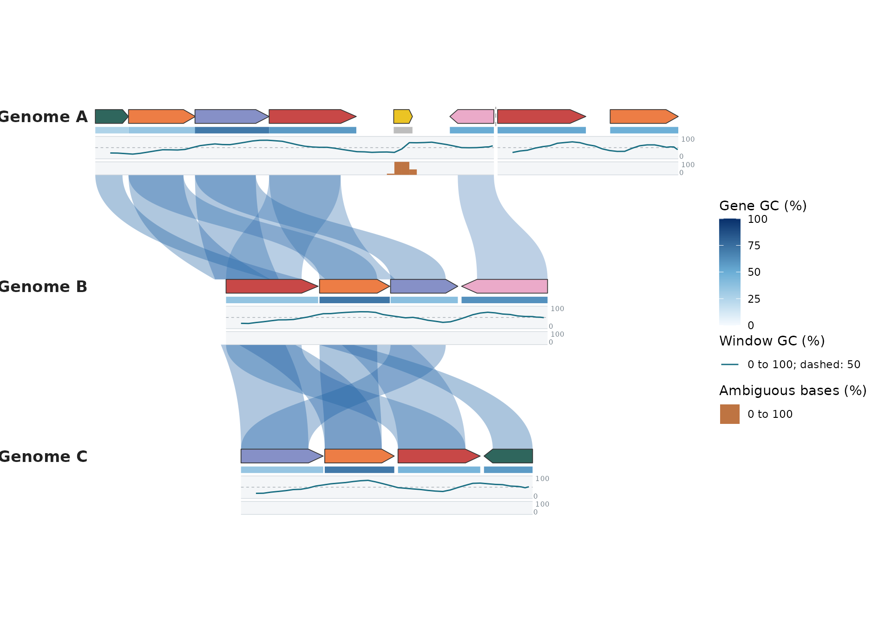

``` r

plot_circular_microsynteny(features, links, palette = "casa_natal", label_genes = FALSE) + tracks
```

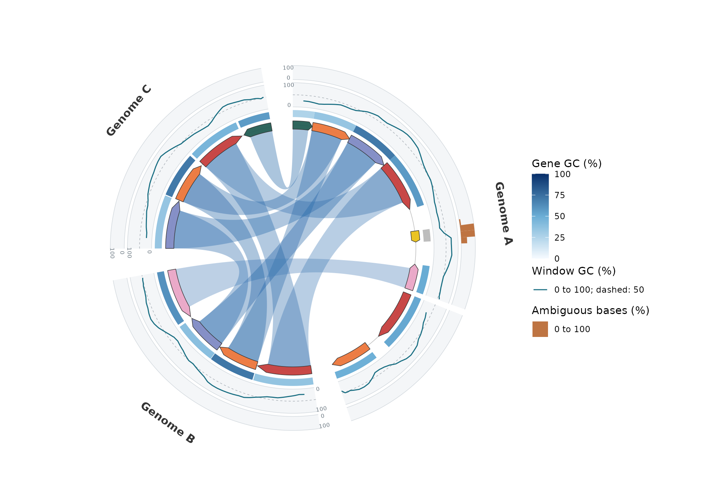

Each track owns its value range, set through `limits`. Lines and bars
increase upward in a linear plot and outward in a circular plot. The
edge labels show the lower and upper limits. `reference` adds a dashed
guide at a chosen value. Use `axis = FALSE` to hide the edge labels and
`show.legend = FALSE` to hide the track’s legend. `colour` sets line/bar
color; `linewidth` sets line thickness. Heatmap colors still use
`palette` and
[`scale_fill_syn_heatmap()`](https://loukesio.github.io/ggsynteny/reference/scale_fill_syn_heatmap.md).

Set `reference = NULL` to remove the middle guide. Style each part with
native ggplot2 elements, independently of the other tracks:

``` r

p + syn_track(gene_gc, geom = "line", colour = "#176D81", reference = NULL,
  background = ggplot2::element_rect(fill = "ivory", colour = NA),
  border = ggplot2::element_line(colour = "#BACACD", linewidth = 0.3))
```

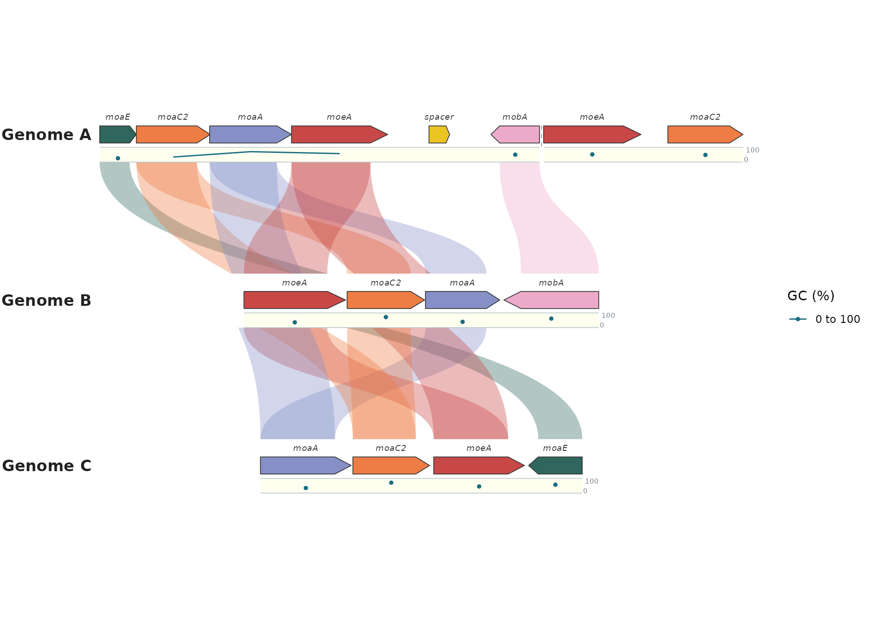

`background = element_blank()` removes the background;
`border = element_blank()` removes boundary lines. To change a visible
guide, supply `reference = 50` and
`reference_line = element_line(colour = "grey60", linetype = "dotted")`.
The background rectangle can also carry a full outline through its
`colour`. These styles are translated into ordinary ggplot2 polygon and
path layers; plots remain editable ggplot objects, not images or
separate drawing systems.

Lines sort window centers within each contig, with breaks at missing
values, uncovered gaps and contig boundaries. A lone value appears as a
point. Window centers must be distinct within a contig. Circular lines
interpolate genomic position and value before drawing, so sparse points
follow the ring; they do not connect across the circle’s origin. No
smoothing or new GC estimates are applied. Changing window width or step
changes the summaries being plotted.

Bars span each interval and start at `baseline`, which defaults to the
lower limit. For a signed measurement, use
e.g. `limits = c(-1, 1), baseline = 0`. Missing bars leave gaps; missing
heatmap values use `na.value`. Tracks with only missing line/bar values
retain the empty lane and axes, with no data key in the legend. Bars and
heatmaps draw overlapping intervals in input order.

You can also stack two heatmaps:

``` r

uncalled <- gene_gc
uncalled$value <- 100 * uncalled$n_ambiguous / (uncalled$end - uncalled$start)
p + syn_track(gene_gc, name = "GC (%)") +
  syn_track(uncalled, name = "Ambiguous bases (%)", palette = c("#FFF7EC", "#7F0000"))
```

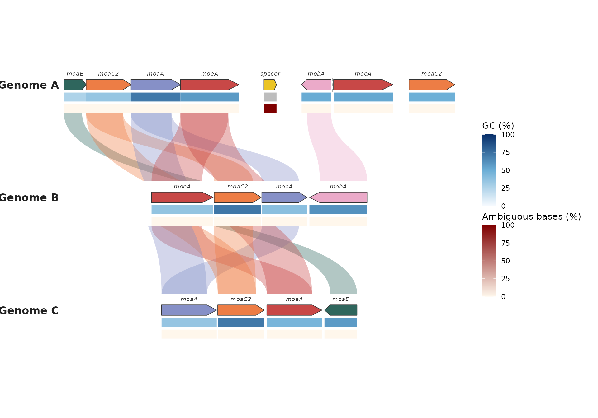

`height` and `gap` are fractions of linear row spacing or the original
circle radius. Linear rows expand automatically; reduce these fractions
for a more compact plot. Use `limits` and `name` for other numeric
measurements, for example
`syn_track(coverage, name = "Depth", limits = c(0, 200))`.

``` r

p + syn_track(gene_gc) +
  scale_fill_syn_heatmap(track = 1, palette = "casa_natal", breaks = c(0, 50, 100)) +
  ggplot2::theme(legend.position = "bottom")
```

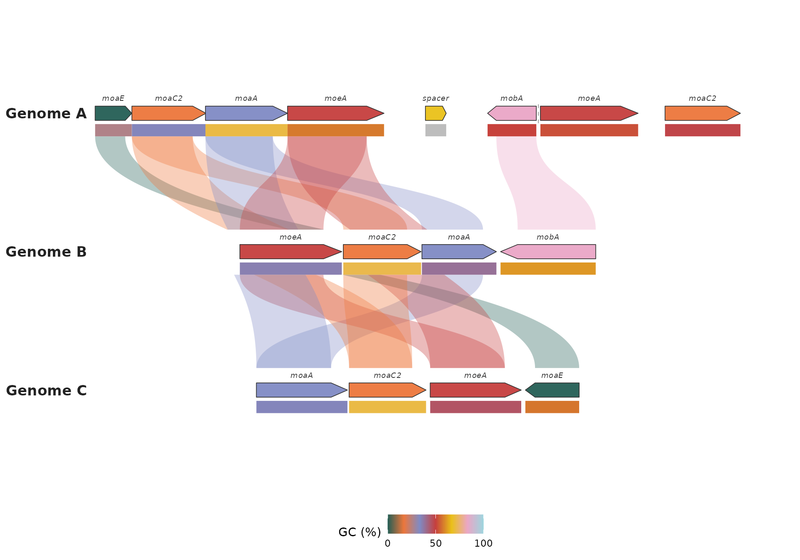

The ordinary ggplot2 scale-replacement message is expected when
replacing a track scale. Numeric limits stay shared across all groups,
making colors comparable. `na.value` changes the color for explicitly
missing measurements.

Add tracks before replacing coordinates. Faceting and coordinate
transforms are not supported for track placement. All track types are
static even on interactive plots; existing gene and ribbon hover
information still works. Studio does not yet provide a track upload
control.

## Feature tracks, coordinate axes and a genome ring

A track is a table of intervals plus a `geom` saying how to draw what
each interval carries. Numeric tracks cover measurements; genes, regions
and other annotated intervals are categories. One wrapper per geom lists
only the options that geom uses:

| Wrapper | Draws | Reads from `data` | Key options |
|----|----|----|----|
| [`syn_track_feature()`](https://loukesio.github.io/ggsynteny/reference/syn_track_geoms.md) | boxes coloured by a category | `start`, `end`, the `fill` column; optional `label`, `strand` | `fill`, `palette`, `strand = "split"` or `"arrow"`, `label`, `colour`, `alpha` |
| [`syn_track_heatmap()`](https://loukesio.github.io/ggsynteny/reference/syn_track_geoms.md) | one colour tile per interval | `start`, `end`, numeric `value` | `limits`, `palette`, `na.value` |
| [`syn_track_line()`](https://loukesio.github.io/ggsynteny/reference/syn_track_geoms.md) | a line through interval midpoints | same | `limits`, `reference`, `colour`, `linewidth`, `axis` |
| [`syn_track_bar()`](https://loukesio.github.io/ggsynteny/reference/syn_track_geoms.md) | a bar from `baseline` over each interval | same | `limits`, `baseline`, `reference`, `colour`, `axis` |

Every wrapper also takes `name` (legend title), `height` and `gap` (lane
size), `show.legend`, `background` and `border`, `position` and
`out_of_bounds`.
[`syn_track()`](https://loukesio.github.io/ggsynteny/reference/syn_track.md)
itself accepts them all and picks the geom from the table when `geom` is
not given: a `value` column means a heatmap, anything else a feature
track.
[`syn_axis()`](https://loukesio.github.io/ggsynteny/reference/syn_axis.md)
adds tick marks and position labels. In circular plots any of them can
go `position = "inside"` the chromosome band, where the ribbons shrink
to make room. Intervals running past a sequence end (the last GC window,
a gene crossing a boundary) are rejected unless `out_of_bounds = "clip"`
or `"drop"`. When the plot shows one species or one sequence, the track
tables need no `species`/`chr` columns; the keys are filled in from the
plot.

The package bundles the published *Arabidopsis thaliana* chloroplast
annotation (RefSeq NC_000932.1, 154,478 bp; see
`system.file("extdata", "chloroplast", "README.md", package = "ggsynteny")`).
A whole genome ring is one sector with everything in its own
coordinates:

``` r

dir <- system.file("extdata", "chloroplast", package = "ggsynteny")
regions <- read.csv(file.path(dir, "regions.csv"))
genes   <- read.csv(file.path(dir, "genes.csv"))
windows <- read.csv(file.path(dir, "gc_windows.csv"))
pairs   <- read.csv(file.path(dir, "ir_pairs.csv"))
syn <- list(chromosomes = data.frame(species = "Arabidopsis thaliana", chr = "plastid", size = 154478),
            blocks = data.frame(species1 = "Arabidopsis thaliana", chr1 = "plastid", start1 = pairs$b_start,
                                end1 = pairs$b_end, species2 = "Arabidopsis thaliana", chr2 = "plastid",
                                start2 = pairs$a_start, end2 = pairs$a_end, class = pairs$class))
gc   <- data.frame(start = windows$start, end = windows$start + 999, value = 100 * windows$gc)
skew <- data.frame(start = windows$start, end = windows$start + 999, value = windows$skew)
pal_class <- c("Photosystems and electron transport" = "#009E73", "ATP synthase" = "#E69F00",
               "NADH dehydrogenase" = "#CC79A7", "Ribosomal proteins" = "#0072B2",
               "tRNA and rRNA" = "#D55E00", "Other genes" = "#9A9A9A")
pal_region <- c(LSC = "#E9DCC4", IRb = "#7FB3B8", SSC = "#C9B79C", IRa = "#7FB3B8")

plot_circular_synteny(syn, ribbon_fill = "class", ribbon_palette = pal_class, ribbon_alpha = 0.55,
                      ribbon_legend = FALSE, chr_palette = "#F1EDE6", chr_color = NA,
                      track_width = 0.02, label_size = 0, species_label_size = 0, group_gap = 1.5) +
  syn_track_feature(regions, fill = "region", label = "region", palette = pal_region,
                    height = 0.07, gap = 0, show.legend = FALSE, label_size = 3.2) +
  syn_axis(by = 10000, unit = "kb", gap = 0) +
  syn_track_feature(genes, fill = "class", strand = "split", palette = pal_class,
                    name = "Gene function", position = "inside", height = 0.14, gap = 0.015,
                    out_of_bounds = "clip") +
  syn_track_line(gc, name = "GC (%)", limits = c(20, 60), reference = 36.3, colour = "#3B1B36",
                 position = "inside", height = 0.15, gap = 0.02, out_of_bounds = "clip") +
  syn_track_heatmap(skew, name = "GC skew", limits = c(-0.25, 0.25),
                    palette = c("#B2182B", "#F7F7F7", "#2166AC"),
                    position = "inside", height = 0.05, gap = 0.015, out_of_bounds = "clip") +
  ggplot2::theme(legend.position = "bottom", legend.box = "vertical") +
  ggplot2::guides(syn_feature3 = ggplot2::guide_legend(nrow = 2))
```

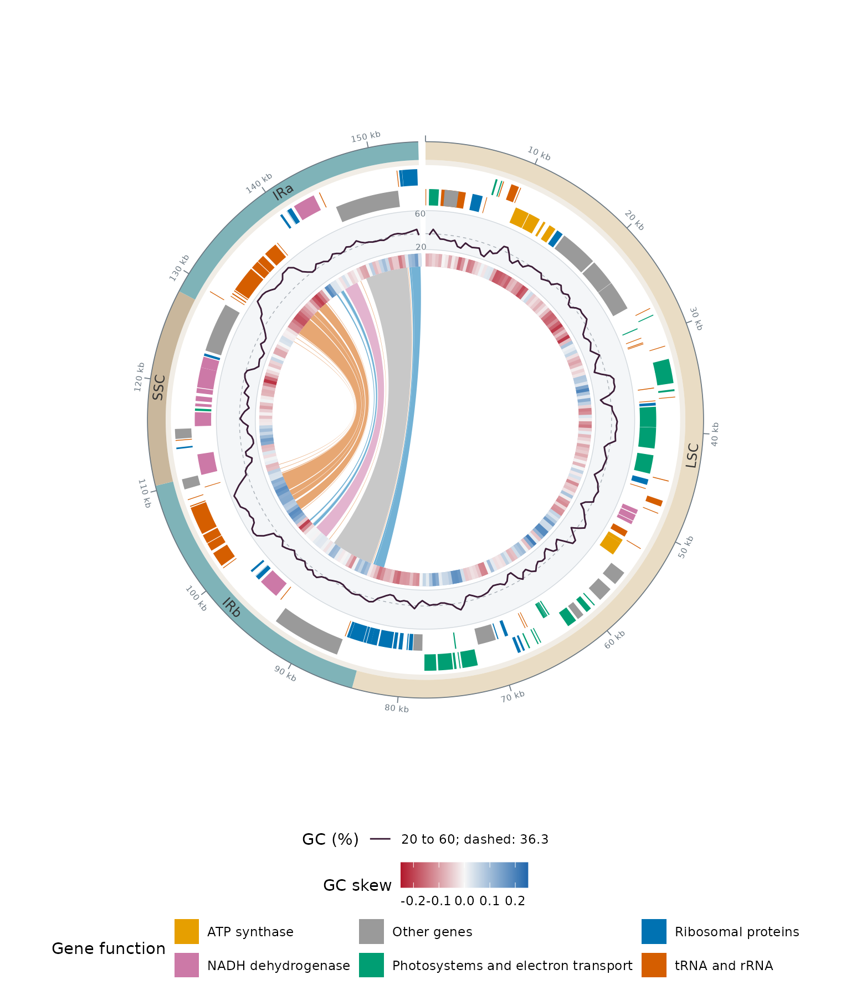

Reading from the outside: the four regions with ticks every 10 kb, genes
on the `+` strand (outer half) and `-` strand (inner half) coloured by
function, GC content in 1-kb windows on a fixed 20–60% scale with the
genome mean dashed, GC skew per window as a diverging heatmap (the sign
flips where replication changes direction), and 17 ribbons joining each
gene of IRb to its copy in IRa, coloured by the `class` column of
`blocks`. Ribbon width follows gene length. Every ring is an ordinary
ggplot2 layer; the guide name `syn_feature3` is the private fill
aesthetic of the third track added.

Chromosomes keep their default order unless you say otherwise:
`chr_order = "input"` follows the `chromosomes` rows, a character vector
or a list named by species gives an explicit order, and a factor `chr`
column uses its levels.

The same additions work in the linear and gene views. Here
`strand = "arrow"` draws gene arrows coloured by a class derived from
the simulated sequence:

``` r

window_gc <- gc_content(dna, window = 300, step = 100)
gene_gc$gc_class <- ifelse(is.na(gene_gc$value), "No called bases",
                           ifelse(gene_gc$value >= 50, "GC-rich gene", "AT-rich gene"))
additions <- list(
  syn_track_feature(gene_gc, fill = "gc_class", strand = "arrow", name = "Gene class",
                    palette = c("GC-rich gene" = "#176D81", "AT-rich gene" = "#D9A441",
                                "No called bases" = "#C8CDD2"), height = 0.07),
  syn_axis(by = 1000, unit = "kb", height = 0.05),
  syn_track_line(window_gc, name = "Window GC (%)", height = 0.16, reference = 50))
plot_microsynteny(features, links, gene_fill = "uniform", gene_palette = "#B8C2CC",
                  ribbon_fill = "per_name", palette = "casa_natal", label_genes = FALSE) + additions
```

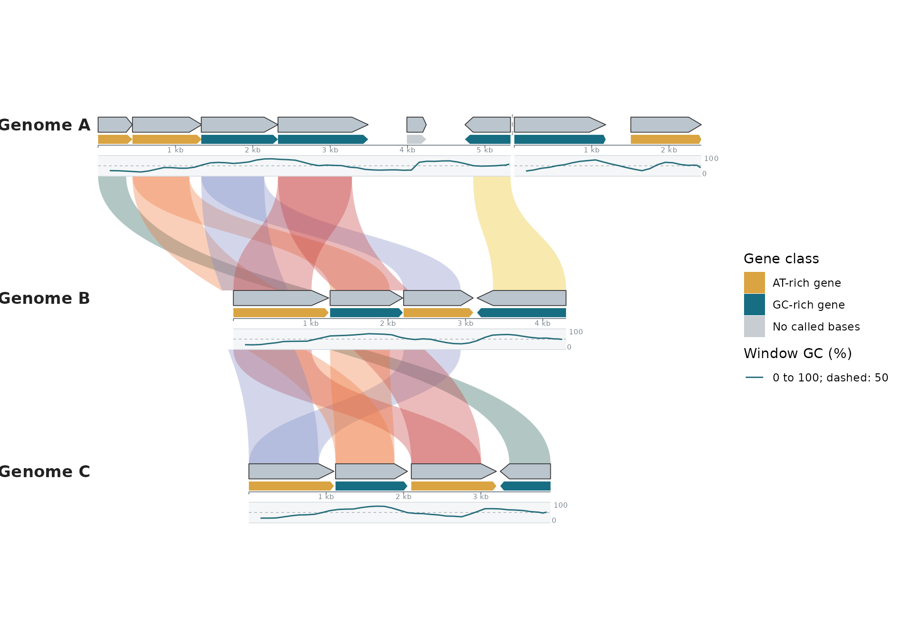

To place something the built-in tracks do not cover, ask the plot for
its geometry.
[`syn_layout()`](https://loukesio.github.io/ggsynteny/reference/syn_layout.md)
returns the sectors with their angles (or x/y positions) and the radii
already used by tracks;
[`syn_project()`](https://loukesio.github.io/ggsynteny/reference/syn_project.md)
turns genomic positions into plot coordinates:

``` r

p <- plot_circular_synteny(syn, ribbon_fill = "class", ribbon_palette = pal_class, label_size = 0)
syn_layout(p)$sectors
```

    ##                  group  seq_id start    end theta_start theta_end
    ## 1 Arabidopsis thaliana plastid     0 154478    1.570796 -4.537856

``` r

origin <- syn_project(p, "Arabidopsis thaliana", "plastid", 1, offset = 1.08)
p + ggplot2::annotate("text", x = origin$x, y = origin$y, label = "position 1", size = 3)
```

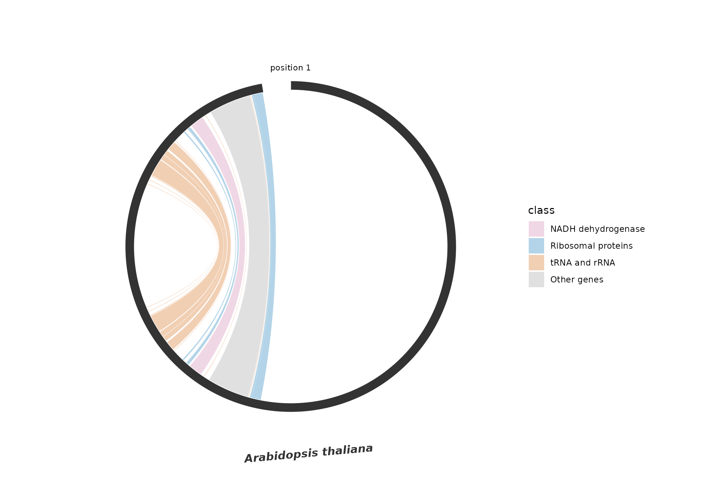

## Design references

The arrangements were informed by
[gbdraw](https://github.com/satoshikawato/gbdraw) and the [circlize
chord-diagram
guide](https://jokergoo.github.io/circlize_book/book/the-chorddiagram-function.html).
This implementation uses [ggplot2’s extension
mechanism](https://ggplot2.tidyverse.org/articles/extending-ggplot2.html),
with polygon layers and a separate continuous aesthetic for every track.
Neither gbdraw nor circlize is a dependency. Existing plotting calls and
the 32 ltc palette definitions are unchanged.
