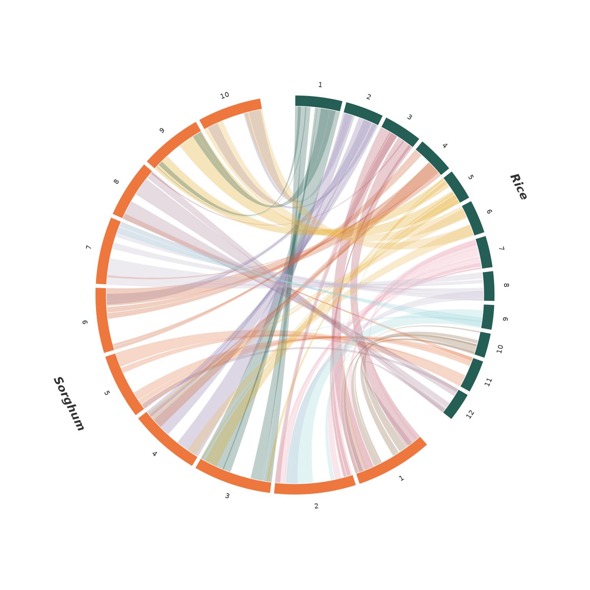
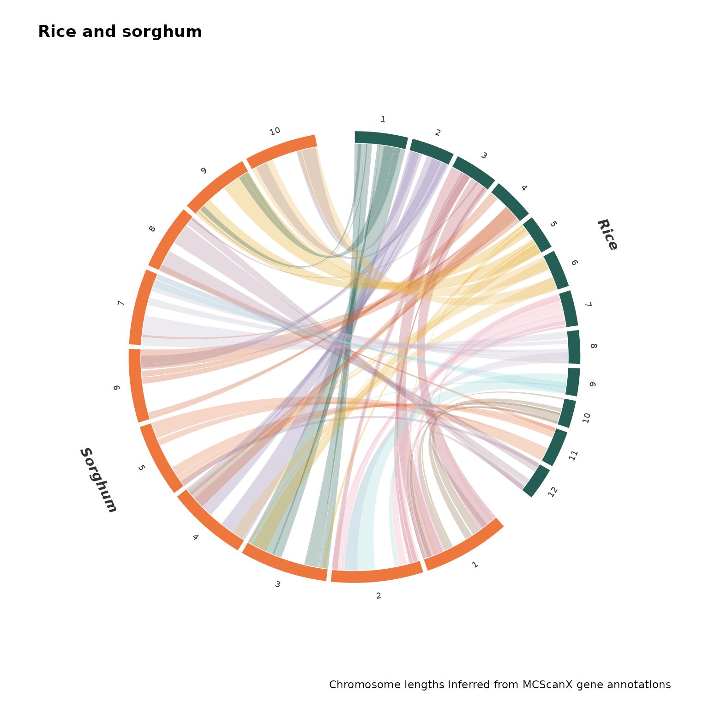
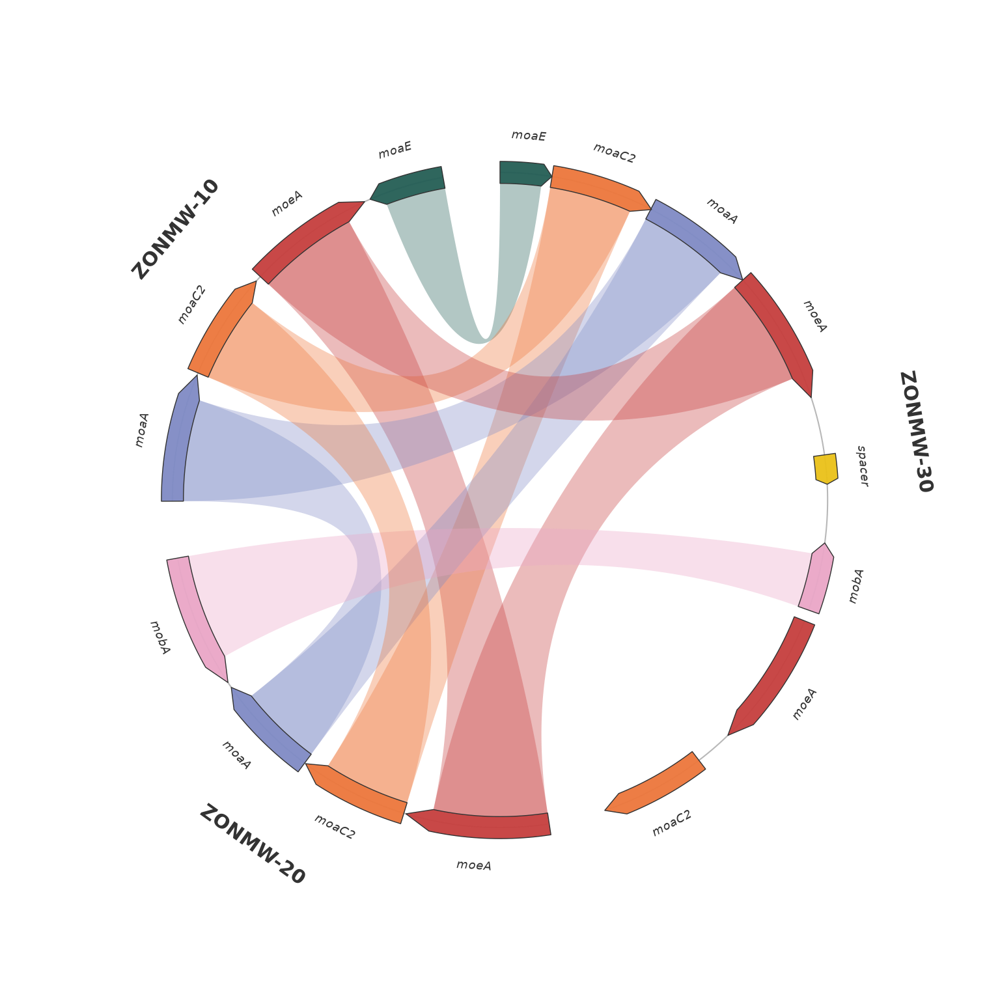
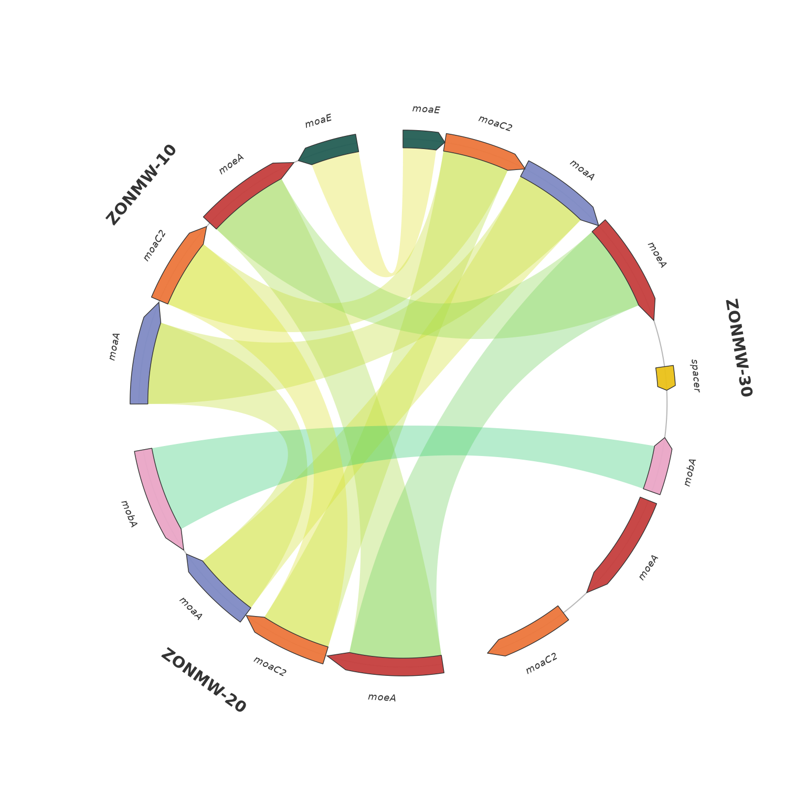
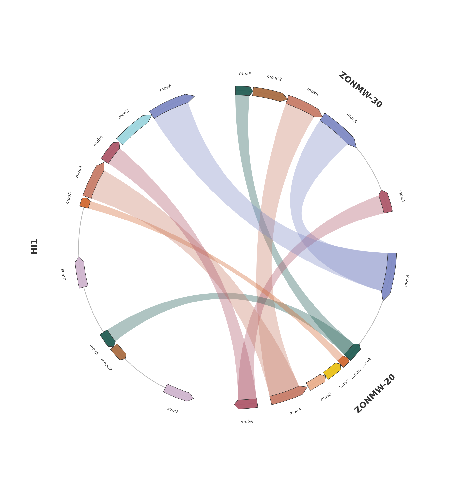

# Circular synteny with ggplot2

The circular functions use the same tables as the linear functions and
return ordinary ggplot objects. Their arcs, curved arrows and ribbons
are polygon layers in Cartesian coordinates, with a fixed aspect ratio
to keep the ring circular. There is no graphics capture or external
plotting backend.

## Chromosome-level synteny

``` r

data(rice_sorghum)
p <- plot_circular_synteny(rice_sorghum, c("Rice", "Sorghum"),
                           palette = "casa_natal", chr_fill = "per_species")
p
```



Chromosome arc widths are proportional to chromosome lengths, using the
same scale across species. Ribbons attach at the supplied block
coordinates. All pairs among selected species are included, including
within-species and non-adjacent comparisons. Overlapping or repeated
blocks remain separate observations; their widths are not summed into a
unique-coverage estimate.

`chr_fill` and `ribbon_fill` follow the linear function’s coloring
modes. `gap = 1` separates chromosomes within species and
`group_gap = 10` separates species (degrees). `species_order` selects
and orders genomes. Repeated chromosome labels in different species are
kept separate.

``` r

p + ggplot2::labs(title = "Rice and sorghum",
                  caption = "Chromosome lengths inferred from MCScanX gene annotations") +
  ggplot2::theme(plot.title = ggplot2::element_text(face = "bold"))
```



The default coverage ribbons join opposite interval boundaries for
clarity. When `blocks$orientation` is available,
`show_orientation = TRUE` connects genomic start/end coordinates
according to `plus` or `minus`. For a plus alignment, starts connect to
starts; for a minus alignment, starts connect to ends. Because both
chromosomes may run clockwise around different portions of a circle, a
twist alone is not an inversion indicator. Read the orientation metadata
or interactive tooltip when interpreting alignment direction. The
previously bundled `rice_sorghum` object lacks orientation metadata;
newly parsed MCScanX input retains it.

## Gene-level synteny

``` r

micro <- demo_microsynteny_data()
pm <- plot_circular_microsynteny(micro$features, micro$links,
                                palette = "casa_natal", ribbon_fill = "per_name")
pm
```



Contigs span the first supplied feature start through the last feature
end. Lengths share a scale across bins. This is an observed gene-region
view; unknown chromosome ends are not inferred. Each contig has its own
coordinate system and gap. The circular arrangement does not assert that
an organism’s chromosomes are biologically circular. A feature crossing
an origin needs to be split into valid intervals before plotting.

Arrows show strand; ribbons represent homology. Gene strand alone is not
used to infer an alignment inversion. `ribbon_anchor = "body"` keeps
arrowheads clear. `ribbon_anchor = "full"` connects the entire gene
span.

For the default identity coloring, the ramp spans 0 to 100 percent.
Missing identity values are gray. With no identity column, links use the
same default 80-percent shade as the linear plot, without claiming a
measured identity in the tooltip. `palette` colors genes; set
`ribbon_palette` explicitly to change the identity ramp.

``` r

plot_circular_microsynteny(micro$features, micro$links,
                           palette = "casa_natal", ribbon_palette = "Viridis")
```



## Three bacterial gene regions

The bundled bacterial inputs also provide a worked comparison of
ZONMW-30, ZONMW-20 and HI1: 21 genes on four contigs and nine supplied
homology links. These prepared tables can be used with either the
circular or linear gene view. The feature IDs are unique across all
selected contigs.

``` r

features <- read.delim(system.file("extdata", "circular_bacterial_features.tsv",
                                   package = "ggsynteny"))
links <- read.delim(system.file("extdata", "circular_bacterial_links.tsv",
                                package = "ggsynteny"))
pb <- plot_circular_microsynteny(
  features, links,
  bin_order = c("ZONMW-30", "ZONMW-20", "HI1"),
  palette = "casa_natal", ribbon_fill = "per_name",
  ribbon_alpha = 0.36, group_gap = 15, gap = 5,
  track_width = 0.055, label_size = 2.3, bin_label_size = 4.5
)
pb
```



The selection covers ZONMW-30 contig 4, ZONMW-20 contigs 10 and 17, and
HI1 contig 1. Placeholder `z_spacer` rows are removed; retained gene
coordinates and intervening genomic gaps are unchanged. ZONMW-30’s other
contigs reuse feature IDs and are outside this selected region. Each
retained feature gets a unique ID made from its bin, contig, coordinates
and original ID; the latter is retained in `source_feat_id`. Link
endpoints must resolve to exactly one feature, otherwise the preparation
script stops.

Four input links connect ZONMW-30 to ZONMW-20, and five connect ZONMW-20
to HI1. The input contains no direct ZONMW-30–HI1 links, and none are
inferred. It also has no identity scores, so ribbons are coloured by
gene name. This is a comparison of selected gene regions, not a
whole-genome alignment.

From a source checkout, `Rscript data-raw/circular_bacteria.R` rebuilds
the prepared TSVs, the README PNG and the annotated vector PDF. The
original `bacterial_genes.csv` and `bacterial_links.csv` inputs are
preserved.

``` r

ggplot2::ggsave("three-bacteria.pdf", pb, width = 10, height = 10.5)
```

## Inspect, export, and interact

The macro plot’s `data` holds its sector layout. Genomic bounds remain
in the original unit; `theta_start` and `theta_end` are radians.
Metadata attributes record displayed links and features, so positions
and filtering are inspectable.

``` r

p$data[, c("group_name", "sector_name", "start", "end")]
#>    group_name sector_name start   end
#> 1        Rice           1     0 45.02
#> 2        Rice           2     0 36.79
#> 3        Rice           3     0 37.30
#> 4        Rice           4     0 36.06
#> 5        Rice           5     0 29.90
#> 6        Rice           6     0 32.10
#> 7        Rice           7     0 30.34
#> 8        Rice           8     0 28.50
#> 9        Rice           9     0 23.82
#> 10       Rice          10     0 23.70
#> 11       Rice          11     0 31.22
#> 12       Rice          12     0 27.68
#> 13    Sorghum           1     0 73.83
#> 14    Sorghum           2     0 77.93
#> 15    Sorghum           3     0 74.44
#> 16    Sorghum           4     0 68.02
#> 17    Sorghum           5     0 62.33
#> 18    Sorghum           6     0 62.20
#> 19    Sorghum           7     0 64.31
#> 20    Sorghum           8     0 55.46
#> 21    Sorghum           9     0 59.62
#> 22    Sorghum          10     0 60.98
head(attr(pm, "circular_features")[, c("bin_id", "seq_id", "feat_id", "strand")])
#>     bin_id seq_id   feat_id strand
#> 1 ZONMW-30      4   moaE_30      +
#> 2 ZONMW-30      4  moaC2_30      +
#> 3 ZONMW-30      4   moaA_30      +
#> 4 ZONMW-30      4   moeA_30      +
#> 5 ZONMW-30      4 spacer_30      +
#> 6 ZONMW-30      4   mobA_30      -
```

``` r

ggplot2::ggsave("circular-synteny.pdf", p, width = 8, height = 8)
ggplot2::ggsave("circular-microsynteny.png", pm, width = 8, height = 8,
                dpi = 300, bg = "white")
```

``` r

pi <- plot_circular_microsynteny(micro$features, micro$links,
                                palette = "casa_natal", interactive = TRUE)
syn_girafe(pi, width_svg = 8, height_svg = 8)
```

The new functions introduce no dependencies. Optional interactivity uses
the same suggested ggiraph dependency as the linear views. Dense
annotations can be exported at a larger physical size or drawn with
`label_genes = FALSE`; labels are not silently discarded.

The visual references for this experiment are [gbdraw’s circular genome
maps](https://github.com/satoshikawato/gbdraw/blob/main/docs/GALLERY.md)
and [circlize’s chord
diagrams](https://jokergoo.github.io/circlize_book/book/the-chorddiagram-function.html).
The latter uses relation strength for sector/link widths; ggsynteny’s
circular functions instead retain genomic coordinate spans.
