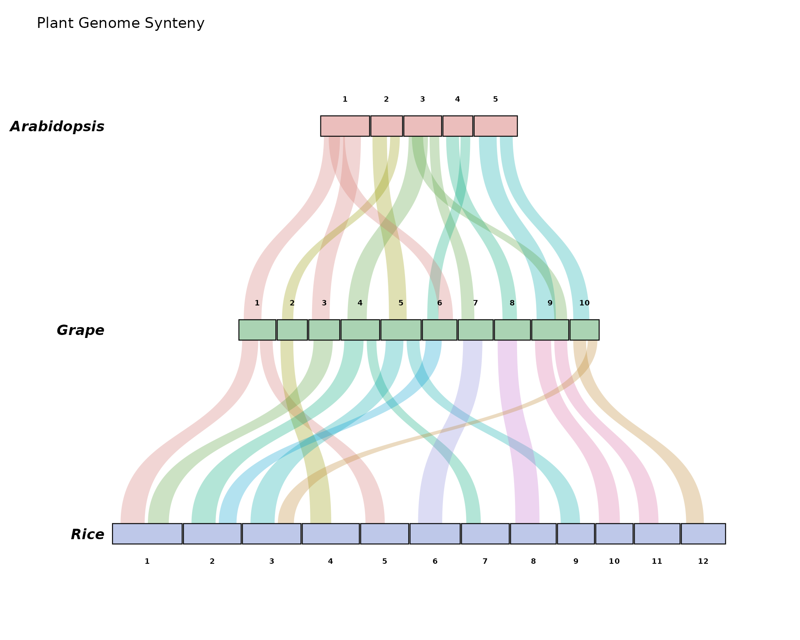
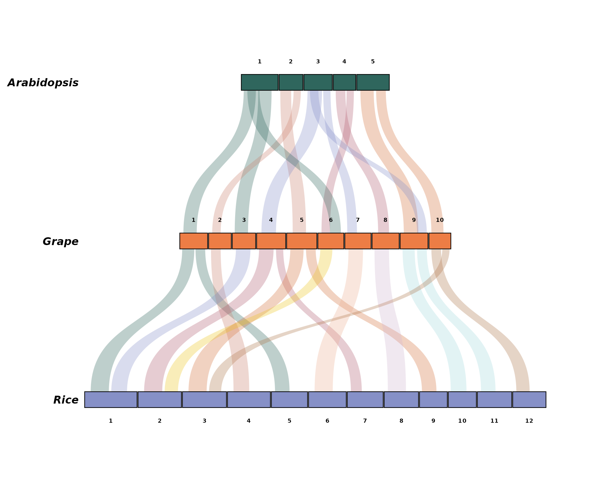
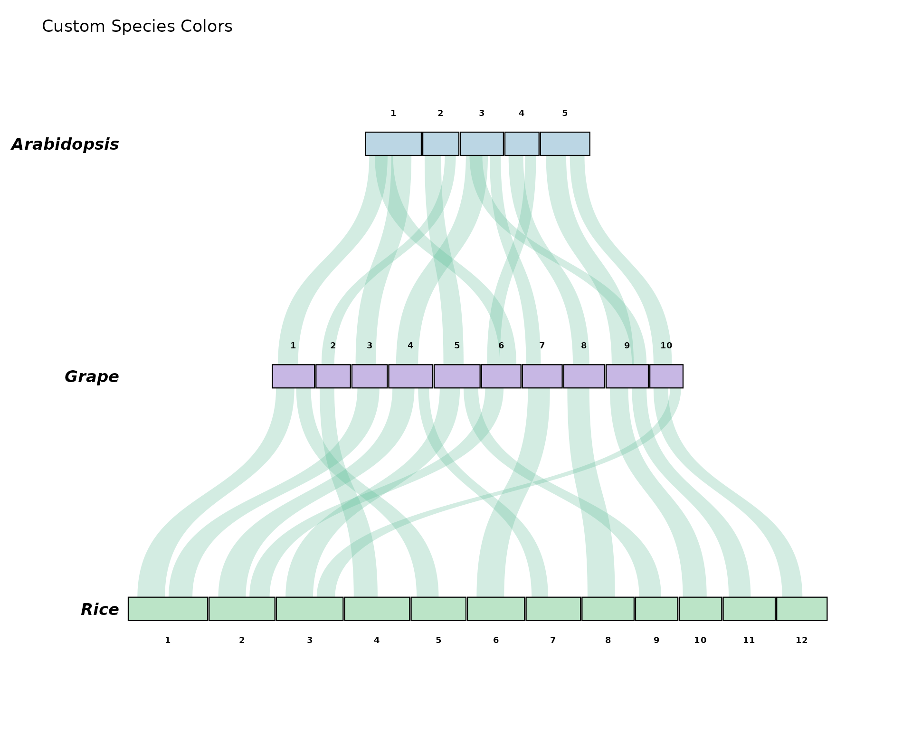
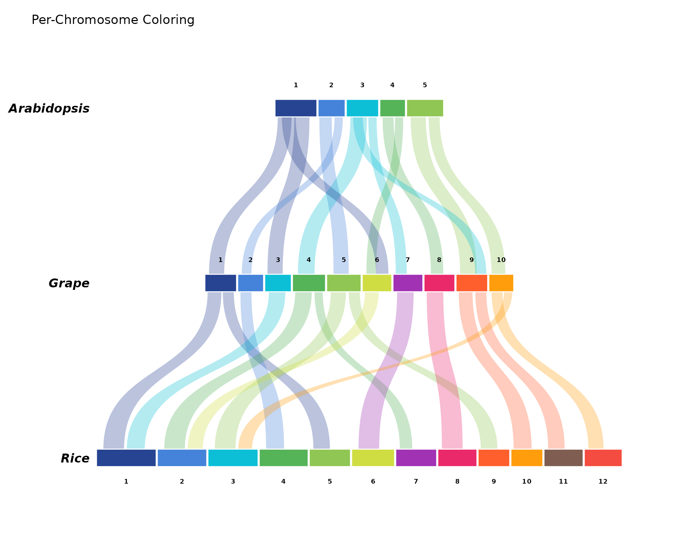
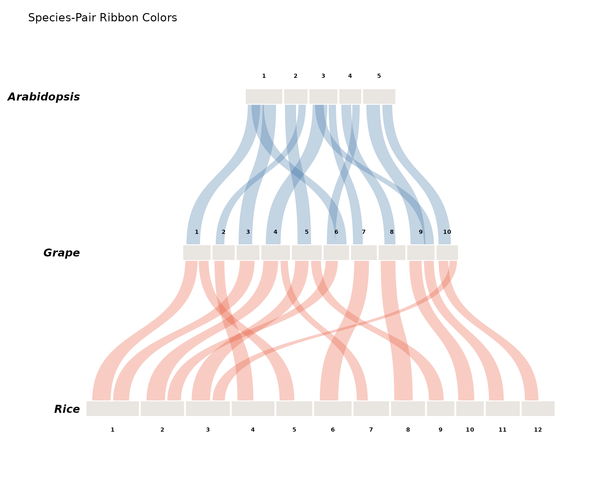
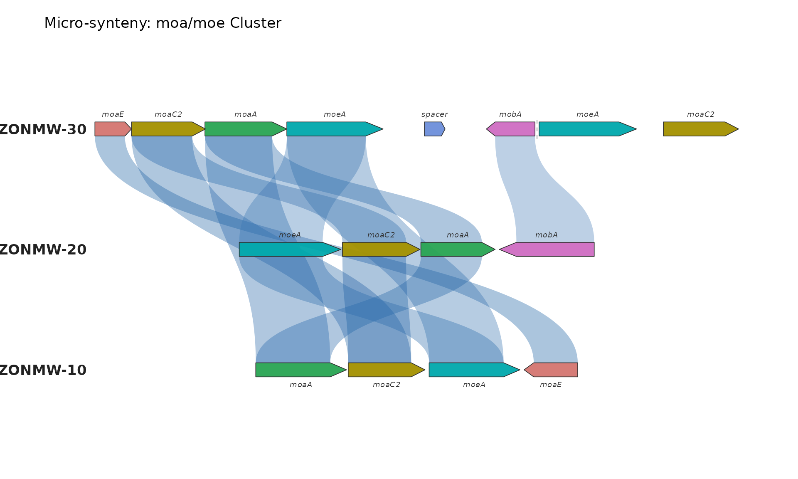
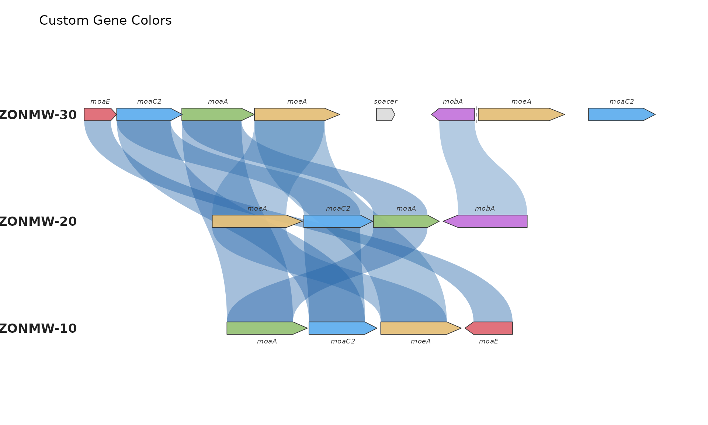
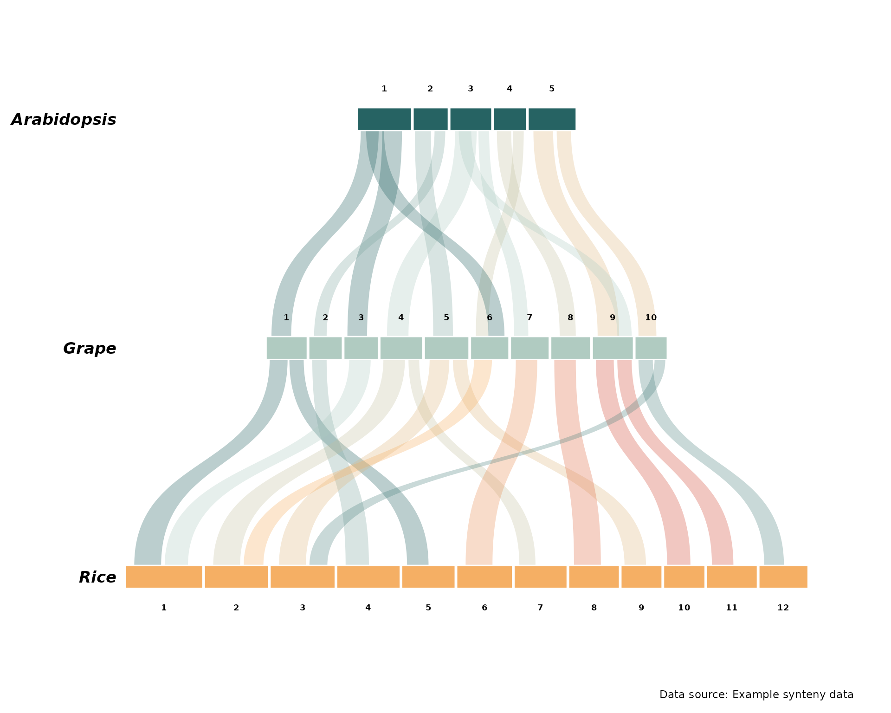

# Getting Started with ggsynteny

## Introduction

`ggsynteny` provides tools for creating publication-quality synteny
plots for comparative genomics. This vignette demonstrates the basic
usage of the package.

## Installation

``` r

# Install from GitHub
devtools::install_github("yourusername/ggsynteny")
```

``` r

library(ggsynteny)
library(ggplot2)
```

## Macro-Synteny Plots

### Basic Example

Let’s start with the bundled example data showing synteny between
Arabidopsis, Grape, and Rice:

``` r

# Load example data
syn <- example_synteny_data()

# Inspect structure
str(syn)
#> List of 2
#>  $ chromosomes: tibble [27 × 3] (S3: tbl_df/tbl/data.frame)
#>   ..$ species: chr [1:27] "Arabidopsis" "Arabidopsis" "Arabidopsis" "Arabidopsis" ...
#>   ..$ chr    : chr [1:27] "1" "2" "3" "4" ...
#>   ..$ size   : num [1:27] 30.4 19.7 23.5 18.6 26.9 23 18.8 19.3 24 25 ...
#>  $ blocks     : tibble [27 × 8] (S3: tbl_df/tbl/data.frame)
#>   ..$ species1: chr [1:27] "Arabidopsis" "Arabidopsis" "Arabidopsis" "Arabidopsis" ...
#>   ..$ chr1    : chr [1:27] "1" "1" "2" "2" ...
#>   ..$ start1  : num [1:27] 2 14 1 12 3 16 2 11 3 16 ...
#>   ..$ end1    : num [1:27] 12 25 10 18 15 22 10 17 14 24 ...
#>   ..$ species2: chr [1:27] "Grape" "Grape" "Grape" "Grape" ...
#>   ..$ chr2    : chr [1:27] "1" "3" "5" "2" ...
#>   ..$ start2  : num [1:27] 3 2 5 3 4 2 5 3 3 2 ...
#>   ..$ end2    : num [1:27] 14 13 16 10 16 10 14 10 15 12 ...
```

The data contains two data frames: - `chromosomes`: chromosome sizes for
each species - `blocks`: syntenic block coordinates

### Creating a Basic Plot

``` r

# Define species order (top to bottom)
sp_order <- c("Arabidopsis", "Grape", "Rice")

# Create plot
p1 <- plot_synteny(syn,
                   species_order = sp_order,
                   title = "Plant Genome Synteny")
print(p1)
```



### Using the Built-in Palettes

Every `palette` argument accepts, by name, all 32 palettes of the [ltc
package](https://github.com/loukesio/ltc-color-palettes) (vendored, so
ltc need not be installed). One palette can drive the whole plot:

``` r

p_pal <- plot_synteny(syn, sp_order, palette = "casa_natal")
print(p_pal)
```



List them all with
[`syn_palettes()`](https://loukesio.github.io/ggsynteny/reference/syn_palettes.md);
names match case-insensitively and ignore spaces, underscores, and
dashes:

``` r

names(syn_palettes())
#>  [1] "paloma"     "maya"       "dora"       "ploen"      "olga"      
#>  [6] "mterese"    "gaby"       "franscoise" "fernande"   "sylvie"    
#> [11] "expevo"     "minou"      "kiss"       "hat"        "reading"   
#> [16] "alger"      "trio1"      "trio2"      "trio3"      "trio4"     
#> [21] "heatmap0"   "pantone23"  "remains"    "midnight"   "lincoln"   
#> [26] "luminaries" "seafarer"   "shuggie"    "heatmap1"   "heatmap2"  
#> [31] "heatmap3"   "casa_natal"
```

### Customizing Colors

#### Per-Species Chromosome Colors

``` r

p2 <- plot_synteny(syn, sp_order,
                   chr_fill = "per_species",
                   chr_palette = c(
                     "Arabidopsis" = "#B8D4E3",
                     "Grape"       = "#C5B4E3",
                     "Rice"        = "#B8E3C5"
                   ),
                   ribbon_fill = "uniform",
                   ribbon_palette = "#50B88E",
                   ribbon_alpha = 0.25,
                   title = "Custom Species Colors")
print(p2)
```



#### Per-Chromosome Colors

``` r

# Define color palette for chromosomes 1-12
chr_pal <- c("1"="#1B3A8C", "2"="#3B7DD8", "3"="#00BCD4", "4"="#4CAF50",
             "5"="#8BC34A", "6"="#CDDC39", "7"="#9C27B0", "8"="#E91E63",
             "9"="#FF5722", "10"="#FF9800", "11"="#795548", "12"="#F44336")

p3 <- plot_synteny(syn, sp_order,
                   chr_fill = "per_chr",
                   chr_palette = chr_pal,
                   ribbon_fill = "source_chr",
                   ribbon_palette = chr_pal,
                   title = "Per-Chromosome Coloring")
print(p3)
```



### Species-Pair Ribbon Colors

``` r

p4 <- plot_synteny(syn, sp_order,
                   chr_fill = "uniform",
                   chr_palette = "#E8E4DF",
                   ribbon_fill = "species_pair",
                   ribbon_palette = c(
                     "Arabidopsis_Grape" = "#3A6EA5",
                     "Grape_Rice"        = "#E8573A"
                   ),
                   title = "Species-Pair Ribbon Colors")
print(p4)
```



## Micro-Synteny Plots

### Basic Example

Micro-synteny plots show gene-level conservation:

``` r

# Load microsynteny example
micro <- demo_microsynteny_data()

# Inspect structure
str(micro)
#> List of 2
#>  $ features:'data.frame':    16 obs. of  7 variables:
#>   ..$ bin_id : chr [1:16] "ZONMW-30" "ZONMW-30" "ZONMW-30" "ZONMW-30" ...
#>   ..$ seq_id : chr [1:16] "4" "4" "4" "4" ...
#>   ..$ start  : num [1:16] 0 444 1333 2325 3991 ...
#>   ..$ end    : num [1:16] 443 1340 2325 3491 4242 ...
#>   ..$ strand : chr [1:16] "+" "+" "+" "+" ...
#>   ..$ feat_id: chr [1:16] "moaE_30" "moaC2_30" "moaA_30" "moeA_30" ...
#>   ..$ name   : chr [1:16] "moaE" "moaC2" "moaA" "moeA" ...
#>  $ links   :'data.frame':    11 obs. of  3 variables:
#>   ..$ feat_id_a: chr [1:11] "moaE_30" "moaC2_30" "moaC2_30" "moaA_30" ...
#>   ..$ feat_id_b: chr [1:11] "moaE_10" "moaC2_20" "moaC2_10" "moaA_20" ...
#>   ..$ identity : num [1:11] 95.2 88.4 91 93.1 89.7 78.3 82.1 71.5 94.3 90.2 ...
```

The data contains: - `features`: gene coordinates, strand, and names -
`links`: homology relationships with identity scores

### Creating a Gene-Level Plot

``` r

p5 <- plot_microsynteny(micro$features,
                        micro$links,
                        bin_order = c("ZONMW-30", "ZONMW-20", "ZONMW-10"),
                        gene_fill = "per_name",
                        ribbon_fill = "identity",
                        title = "Micro-synteny: moa/moe Cluster")
print(p5)
```



### Custom Gene Colors

``` r

# Define custom gene colors
gene_pal <- c(
  moaE   = "#E06C75",
  moaC2  = "#61AFEF",
  moaA   = "#98C379",
  moeA   = "#E5C07B",
  mobA   = "#C678DD",
  spacer = "#DDDDDD"
)

p6 <- plot_microsynteny(micro$features,
                        micro$links,
                        bin_order = c("ZONMW-30", "ZONMW-20", "ZONMW-10"),
                        gene_fill = "per_name",
                        gene_palette = gene_pal,
                        ribbon_fill = "identity",
                        ribbon_alpha = 0.40,
                        title = "Custom Gene Colors")
print(p6)
```



## Reading Your Own Data

### TSV Format

``` r

# Read your own TSV files
syn <- read_synteny_tsv("my_chromosomes.tsv", "my_blocks.tsv")
p <- plot_synteny(syn, species_order = c("SpeciesA", "SpeciesB", "SpeciesC"))
```

### MCScanX Format

``` r

# Parse MCScanX output
syn <- read_mcscanx("output.collinearity", "output.gff")
p <- plot_synteny(syn, species_order = c("Species1", "Species2"))
```

### GENESPACE Format

``` r

# Parse GENESPACE output
syn <- read_genespace("synHits.tsv")
p <- plot_synteny(syn, species_order = c("genome1", "genome2", "genome3"))
```

## Saving Plots

``` r

# Save as high-resolution PNG
ggsave("synteny.png", p1, width = 20, height = 10, dpi = 300, bg = "white")

# Save as PDF for publications
ggsave("synteny.pdf", p1, width = 20, height = 10)

# Save as SVG for editing in Inkscape/Illustrator
ggsave("synteny.svg", p1, width = 20, height = 10)
```

## Advanced Customization

Since `ggsynteny` returns ggplot2 objects, you can further customize
them:

``` r

p7 <- plot_synteny(syn, sp_order,
                   chr_fill = "per_species",
                   ribbon_fill = "source_chr") +
  theme(plot.background = element_rect(fill = "white", color = NA)) +
  labs(caption = "Data source: Example synteny data")

print(p7)
```



## Session Info

``` r

sessionInfo()
#> R version 4.6.1 (2026-06-24)
#> Platform: x86_64-pc-linux-gnu
#> Running under: Ubuntu 24.04.4 LTS
#> 
#> Matrix products: default
#> BLAS:   /usr/lib/x86_64-linux-gnu/openblas-pthread/libblas.so.3 
#> LAPACK: /usr/lib/x86_64-linux-gnu/openblas-pthread/libopenblasp-r0.3.26.so;  LAPACK version 3.12.0
#> 
#> locale:
#>  [1] LC_CTYPE=C.UTF-8       LC_NUMERIC=C           LC_TIME=C.UTF-8       
#>  [4] LC_COLLATE=C.UTF-8     LC_MONETARY=C.UTF-8    LC_MESSAGES=C.UTF-8   
#>  [7] LC_PAPER=C.UTF-8       LC_NAME=C              LC_ADDRESS=C          
#> [10] LC_TELEPHONE=C         LC_MEASUREMENT=C.UTF-8 LC_IDENTIFICATION=C   
#> 
#> time zone: UTC
#> tzcode source: system (glibc)
#> 
#> attached base packages:
#> [1] stats     graphics  grDevices utils     datasets  methods   base     
#> 
#> other attached packages:
#> [1] ggplot2_4.0.3   ggsynteny_0.3.0
#> 
#> loaded via a namespace (and not attached):
#>  [1] gtable_0.3.6       jsonlite_2.0.0     dplyr_1.2.1        compiler_4.6.1    
#>  [5] tidyselect_1.2.1   jquerylib_0.1.4    systemfonts_1.3.2  scales_1.4.0      
#>  [9] textshaping_1.0.5  yaml_2.3.12        fastmap_1.2.0      readr_2.2.0       
#> [13] R6_2.6.1           labeling_0.4.3     generics_0.1.4     knitr_1.51        
#> [17] htmlwidgets_1.6.4  tibble_3.3.1       desc_1.4.3         tzdb_0.5.0        
#> [21] bslib_0.12.0       pillar_1.11.1      RColorBrewer_1.1-3 rlang_1.3.0       
#> [25] cachem_1.1.0       xfun_0.60          fs_2.1.0           sass_0.4.10       
#> [29] S7_0.2.2           otel_0.2.0         cli_3.6.6          withr_3.0.3       
#> [33] pkgdown_2.2.1      magrittr_2.0.5     digest_0.6.39      grid_4.6.1        
#> [37] hms_1.1.4          lifecycle_1.0.5    vctrs_0.7.3        evaluate_1.0.5    
#> [41] glue_1.8.1         farver_2.1.2       ragg_1.5.2         rmarkdown_2.31    
#> [45] tools_4.6.1        pkgconfig_2.0.3    htmltools_0.5.9
```
