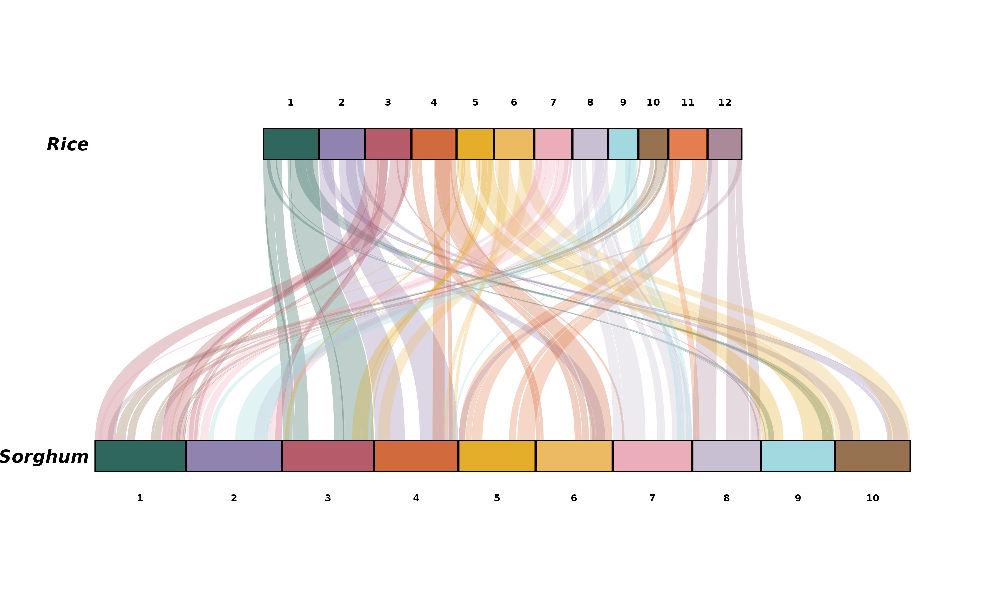
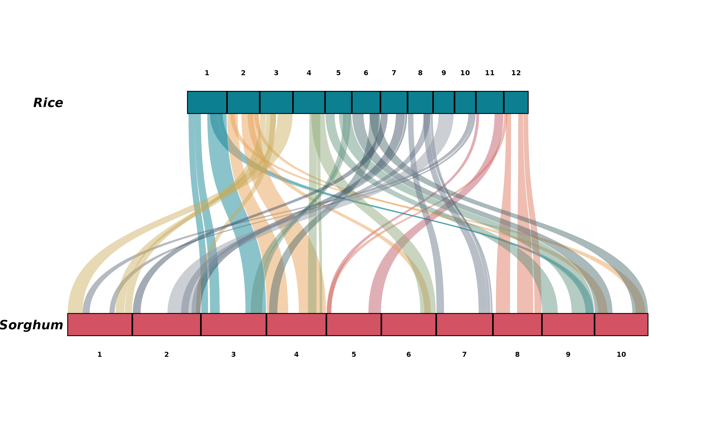
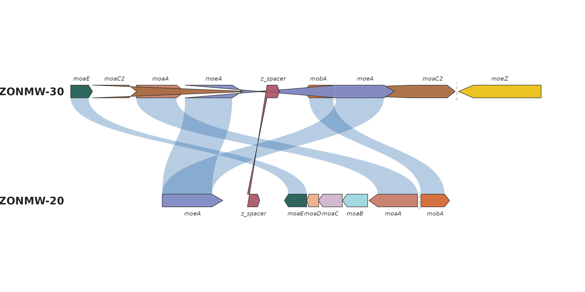
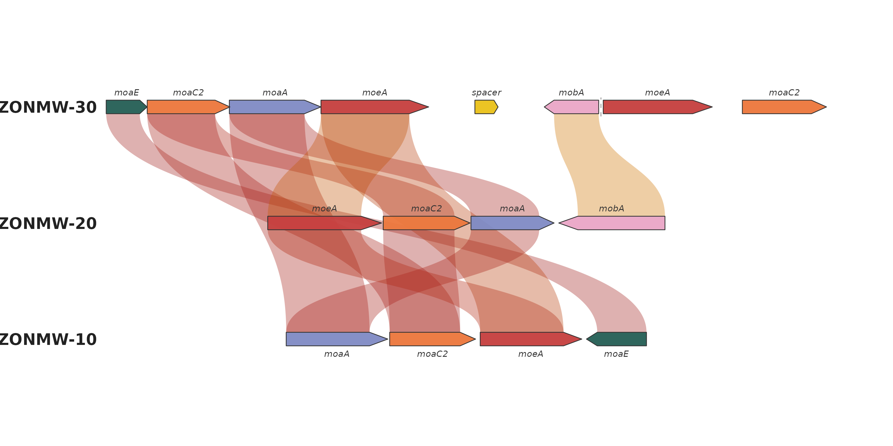

# Real data: rice-sorghum and a bacterial gene cluster

This article works through two *real* datasets end to end — one
macro-synteny (chromosome-level) and one micro-synteny (gene-level) —
the way you would use ggsynteny on your own data.

``` r

library(ggsynteny)
library(ggplot2)
```

## Macro-synteny: rice vs sorghum, from MCScanX output

Rice (*Oryza sativa*) and sorghum (*Sorghum bicolor*) diverged roughly
50 million years ago, yet their chromosomes still align over long
stretches — the textbook example of grass synteny.

The bundled `rice_sorghum` dataset is genuine MCScanX output: the
rice-sorghum example data shipped with MCScanX itself (all-vs-all
protein BLAST plus gene positions; Wang et al. 2012, *Nucleic Acids
Research* 40:e49) was run through MCScanX with default parameters, and
the resulting `os_sb.collinearity` file was parsed with ggsynteny’s own
[`read_mcscanx()`](https://loukesio.github.io/ggsynteny/reference/read_mcscanx.md):

``` r

syn <- read_mcscanx("os_sb.collinearity", "os_sb.gff")
```

The prepared object keeps the 100 largest inter-genome blocks (at least
20 collinear gene pairs each) so the default plot stays legible —
`data-raw/rice_sorghum.R` in the package sources documents every step:

``` r

data(rice_sorghum)
str(rice_sorghum, max.level = 1)
#> List of 2
#>  $ chromosomes:'data.frame': 22 obs. of  3 variables:
#>  $ blocks     :'data.frame': 100 obs. of  10 variables:
head(rice_sorghum$blocks, 3)
#>   species1 chr1 start1  end1 species2 chr2 start2  end2 score n_genes
#> 1     Rice    1  22.75 44.95  Sorghum    3  50.83 74.42 77991    1593
#> 2     Rice    1   8.16 15.40  Sorghum    3  10.09 21.19 12422     258
#> 3     Rice    1  19.84 22.30  Sorghum    3  42.09 50.40  1179      27
```

One call plots it. Colouring the ribbons by their rice source chromosome
makes the block structure pop — note how rice 1 maps almost entirely to
sorghum 3, and rice 11/12 to sorghum 5/8:

``` r

plot_synteny(rice_sorghum, c("Rice", "Sorghum"),
             palette = "casa_natal",
             chr_fill = "per_chr", ribbon_fill = "source_chr")
```



The `blocks` data frame keeps MCScanX’s alignment score and gene count
per block, so you can filter harder before plotting:

``` r

big <- rice_sorghum
big$blocks <- subset(big$blocks, n_genes >= 100)

plot_synteny(big, c("Rice", "Sorghum"),
             palette = "minou", ribbon_alpha = 0.45)
```



## Micro-synteny: a bacterial moa/moe gene cluster

The package also ships a gene-level dataset from a real comparative
analysis: the molybdenum-cofactor (moa/moe) gene cluster across three
bacterial strains, with per-link protein identities. The raw CSVs live
in `inst/extdata`, so this doubles as a template for loading your own
files:

``` r

genes <- read.csv(system.file("extdata", "bacterial_genes.csv",
                              package = "ggsynteny"))
links <- read.csv(system.file("extdata", "bacterial_links.csv",
                              package = "ggsynteny"))

head(genes, 3)
#>     bin_id seq_id start  end strand        feat_id  name
#> 1 ZONMW-30      4     0  443      +  moaE_ZONMW-30  moaE
#> 2 ZONMW-30      4   444 1340      + moaC2_ZONMW-30 moaC2
#> 3 ZONMW-30      4  1333 2325      +  moaA_ZONMW-30  moaA
head(links, 3)
#>     bin_id       feat_id  bin_id2      feat_id2
#> 1 ZONMW-30 moaE_ZONMW-30 ZONMW-20 moaE_ZONMW-20
#> 2 ZONMW-30 moaA_ZONMW-30 ZONMW-20 moaA_ZONMW-20
#> 3 ZONMW-30 moeA_ZONMW-30 ZONMW-20 moeA_ZONMW-20
```

The links file pairs `feat_id`s across strains; rename to the columns
[`plot_microsynteny()`](https://loukesio.github.io/ggsynteny/reference/plot_microsynteny.md)
expects:

``` r

links <- data.frame(feat_id_a = links$feat_id,
                    feat_id_b = links$feat_id2)
```

``` r

plot_microsynteny(genes, links,
                  bin_order = c("ZONMW-30", "ZONMW-20", "ZONMW-10"),
                  palette = "casa_natal")
```



Without an `identity` column the ribbons fall back to a uniform colour
via `ribbon_fill = "identity"`’s default; with identities (as in
[`demo_microsynteny_data()`](https://loukesio.github.io/ggsynteny/reference/demo_microsynteny_data.md))
the ribbon darkness encodes percent identity, and an ordered palette
restyles the ramp:

``` r

micro <- demo_microsynteny_data()

plot_microsynteny(micro$features, micro$links,
                  bin_order = c("ZONMW-30", "ZONMW-20", "ZONMW-10"),
                  gene_fill = "per_name", gene_palette = "casa_natal",
                  ribbon_fill = "identity", ribbon_palette = "heatmap0")
```



## References

- Wang, Y. et al. (2012). “MCScanX: a toolkit for detection and
  evolutionary analysis of gene synteny and collinearity.” *Nucleic
  Acids Research* 40(7):e49. <doi:10.1093/nar/gkr1293>
