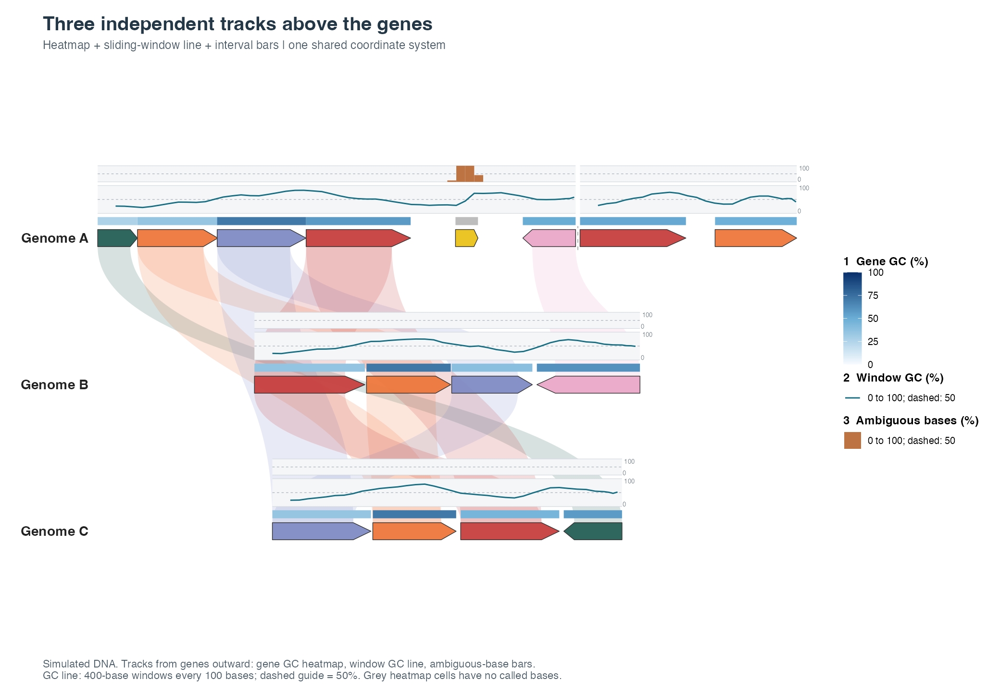

# Try the development branch: GC tracks step by step

A track is a small graph attached to the same genome positions as the genes.
You give it a table of positions and values, choose how to draw those values,
and add it to a synteny plot with `+`.

This branch supports three choices:

| Display | What you see | What carries the value |
| --- | --- | --- |
| `geom = "heatmap"` | A colored strip over each interval | Color |
| `geom = "line"` | A line through the centers of the windows | Height, or distance outward in a circle |
| `geom = "bar"` | A bar spanning each interval | Bar height, or radial length |

The first track is closest to the genes. Each later track is placed farther
out. The same list of tracks works in linear and circular plots.



[Open the two-page example PDF](../../../man/figures/gc-tracks/modular-tracks.pdf).
All DNA in this tutorial is simulated. These are examples of the software,
not measurements of the organisms in the package's other datasets.

## 1. Install this branch

Run this in R or RStudio:

```r
install.packages("remotes")  # only once
remotes::install_github(
  "loukesio/ggsynteny",
  ref = "feature/gc-content-tracks",
  upgrade = "never"
)
```

This installs the development version into your usual R library. It replaces
an existing ggsynteny installation in that library. The published release and
the repository's main branch are unchanged.

Restart R if ggsynteny was already loaded, then:

```r
library(ggsynteny)
packageVersion("ggsynteny")  # should show 0.5.0.9000
```

Keep the `ref` argument: omitting it installs main, which does not include the
new tracks. To update later, run the same installation command and restart R.
To return to main, use `ref = "main"` instead.

## 2. Run the complete example

```r
source(system.file("examples", "annotation-tracks.R", package = "ggsynteny"))
```

This reads small example files installed with the package and draws two
figures. It does not need a repository checkout or download DNA. In RStudio,
use the back arrow in the Plots pane to see the preceding figure, or print
either one explicitly:

```r
print(track_demo$linear)
print(track_demo$circular)
```

The three tracks, starting from the genes, are gene GC colors, a line showing
GC across windows, and bars showing the percentage of ambiguous DNA bases.
`track_demo` also holds the inputs and intermediate plots, so you can change
one piece at a time.

## 3. Start with the genes alone

```r
p <- track_demo$base
print(p)
```

The arrows are genes. The ribbons connect supplied matching genes. No GC
calculation is involved in those ribbons.

## 4. Add a heatmap of GC per gene

```r
gene_gc <- gc_content(track_demo$sequences, intervals = track_demo$features)
head(gene_gc[c("group", "seq_id", "start", "end", "value")])

p + syn_track(gene_gc, geom = "heatmap", name = "Gene GC (%)")
```

Each row describes one interval: which genome (`group`), which contig
(`seq_id`), its start and end, and a numeric value. For this example the value
is GC percent: the share of A/C/G/T bases that are G or C. Darker blue means
more GC. Grey means there were no usable bases for that interval.

## 5. Show GC across windows as a line

```r
window_gc <- gc_content(track_demo$sequences, window = 400, step = 100)

p + syn_track(
  window_gc,
  geom = "line",
  name = "Window GC (%)",
  limits = c(0, 100),
  height = 0.19,
  colour = "#176D81",
  reference = 50
)
```

`window = 400` means calculate GC for a stretch of 400 bases. `step = 100`
means start another window 100 bases later, so neighboring windows overlap.
The line places each result at that window's center. It does not smooth or
invent extra measurements. A dashed line marks 50% GC.

Try `window = 800, step = 200` to see a broader summary, or `window = 100,
step = 100` for short, non-overlapping windows. The last window may be shorter
at the end of a contig. Lines stop at missing measurements and uncovered gaps,
and never connect separate contigs.

## 6. Stack different track types

```r
ambiguous <- gc_content(track_demo$sequences, window = 100)
ambiguous$value <- 100 * ambiguous$n_ambiguous / (ambiguous$end - ambiguous$start)

tracks <- list(
  syn_track(gene_gc, geom = "heatmap", name = "Gene GC (%)", height = 0.055),
  syn_track(window_gc, geom = "line", name = "Window GC (%)",
            height = 0.19, gap = 0.025, colour = "#176D81", reference = 50),
  syn_track(ambiguous, geom = "bar", name = "Ambiguous bases (%)",
            height = 0.11, gap = 0.025, colour = "#BE7442")
)

linear <- p + tracks
print(linear)

circular <- plot_circular_microsynteny(
  track_demo$features, track_demo$links,
  palette = "casa_natal", label_genes = FALSE
) + tracks
print(circular)
```

The orange bars show the percentage of bases marked as uncertain, such as `N`.
They demonstrate a second measurement with its own graph. These uncertainties
are deliberately included in the simulated DNA.

`height` is the space allocated to a track, not its measured value. In linear
plots it is a fraction of row spacing; in circular plots it is a fraction of
the original circle radius. `gap` controls separation. Reduce these if many
tracks cannot fit between linear rows. Gene labels are hidden here for space;
you can turn them back on with `label_genes = TRUE` in the plot function.

## 7. Save and check your figures

```r
ggplot2::ggsave("my-linear-tracks.pdf", linear, width = 13, height = 9)
ggplot2::ggsave("my-circular-tracks.pdf", circular, width = 13, height = 9)

# Confirm this is the branch with the modular track interface:
stopifnot("geom" %in% names(formals(syn_track)))
stopifnot(length(attr(linear, "synteny_tracks")) == 3)
```

The output files are saved in your current working directory (`getwd()`).
The plots remain ggplot2 objects: add a title with `ggplot2::labs()` or change
legend placement with `ggplot2::theme(legend.position = "bottom")`.

## Use your own measurements

You can supply a table directly instead of calculating GC. It needs `group`,
`seq_id`, `start`, `end`, and `value`. Existing `species`/`chr` or
`bin_id`/`seq_id` keys are also accepted. Set `name` and `limits` for the
measurement: for example, coverage might use `name = "Read depth"` and
`limits = c(0, 200)`. Signed bars can use `limits = c(-1, 1), baseline = 0`.

Positions must use the same origin and units as the synteny plot. The DNA
calculator uses zero-based, half-open base-pair intervals: `[0, 4)` means
the first four bases. Convert one-based inclusive annotations by subtracting
1 from the start, leaving the end unchanged. Gene plots display only the
first-to-last gene span per contig, so restrict window tables to that span.

Missing values are not zeros. Heatmaps show them with `na.value`; lines and
bars leave gaps. Circular windows do not wrap across the origin. Tracks are
currently static, and Studio does not yet have a track upload control.

For the complete interface, see `?syn_track`, `?gc_content`, and
`?scale_fill_syn_track`, or the [longer guide](../../../vignettes/articles/annotation-tracks.Rmd).
