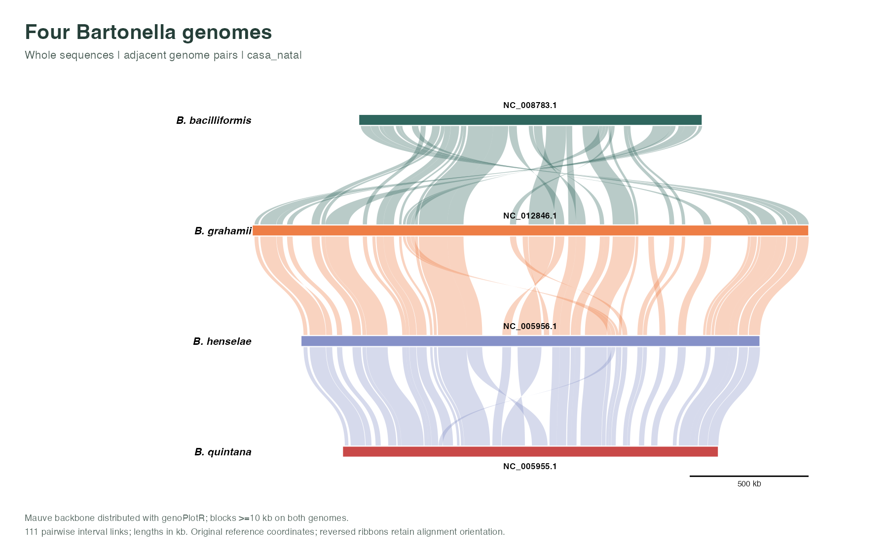
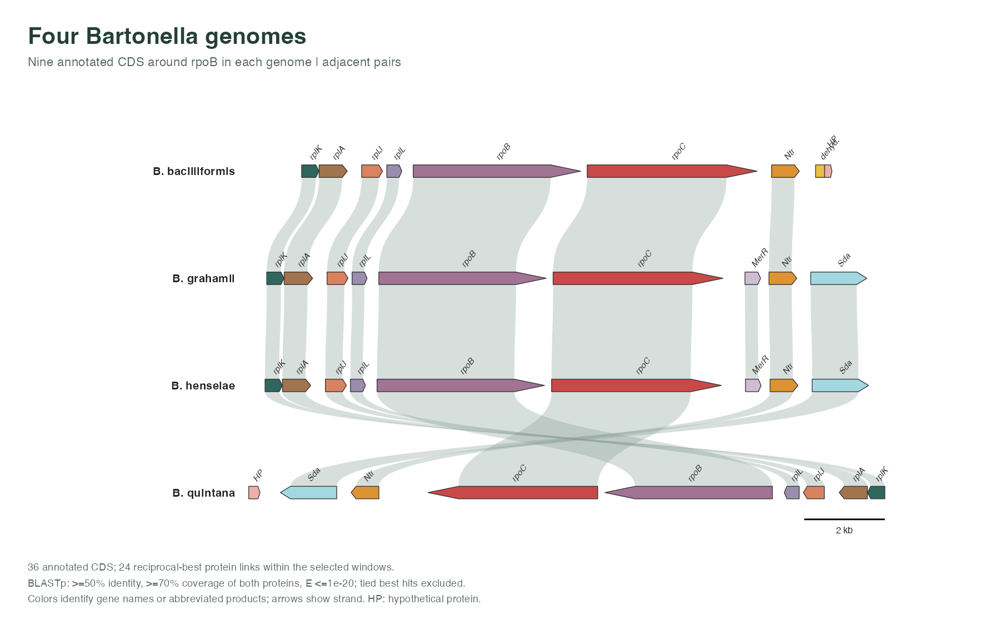
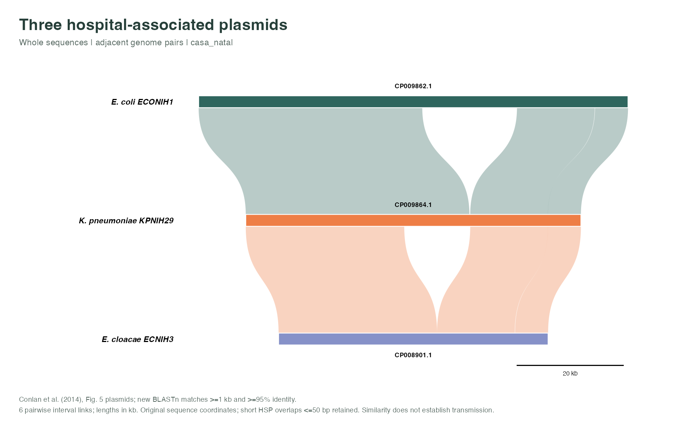
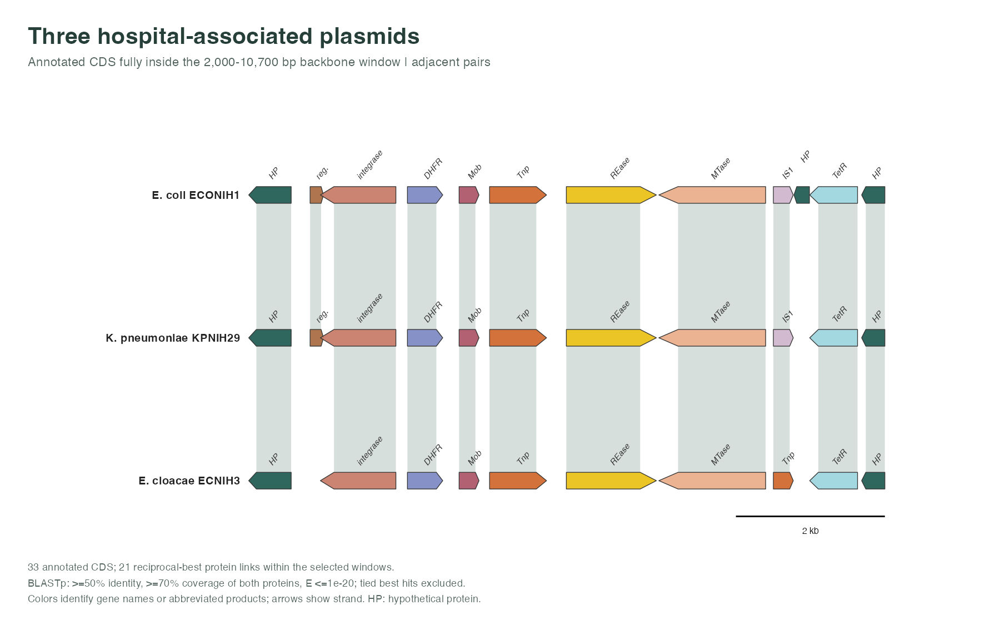

# Public bacterial examples

Two real-data comparisons for ggsynteny, published on
`examples/public-health-bacteria`. The examples use the existing ggplot2
functions and `casa_natal` palette. No package plotting, parser or palette
implementation is changed.

**View:** [all eight figures as a PDF](../../man/figures/public-health/public-health-examples.pdf).
**Interact:** download [the standalone HTML gallery](https://raw.githubusercontent.com/loukesio/ggsynteny/examples/public-health-bacteria/dev/public-health/gallery/index.html)
and open it in a browser. Hover for identifiers and coordinates, scroll to
zoom, drag to pan, and reset with the toolbar. GitHub's file viewer does not
execute HTML widgets.

## Four Bartonella genomes

This reuses the Mauve backbone supplied with
[genoPlotR's four-genome example](https://genoplotr.r-forge.r-project.org/vignette.php).
The source file and genome order are pinned to genoPlotR's CRAN mirror commit
`3887f91ed718b7df935c11d1a84e9276f4f6b01c`.
The included species have public-health relevance: *B. henselae*,
*B. quintana* and *B. bacilliformis* cause distinct forms of bartonellosis.
[CDC background](https://www.cdc.gov/bartonella/about/index.html).

| Genome | Versioned record | Length |
|---|---|---:|
| *B. bacilliformis* KC583 | [NC_008783.1](https://www.ncbi.nlm.nih.gov/nuccore/NC_008783.1) | 1,445,021 bp |
| *B. grahamii* as4aup | [NC_012846.1](https://www.ncbi.nlm.nih.gov/nuccore/NC_012846.1) | 2,341,328 bp |
| *B. henselae* Houston-1 | [NC_005956.1](https://www.ncbi.nlm.nih.gov/nuccore/NC_005956.1) | 1,931,047 bp |
| *B. quintana* Toulouse | [NC_005955.1](https://www.ncbi.nlm.nih.gov/nuccore/NC_005955.1) | 1,581,384 bp |



The 672 source backbone rows yield **215 pairwise interval links** after
requiring at least 10 kb in each genome of a pair. Of these, **62 have reversed
relative orientation**. A source block can contribute to multiple genome pairs;
215 is not a count of independent evolutionary events. Circular plots show
all six pairs; the linear figure shows 111 links between adjacent genomes.



The close-up selects `rpoB` and its four neighboring annotated CDS on each
side, in reference-coordinate order: **36 CDS and 46 protein links** across
all pairs, or 24 adjacent-pair links in the linear view. These protein matches
are newly computed from the selected annotated windows. The reverse strand
and reversed local order of the displayed *B. quintana* region are retained;
we have not rotated or reverse-complemented the reference genomes.

## Three hospital-associated plasmids

These are the IncN plasmids compared in Figure 5 of
[Conlan et al. (2014), *Single molecule sequencing to track plasmid diversity
of hospital-associated carbapenemase-producing Enterobacteriaceae*](https://pmc.ncbi.nlm.nih.gov/articles/PMC4203314/).
The study provides a clinical context for related plasmids in different
bacterial hosts. Here the alignments are newly generated from deposited
complete sequences; they are not the authors' original alignment files.

| Host label used in the study | Plasmid | Versioned record | Length |
|---|---|---|---:|
| *E. coli* ECONIH1 | pKPC-629 | [CP009862.1](https://www.ncbi.nlm.nih.gov/nuccore/CP009862.1) | 80,186 bp |
| *K. pneumoniae* KPNIH29 | pKPC-e4e | [CP009864.1](https://www.ncbi.nlm.nih.gov/nuccore/CP009864.1) | 62,589 bp |
| *E. cloacae* ECNIH3 | pKPC-47e | [CP008901.1](https://www.ncbi.nlm.nih.gov/nuccore/CP008901.1) | 50,333 bp |

ECNIH3 is now identified in the source record and
[RefSeq](https://www.ncbi.nlm.nih.gov/nuccore/NZ_CP008901.1) as
*Enterobacter hormaechei* subsp. *hoffmannii*. The plots retain the study's
host label so they can be compared with its figures; `sequences.tsv` records
the downloaded organism name separately.



The three pairwise BLASTn comparisons retain **eight local nucleotide matches**
across all pairs, or six between adjacent hosts. These show shared sequence
and differences in its arrangement. Their presence does not by itself establish
the direction, timing or route of plasmid transmission.



The close-up contains annotated CDS fully inside the same 2,000–10,700 bp
window of each deposited plasmid: **33 CDS and 31 protein links**, or 21 links
in the linear view. This shared-backbone window illustrates local annotation
and gene-order differences. It is not the complete resistance region, and an
absent arrow means no retained CDS annotation at that position, not necessarily
absence of the underlying sequence.

## Plot from the committed tables

Install this branch to make its data available through `system.file()`:

```r
remotes::install_github("loukesio/ggsynteny", ref = "examples/public-health-bacteria")
library(ggsynteny)

path <- system.file("extdata", "public-health", "bartonella", package = "ggsynteny")
read_table <- function(name) read.delim(file.path(path, paste0(name, ".tsv")),
                                       stringsAsFactors = FALSE)
syn <- list(chromosomes = read_table("chromosomes"), blocks = read_table("blocks"))

plot_circular_synteny(syn, palette = "casa_natal", chr_fill = "per_species",
                      ribbon_fill = "species_pair", show_orientation = TRUE)

features <- read_table("features")
links <- read_table("links")
plot_circular_microsynteny(features, links, palette = "casa_natal",
                          ribbon_fill = "uniform")
```

Replace `"bartonella"` with `"plasmids"` for the second dataset. Use
`plot_synteny(syn, syn$chromosomes$species, show_inversions = TRUE)` or
`plot_microsynteny(features, links)` for linear views. The prepared figure
script explicitly restricts linear gene links to adjacent genomes for clarity.
For an interactive plot, supply `interactive = TRUE` and pass the result to
`syn_girafe()`.

## Upload to ggsynteny Studio

Open [the public app](https://01a0ae1e-adb1-a4f8-1ced-261952037ebf.share.connect.posit.cloud/)
or run `ggsynteny_app()` locally. Download the four relevant TSV files from
[Bartonella](../../inst/extdata/public-health/bartonella) or
[plasmids](../../inst/extdata/public-health/plasmids).

| View | Input format | First upload | Second upload |
|---|---|---|---|
| Whole sequences | Native chromosome tables | `chromosomes.tsv` | `blocks.tsv` |
| Gene windows | Gene / link tables | `features.tsv` | `links.tsv` |

Select Upload, choose the format and files, and select Linear or Circular.
Enable the Interactive switch for tooltips and navigation. For whole-sequence
views, enable the orientation option to retain reversed matches. Keep the link
limit at 1,000 or higher to include every supplied link. Studio's labels and
spacing use its own controls; the PDF/gallery use the documented figure script.

## Methods and reproduction

From a checkout of this branch, **render the committed results without network
access or BLAST**:

```sh
Rscript data-raw/public-health/render.R
```

Rendering requires the package's dependencies, devtools, ggiraph, htmlwidgets,
htmltools, rmarkdown, and Pandoc. The output is eight PNG/PDF figures, a combined
PDF, and one standalone interactive HTML page. To rebuild the input tables as
well, use Python 3.10+, Biopython and NCBI BLAST+:

```sh
python3 data-raw/public-health/prepare.py
Rscript data-raw/public-health/render.R
Rscript data-raw/public-health/validate.R
```

The preparation script pins accession versions, verifies SHA-256 hashes of the
downloaded GenBank records, and records sequence hashes and software versions.
It stops if an upstream record changes, including annotation changes under an
unchanged accession version. Review such changes before updating the source
lock. Raw downloads and intermediate FASTA files stay in the ignored cache.

- **Coordinates:** all intervals are zero-based, half-open. Whole-sequence
  tables use **kb**, including sequence lengths; gene tables use **bp**.
  Mauve's signed one-based coordinates are converted while preserving relative
  orientation. Protein strands come directly from the sequence annotations.
- **Plasmid matches:** BLASTn, task `blastn`, E-value ≤1e-20, dust and soft
  masking disabled; retain identity ≥95% and alignment/coordinate spans ≥1 kb.
  Process by decreasing bit score; discard matches overlapping an accepted
  match by >50 bp on either sequence. The audit table retains every raw match
  and its filtering decision. These are local alignments, not a separate
  synteny-block inference algorithm or an exhaustive map of repetitive DNA.
- **Protein links:** BLASTp with SEG filtering, E-value ≤1e-20, one HSP per
  subject; identity ≥50% and aligned span ≥70% of both protein lengths. Keep
  unique reciprocal best bit-score matches within each pair of selected
  windows, excluding tied best hits. These are regional homology candidates,
  not a genome-wide orthology analysis. All raw protein matches are included.
- **Labels:** existing gene names are retained; otherwise a short product
  label is used. HP = hypothetical protein; Ntr = nitroreductase; Sda = serine
  ammonia-lyase; dehyd. = serine dehydratase beta chain; DHFR = dihydrofolate
  reductase; REase = restriction endonuclease; MTase = EcoRII methylase;
  Mob = mobilization protein; Tnp = transposase; reg. = transcriptional regulator.
  Full products, locus tags, protein accessions and coordinates remain in the
  feature tables. Equal colors identify equal labels, not proven orthology.
- **Circular views:** whole-sequence sectors represent complete circular
  replicons. Gene sectors span only the selected features. The latter are local
  windows displayed around a circle; unannotated flanks are not inferred.

The reuse notice and GPL license for the upstream Bartonella alignment and
derived macro tables are in [the data directory](../../inst/extdata/public-health/README.md).
The preparation and rendering scripts are original example code under the
repository license. [Validation results](VALIDATION.md) record the checks run
for this branch.
