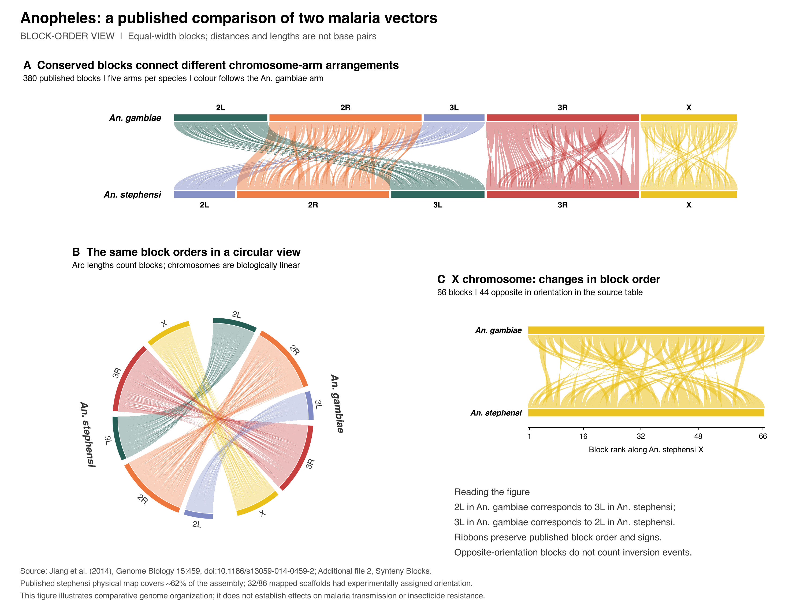

# Anopheles: published block-order comparison

[Open the figure PDF](../../../../man/figures/public-health/anopheles-block-order.pdf)
or [the PNG](../../../../man/figures/public-health/anopheles-block-order.png).
The public example includes linear, circular and X-chromosome detail views,
plus the native tables for ggsynteny Studio. Existing package functions and
all LTC palettes are unchanged.



## Biological question and importance

How does conserved gene order differ between two malaria-vector genomes?
The figure compares *Anopheles gambiae* and *Anopheles stephensi* using the
published signed block orders in [Jiang et al. (2014), Genome Biology
15:459](https://doi.org/10.1186/s13059-014-0459-2). It adds a eukaryotic example
with five chromosome arms per species, different arm correspondences and
extensive changes in block order. This complements the bacterial example.

*An. stephensi* is an urban malaria vector whose spread has prompted a
[WHO vector alert](https://www.who.int/publications/b/67602).
Comparative genome organization supplies context for studies of vector biology;
the ribbons do not establish effects on transmission, invasiveness or
insecticide resistance. This example complements the bacterial comparisons with a multi-arm eukaryotic dataset.

## What is plotted

All 380 blocks from the published spreadsheet are retained. The linear and
circular overviews show the same data, and the third panel enlarges the X-arm
comparison. Colour uses the existing `casa_natal` palette, matched to the
*An. gambiae* arm. The two species' 2L and 3L labels refer to different
homologous arms, as recorded by the source.

| An. gambiae arm | An. stephensi arm | Blocks | Opposite orientation |
| --- | --- | ---: | ---: |
| 2L | 3L | 64 | 34 |
| 2R | 2R | 104 | 53 |
| 3L | 2L | 42 | 22 |
| 3R | 3R | 104 | 45 |
| X | X | 66 | 44 |
| Total | | 380 | 198 |

**The source contains signed block permutations, not base-pair coordinates.**
Each block occupies one rank unit. Track lengths and circular arc lengths
therefore represent numbers of blocks; they are not chromosome sizes, genomic
coverage, breakpoint positions or rearrangements per megabase. The `size` field
in `chromosomes.tsv` is a block count. Opposite-orientation block counts do not
equal evolutionary inversion counts. Circular arrangement does not imply
circular chromosomes. Arm ordering is alphabetical within each species in both
views, and the published within-arm block orders are preserved.

The underlying study used a physical map covering approximately 62% of the
*An. stephensi* assembly. Of 86 mapped scaffolds, 32 had experimentally assigned
orientations; the authors used default orientation for the others. This is a
visualization of a published analysis with those limitations, not independent
validation of every rearrangement. A future base-pair-scale example should use
versioned chromosome assemblies and independently computed or archived
alignments. Do not map these block ranks onto modern assembly coordinates.

## Provenance and reproduction

The publisher's Additional file 2 ZIP contains
`Additional file 22: Synteny Blocks.xlsx`. The 14,807-byte workbook is retained
unchanged as `synteny-blocks-source.xlsx`; the larger original ZIP is an ignored
local cache under `dev/public-health/cache/`. The relevant worksheet is named
`two gene as one block`. Archive and workbook SHA-256 values, download URL,
coordinate units and output checksums are in [provenance.json](provenance.json).

The source paper is CC BY 4.0 and states that its data are covered by CC0 unless
otherwise noted. Credit: Xiaofang Jiang and colleagues, 2014. The spreadsheet
is unmodified; TSV conversion and all three panels were produced for this
example. Source code uses the repository's license.

From the repository root, using Python with `openpyxl` and R with the installed
ggsynteny development dependencies and Cairo support:

```sh
python3 data-raw/public-health/prepare_anopheles.py
Rscript data-raw/public-health/render.R
```

The normal build uses the bundled workbook and needs no network, FASTQ data,
genome download or new alignment. To re-fetch and verify the publisher archive:

```sh
python3 data-raw/public-health/prepare_anopheles.py --download-source
```

`source-permutations.tsv` preserves every signed source entry.
`blocks.tsv` and `chromosomes.tsv` are the ggsynteny inputs;
`arm-summary.tsv` gives the counts above. R environment versions are recorded
in `dev/public-health/validation/render-session.txt` in the source checkout.

Checks enforce source checksums, published per-arm counts, complete one-to-one
signed permutations, bounded plotting intervals, and exact reconstruction of
each source permutation from the converted data. The rendering script checks
that both overviews contain all 380 links, the X detail contains 66, and circular
link identities, intervals and signs remain intact. The exported PDF and PNG
were inspected; PDF text stays within its single 12-by-9-inch page. These checks validate data conversion and plotting; they are not a runtime benchmark.
Public-gallery and Studio checks are recorded in
[the validation guide](../../../../dev/public-health/VALIDATION.md).

## Use the installed dataset

```r
library(ggsynteny)
path <- system.file("extdata", "public-health", "anopheles", package = "ggsynteny")
syn <- list(
  chromosomes = read.delim(file.path(path, "chromosomes.tsv")),
  blocks = read.delim(file.path(path, "blocks.tsv"))
)
plot_circular_synteny(syn, palette = "casa_natal", chr_fill = "per_chr",
                     show_orientation = TRUE) +
  ggplot2::labs(caption = "Block ranks, not base pairs; Jiang et al. (2014).")
```

Install branch `examples/public-health-bacteria` to obtain these files. For
Studio, select Upload and Native chromosome tables, then supply
`chromosomes.tsv` and `blocks.tsv`. Both layouts and the Interactive switch are
supported. Enable orientation and keep the link limit at least 380. There is
no gene-level feature table: the records are synteny blocks, not gene models.
Do not interpret Studio's generic chromosome-size field as a nucleotide length
for this dataset. The curated gallery identifies block-rank units in captions
and tooltips; Studio uses its generic tooltips. The full published comparison
and the X-only detail can also be explored in the downloadable HTML gallery.
